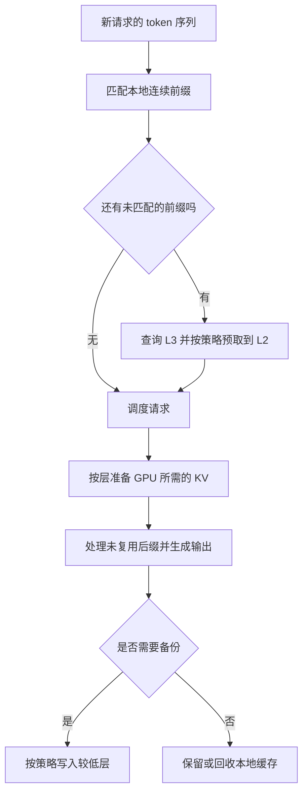

# HiCache 与 Strata：论文精读和明早学习指南

> **明早目标：** 能解释 HiCache 缓存什么、为什么需要分层，以及 Strata 如何处理分层之后的搬运和调度问题。先完成一遍有重点的阅读，再决定是否复现。
>
> **主读一篇：** *Strata: Hierarchical Context Caching for Long Context Language Model Serving*，OSDI 2026。
>
> **先记一句话：** KV Cache 节省重复计算，分层缓存扩大可复用的历史容量；Strata 进一步解决“缓存虽然保住了，但搬回来和安排执行仍然很慢”的问题。

## 0. 论文已选好：读什么、从哪里读

| 项目 | 内容 |
| --- | --- |
| 英文题目 | Strata: Hierarchical Context Caching for Long Context Language Model Serving |
| 中文理解 | Strata：面向长上下文语言模型服务的分层上下文缓存 |
| 作者 | Zhiqiang Xie, Ziyi Xu, Mark Zhao, Yuwei An, Vikram Sharma Mailthody, Scott Mahlke, Michael Garland, Christos Kozyrakis |
| 正式发表 | 20th USENIX Symposium on Operating Systems Design and Implementation，OSDI 2026，pp. 1–16 |
| 研究类型 | 大模型推理系统论文；适合作为分层 KV 缓存的代表性顶会论文阅读 |
| 会议官网 | [USENIX 论文页面](https://www.usenix.org/conference/osdi26/presentation/xie-zhiqiang) |
| 正式版 PDF | [官网下载](https://www.usenix.org/system/files/osdi26-xie-zhiqiang.pdf)；随本笔记另附 `Strata_OSDI2026.pdf` |
| 早期预印本 | [arXiv:2508.18572](https://arxiv.org/abs/2508.18572)；[HTML 阅读版](https://arxiv.org/html/2508.18572v1) |

**版本说明。** 会议官网和正式版 PDF 确认了 OSDI 2026 发表信息；arXiv v1 仍保留 2025 年的“under peer review”说明。本文的章节、图号和实验口径以正式版为准。正式 PDF 共 17 个文件页面，包含一页会议封面；下文“正文第 6 页”对应 PDF 阅读器的第 7 页。[1][2]

**为什么选它？** 你现在要把 Transformer、KV Cache 和 HiCache 串起来，明早只有一个上午。Strata 的问题集中、机制明确，而且正式版明确说明它已集成进 SGLang；配合 HiCache 官方资料，可以从基础一路读到真实系统设计。[1][3]

**两个名字上的提醒：**

- 本文的 HiCache 指 **SGLang Hierarchical KV Caching**。另有题名以 *HiCache* 开头、研究 Hermite 多项式特征缓存的论文，它面向扩散模型加速，不是本次主线。[6]
- Strata 论文实验中的 `SGLang-HiCache` 是作者为对照构建的特定基线。不能把它当成当前 SGLang HiCache 的全部实现，再说“Strata 打败了今天的 HiCache”。[1, §5.1]

## 1. 明早按这个顺序学

以 **9 月 30 日 08:30 到工位、11:00 完成**为例；到得晚就整体顺延。

| 时间 | 做什么 | 完成标准 |
| --- | --- | --- |
| 08:30–08:50 | 看本笔记第 2 节；读论文 §2 | 能说清 prefill、decode 和“为什么只缓存 K/V” |
| 08:50–09:15 | 看第 3 节；浏览 HiCache 官方架构资料 | 能解释 GPU、主存、外部存储分别干什么 |
| 09:15–10:05 | 看第 4–6 节；对应论文 §3、§4 和图 4、6、7 | 能用自己的例子解释搬运瓶颈、delay hit、平衡批次 |
| 10:05–10:15 | 休息 | 离开屏幕 |
| 10:15–10:40 | 看第 7 节；重点读论文图 8、图 9 | 能说清比较对象、指标、适用场景和实验边界 |
| 10:40–11:00 | 做第 9 节自测，整理第 10 节汇报 | 不看笔记讲 2 分钟，写下一个仍未解决的问题 |

**如果只剩 60 分钟：** 基础 15 分钟 → HiCache 架构 10 分钟 → 核心设计 20 分钟 → 图 8/9 与自测 15 分钟。可以先跳过代码、写策略细节和端侧延伸。

**明早暂时不需要补完：** Transformer 的完整训练流程、反向传播、LayerNorm 细节、FFN 推导和所有 CUDA 代码。读这篇最需要的是：因果注意力、K/V 的复用、显存容量、数据传输和请求调度。

## 2. 先把 KV Cache 的基础接上

### 2.1 Prefill 和 decode 是什么

假设你输入“请总结下面这篇论文：……”并附上一段很长的文字。

- **Prefill：** 模型处理输入 token，计算各层的表示和 K/V，并得到用于预测第一个输出 token 的结果。
- **Decode：** 模型逐步处理新生成的 token，每一步利用已有的 K/V 继续预测下一个 token。

并行处理一段输入，不等于这些位置能看到未来。Prefill 中依然使用因果约束；只是在硬件上可以把许多位置的运算一起做。

### 2.2 为什么新增 token 后，历史 K/V 能继续用

在一层、一个注意力头中，令第 $t$ 个位置进入该层的表示为行向量 $h_t$。简化写作：

$$
q_t=h_tW_Q,\qquad k_t=h_tW_K,\qquad v_t=h_tW_V.
$$

这里省略了归一化、位置编码等细节；实际缓存的 K 要与模型使用的位置处理保持一致。

把截至当前位置的 K/V 按行排列：

$$
K_{1:t}=\begin{bmatrix}k_1\\\vdots\\k_t\end{bmatrix},\qquad
V_{1:t}=\begin{bmatrix}v_1\\\vdots\\v_t\end{bmatrix}.
$$

当前位置的注意力输出为：

$$
o_t=\operatorname{softmax}\left(\frac{q_tK_{1:t}^{\mathsf T}}{\sqrt{d_k}}\right)V_{1:t}.
$$

矩阵形状是：

$$
(1\times d_k)(d_k\times t)\longrightarrow 1\times t,
\qquad
(1\times t)(t\times d_v)\longrightarrow 1\times d_v.
$$

**关键原因是因果性。** 历史位置只依赖它前面的 token；在模型和计算设置相同的情况下，往末尾追加新 token 不会改变过去位置的表示。因此过去各层的 K/V 不必重新生成。

> 例如已经算完 token A、B、C，下一步处理 D 时，只要生成 D 在各层对应的新 Q/K/V，并让 D 的 Q 与已有 K 做注意力即可。A、B、C 的 K/V 可以直接读取。

### 2.3 为什么通常不缓存 Q

计算位置 D 的输出需要的是 **D 的 Q** 和 **A、B、C、D 的 K/V**。A、B、C 的旧 Q 已经完成了各自位置的查询，未来位置不需要拿它们再次查询。

所以标准自回归推理持续保留 K/V；“不缓存 Q”不是说 Q 不重要，而是旧 Q 对未来位置没有同样的复用价值。

**不要误解成每一步只有常数计算量。** 有了缓存，当前 Q 仍要读取并关注历史 K/V。对标准全注意力，历史越长，这部分工作仍然增长。

### 2.4 两种复用，要分开理解

| 复用范围 | 例子 | 节省了什么 |
| --- | --- | --- |
| 同一个请求内部 | 生成第 101 个 token 时使用之前的 K/V | 避免重新跑整个历史序列 |
| 不同请求之间 | 多个问题使用同一个 system prompt 和同一篇长文档 | 避免每次重新 prefill 相同前缀 |

HiCache 的重要场景是第二种：历史请求结束后，仍尽量保留可复用的前缀 K/V。基础 KV Cache、跨请求前缀缓存、分层管理，是相互衔接的三个问题。[3][5]

### 2.5 “相同前缀”不是“意思差不多”

例子：

- 请求 A：`[固定系统提示][论文全文][问题：方法是什么？]`
- 请求 B：`[固定系统提示][论文全文][问题：实验怎么做？]`

前两个部分的 token 前缀一致，就可能复用；问题部分需要继续计算。

如果请求 C 把一段不同的说明放到论文前面，即使论文文字没变，论文中每个位置的上文也变了，不能直接认定其 K/V 相同。复用还要满足模型权重、tokenization、位置、相关适配器和计算配置等兼容条件；不能跨任意模型共享。

### 2.6 为什么 KV 会把显存吃满

对普通 MHA/GQA，假设各层相同、K/V 头维度都为 $d_h$，不考虑共享、压缩和分片：

$$
M_{\mathrm{KV}}=2\,L\,B\,T\,H_{\mathrm{KV}}\,d_h\,s.
$$

| 符号 | 意义 |
| --- | --- |
| $2$ | K 和 V 两份 |
| $L$ | 层数 |
| $B$ | 等长、互不共享缓存的序列数 |
| $T$ | 每个序列缓存的 token 数 |
| $H_{\mathrm{KV}}$ | KV 头数；GQA 下可以少于 Q 头数 |
| $d_h$ | 每个头的维度 |
| $s$ | 每个数的字节数，如 FP16 为 2 |

**教学算例，并非论文测量：** 设 $L=32,H_{\mathrm{KV}}=8,d_h=128,s=2,B=1$。

$$
M_{\mathrm{per\ token}}=2\times32\times8\times128\times2
=131072\ \text{bytes}=128\ \text{KiB}.
$$

- 8,192 token 对应 **1 GiB** KV。
- 32,768 token 对应 **4 GiB** KV。
- 8 条互不共享的 32,768-token 序列对应 **32 GiB** KV。

这还没有计算模型权重、临时张量、内存池和其他开销。实际使用 MLA、量化、滑动窗口、不同层结构或跨请求共享时，要重新核算；上述公式也不是直接给出 TP 部署中每块卡的占用。

## 3. HiCache：缓存扩大之后，系统怎么工作

### 3.1 三层分别存在哪里

| 层级 | 典型位置 | 在这里的作用 | 代价 |
| --- | --- | --- | --- |
| L1 | 本实例的 GPU 显存 | 保存正在计算或适合快速复用的 K/V | 容量紧张 |
| L2 | 本实例的 CPU 主存 | 承接更多历史 K/V | 使用前通常需要搬回 GPU |
| L3 | 本地文件、SSD 或外部分布式存储 | 容纳更多历史，视后端支持跨实例复用 | 访问延迟和带宽更依赖后端 |

这里的 L1/L2/L3 是 **HiCache 的逻辑分层**，不是 CPU 芯片内部的硬件缓存。多台机器的 L2 也不会自动合成一个共享池；跨实例共享要看 L3 后端及配置。[4]

同一段缓存可以在多个层级同时有副本。“分层”不意味着每段数据只能属于一层。

### 3.2 HiRadixTree、Controller、Scheduler 各管什么

| 组件 | 你可以把它理解成 | 核心问题 |
| --- | --- | --- |
| HiRadixTree | 按 token 前缀组织的索引和状态表 | 哪段前缀可复用，本地 K/V 在哪里？ |
| Cache Controller | 负责搬运与同步的管理者 | 何时读入、备份，数据是否准备好？ |
| Scheduler | 给请求安排执行次序和批次的调度器 | 哪些请求一起跑，哪些需要等一下？ |

树主要管理索引和状态，不能把它理解成“把所有大矩阵都直接塞进树节点”。L3 的存在性和位置信息还需要查询后端，HiRadixTree 不持续维护完整的全局 L3 元数据。[3][4]

### 3.3 一次请求走一遍

以下图是概念流程，省略了并发、多 GPU 同步和错误处理；不表示系统必须串行执行全部步骤。



**教学例子：** 请求共有 10,000 token。连续前缀中，前 2,000 token 在 GPU，接下来 5,000 在主存，再接下来 2,000 在外部存储，最后 1,000 没有缓存。

如果外部预取及时完成，就可以复用 9,000 token，对其余 1,000 token 做后缀 prefill；这 1,000 个位置的注意力仍会访问此前的前缀 K/V。

如果预取没有及时完成，系统可能利用已经准备好的连续前缀，并重算剩余部分；也可能按所选策略继续等待。必须保持前缀连续、依赖正确，不能跳过中间缺失部分就直接把后面的历史状态拼上。

### 3.4 命中不等于没有代价

教学上可以把首字延迟粗略拆成：

$$
\mathrm{TTFT}\approx T_{\mathrm{queue}}+T_{\mathrm{load,exposed}}
+T_{\mathrm{remaining\ prefill}}+T_{\mathrm{other}}.
$$

$T_{\mathrm{load,exposed}}$ 指没有被排队或其他计算掩盖的搬运时间。真实执行有重叠，上式只是分解问题的模型，不是 Strata 的精确延迟公式。

GPU 命中通常不需要从低层回迁，CPU 或 L3 命中却有搬运代价。因此 **命中率提高是否能改善 TTFT，仍要看搬运成本和调度**。

### 3.5 预取和备份策略，先理解取舍

| 策略 | 理解方式 | 主要取舍 |
| --- | --- | --- |
| `best_effort` | 到调度执行时，尽量用已取回的数据 | 少等，但可能重算更多 |
| `wait_complete` | 等预取完成后再执行 | 复用更充分，但可能等待更久 |
| `timeout` | 完成或达到时间预算后停止等待 | 在等待与重算之间折中 |
| `write_through` | 新缓存产生后主动备份 | 为后续复用做准备，但增加写入 |
| `write_through_selective` | 对达到访问热度条件的内容备份 | 节省带宽，但可能漏掉之后有用的内容 |
| `write_back` | 接近上层淘汰时再备份 | 推迟写入，但可能让回收过程等待 |

前 3 行控制“等多久取回”，后 3 行控制“何时往下保存”，不能混成同一组开关。命名与行为来自官方资料；具体参数和默认值应以部署版本为准。[3][4]

## 4. Strata 的第一个问题：数据已经缓存，为什么还是搬不快

### 4.1 分页有利于管理，但数据可能很碎

把缓存分成小页，可以灵活分配空间和复用前缀。代价是一个长请求的 K/V 可能分布在许多不连续的页里。跨层搬运时，如果每个小块都触发一次独立复制，启动与调度开销就可能变得显著。

**原创教学算例：** 总共搬 1 MiB。分成 1,024 次 1 KiB 复制，和一次 1 MiB 复制，总字节数一样，但调用次数不同。即使完全不改变物理链路，小块复制也可能浪费更多时间。

也不能简单宣布“页越大越好”：假设公共前缀为 30 token，只有完整页可复用。页大小为 16 时可能复用 16 token；页大小为 32 时就可能连一个完整页也匹配不上。实际细节取决于实现，但这个例子说明了页粒度与复用边界的矛盾。

### 4.2 GPU-assisted I/O：换一种组织搬运的方式

Strata 让 CUDA kernel 中的 GPU 线程并行处理细碎传输，连接 GPU 显存和注册的 pinned 主存；相比逐小块发起复制，更好地组织并发和地址访问。它还限制 I/O kernel 使用的资源，降低对模型计算的干扰。[1, §4.2]

理解时回答三问就够了：

1. **数据从哪里来？** 仍然来自主存或显存，不是凭空出现。
2. **为什么可能更快？** 搬运任务的组织和并发效率改善了，链路利用率更高。
3. **是否没有成本？** 不是。I/O kernel 也占 GPU 资源，需要控制与计算的竞争。

不要把 GPU-assisted I/O 理解成“用 GPU 算出以前的缓存”，也不要理解成“PCIe 的物理带宽变大了”。

### 4.3 Layer-first 和 page-first 为什么要分开

设有两页 A、B，三层 0、1、2。下面只表示逻辑排列，不展示 K/V 内部维度。

| 布局 | 顺序示例 | 更方便的操作 |
| --- | --- | --- |
| Layer-first | A0, B0, A1, B1, A2, B2 | 同一层的计算读取 |
| Page-first | A0, A1, A2, B0, B1, B2 | 以完整缓存页组织跨层数据和较大块传输 |

HiCache 官方设计保留 GPU 上适合计算的 layer-first，在主存及外部层使用适合 I/O 的 page-first，并在搬运路径中转换布局。[3]

这类似于同一份信息按“课程”归档方便上课时取用，按“学生”归档方便一次移交某人的全部资料。**数据内容可以相同，排列方式服务于不同访问模式。**

阅读论文图 6 时，把手指放在页 A 上：分别找出 A 在两种布局中跨层数据的位置，就能看懂为什么布局影响传输粒度。

### 4.4 逐层重叠为何仍不够

理想情况：模型算第 $\ell$ 层时，系统提前加载第 $\ell+1$ 层的 KV。如果后一层数据按时到达，计算不必等待。

但当缓存前缀很长、需要新计算的后缀很短时，可能出现“要搬很多、只算一点”。例如某段搬运要 8 ms，能与之重叠的计算只有 2 ms，仍有最多约 6 ms 的暴露等待。

这引出第二个问题：**除了单次搬得快，还要让整批请求的搬运和计算安排得合理。**

## 5. Strata 的第二个问题：哪些请求应该一起运行

这一节用原创小例子解释论文 §4.3 的三个机制，不是对论文算法的逐行复现。

### 5.1 Delay hit：缓存快要有了，却被当成没有

设 A、B 都使用同一篇长文档，问题不同。

| 时刻 | 系统发生了什么 | B 看到什么 |
| --- | --- | --- |
| $t_0$ | A 到达；文档前缀尚无 KV，开始计算 | 暂时没有可用缓存 |
| $t_1$ | A 的前缀还没算完，B 到达 | 如果只查已完成缓存，仍会判断 miss |
| $t_2$ | A 的前缀完成，缓存可供复用 | B 此时可以避免重复计算公共前缀 |

如果在 $t_1$ 就让 B 也完整计算一遍公共前缀，系统会做冗余工作。Strata 跟踪“已排队”和“计算中”的前缀状态，对满足条件的请求延后调度，让其利用即将产生的缓存。[1, §4.3.1]

直观上，B 不是在等一个永远不存在的结果，而是在等 A 即将完成的结果。是否值得等待，要看共享前缀够不够长、A 还需多久以及 B 的等待代价；不能推广成“所有相同开头的请求都要等”。

**与 CPU 命中的区别：** CPU 命中意味着 K/V 已经存在、需要搬运；这个 delay hit 例子的 K/V 还在产生中、需要等计算完成。

### 5.2 Balanced batch：让搬运需求与计算需求更匹配

有三个请求，下面的时间是假设值，仅用于解释重叠，不是实测：

| 请求 | 需加载的历史 KV 对应时间 | 可提供的计算时间 | 特征 |
| --- | --- | --- | --- |
| A | 8 ms | 1 ms | 缓存很长，新问题很短 |
| B | 8 ms | 1 ms | 同样偏搬运 |
| C | 0 ms | 8 ms | 无需低层加载，计算较多 |

如果先组成 A+B，加载需求集中，而可覆盖它的计算很少。A+C 则更有机会把 A 的部分搬运与 C 的计算重叠。

这里**不能**把表中的数字简单相加后宣布实际批次延迟：批处理计算不是各请求时间线性相加，且受层依赖、SM 资源、HBM 和链路竞争影响。例子只说明调度为什么要同时估计“需要搬多少”和“需要算多少”。

论文的批次形成算法结合加载/计算需求和共享关系选择请求，同时保留避免饥饿的安排。读 Algorithm 1 时抓住“先放队首、判断新增请求是否使批次过度依赖加载、最后补充被暂缓的请求”即可；第一次不必记阈值。[1, §4.3.2]

### 5.3 Bundle hit：共享内容已存在时，成组反而有利

再看 A、B 共享长文档的情况，但这次该文档 K/V **已经在主存中**。

如果把两者放入同一批次并共享同一份前缀，可以避免把它当成两份独立的历史数据反复搬运和存储。论文称这种有利的共享组合为 bundle hit。[1, §4.3.2]

| 状态 | 值得考虑的安排 | 原因 |
| --- | --- | --- |
| 共享前缀还没算好 | 推迟后续请求 | 避免重复 prefill |
| 共享前缀已存在且能共同复用 | 一起调度 | 共享加载和存储 |

因此，“内容相似的请求一起跑”不是完整调度规则。**内容是否相同、缓存是否已准备好、数据在哪一层，都要知道。**

### 5.4 Bubble filling：等待搬运时安排能做的工作

即使批次已经尽量平衡，仍可能有一段时间在等 KV。系统可以让其他已经具备运行条件的工作利用这段空档，例如执行一批 decode。[1, §4.3.3]

要分清两个带宽：

- **主存到 GPU 的加载**主要占用 CPU–GPU 互连。
- **已经在 GPU 上进行的 decode**主要访问显存内的数据，经常受到 HBM 带宽限制。

两者的主要瓶颈并不完全相同，所以存在重叠机会；但它们也共享部分硬件资源，不能说完全没有竞争。

如果设备上只有一个等待加载的请求，也没有其他可执行工作，就未必有空档可填。这也是把数据中心方法迁移到个人设备时要重新评估的地方。

## 6. 用一个算例理解“读取还是重算”

这是帮助理解分层缓存收益的简化模型，**不是 Strata 的完整调度公式或性能复现**。

设缓存大小为 $M$，某条需要实际传输的链路有效带宽为 $BW_{\mathrm{eff}}$，则：

$$
T_{\mathrm{transfer}}\gtrsim \frac{M}{BW_{\mathrm{eff}}}.
$$

一次复用是否值得，至少要比较：

$$
T_{\mathrm{lookup}}+T_{\mathrm{load,exposed}}+T_{\mathrm{extra}}
<T_{\mathrm{recompute\ saved}}.
$$

右侧是因为复用实际省掉的计算，不是整个请求的总计算。左侧也不能忘掉查询、等待、布局处理和同步等成本。

**例子：** 1 GiB KV 通过有效带宽 20 GiB/s 的链路加载，单纯传输下界为 50 ms。如果可以省掉 500 ms 的前缀重算，就有明显潜力；若只能省掉 30 ms，则仅传输下界就已更高。是否有重叠还会改变暴露给用户的等待。

外部存储回迁可能经过 L3→L2→L1。粗略估算串行时间时要分别看各段，不能只用最快链路除一下总字节数；流水线实际能重叠多少，需要测量。

### 可选：3 分钟运行这个容量小计算

不需要模型和 GPU，也不需要安装第三方包。它只计算教学假设下的容量与传输下界。

```python
def kv_bytes(tokens, layers=32, kv_heads=8,
             head_dim=128, bytes_per_element=2, sequences=1):
    return (2 * layers * sequences * tokens * kv_heads
            * head_dim * bytes_per_element)

GiB = 1024 ** 3
bandwidth = 20 * GiB  # 假设有效带宽为 20 GiB/s

for tokens in (8192, 32768):
    size = kv_bytes(tokens)
    lower_bound_ms = size / bandwidth * 1000
    print(f"{tokens} tokens: {size / GiB:.3f} GiB, "
          f"transfer lower bound = {lower_bound_ms:.1f} ms")

print("8 independent sequences:",
      kv_bytes(32768, sequences=8) / GiB, "GiB")
```

预期输出：

```text
8192 tokens: 1.000 GiB, transfer lower bound = 50.0 ms
32768 tokens: 4.000 GiB, transfer lower bound = 200.0 ms
8 independent sequences: 32.0 GiB
```

运行之后把 `kv_heads` 改为 32，想一想为什么容量会变为 4 倍。再把带宽改为原来的一半，观察传输下界如何变化。

## 7. 论文怎么读、实验怎么讲

### 7.1 明早重点看这五张图

| 位置 | 正文页 / PDF 阅读器页 | 带着什么问题看 |
| --- | --- | --- |
| 图 4：系统架构 | 4 / 5 | Scheduler、Controller、HiRadixTree 谁负责决策、谁负责搬运？ |
| 图 6：两种布局 | 6 / 7 | 一个逻辑页的跨层数据，在两种布局里分别在哪里？ |
| 图 7：调度时间线 | 6 / 7 | 哪段是重复计算，哪段是搬运等待，如何重新安排？ |
| 图 8：端到端性能 | 10 / 11 | 相同 TTFT 下谁的吞吐更高？相同吞吐下谁的 TTFT 更低？ |
| 图 9：消融分析 | 11 / 12 | 只优化 I/O、只优化调度、两者结合分别怎样？ |

图号和页码已经对照随附的 OSDI 正式版核查。不要直接套到 arXiv v1 上。

### 7.2 先理解坐标轴，再读“几倍”

- **TTFT（Time To First Token）：** 请求发出到第一个输出 token 到达的时间，越低越好。
- **输出 token 吞吐量：** 单位时间生成多少输出 token，越高越好。
- **Cache hit rate：** 要看按 token、页还是请求统计；不同口径不能混着比较。

对吞吐–延迟曲线，在相同延迟预算下能更靠右，说明能支撑更多工作；在相同吞吐下更靠下，说明响应更快。靠右且靠下通常更理想，但比较前要确认负载和模型相同。

**一个可准确复述的正式版结果：** 在论文的 LooGLE、Llama-70B 配置中，Strata 在相同 TTFT 下，相对 vLLM-LMCache 的吞吐最高达到 5 倍，相对 TRT-LLM-HiCache 最高达到 3.75 倍。[1, §5.2.1]

这里不能改写成“所有情况下延迟降低 5 倍”，更不能把这个数预测到自己的笔记本。早期 arXiv 摘要采用了不同表述；汇报时用正式版的指标和条件。

### 7.3 阅读实验时必须记住的边界

1. **软件是论文当时的版本。** §5.1 使用 vLLM 0.8.5、LMCache 0.2.1、TensorRT-LLM 0.17.0、SGLang 0.4.5。这不是对 2026 年 9 月各项目最新版本的排名。[1]
2. **主实验主要验证 GPU–主存层级。** 多数基准没有使用磁盘；正式版 §5.3.5 另做存储布局实验。因此不能把所有吞吐增益都归因于 SSD。[1]
3. **场景以可复用的长上下文为核心。** 在缺乏公共前缀、首次冷启动或主要时间花在长输出 decode 上时，应重新看瓶颈。
4. **对照必须拆开看。** 当前 HiCache 功能、论文自建的 SGLang-HiCache 基线、基础 SGLang 是不同含义。
5. **消融比最高倍数更有解释力。** 图 9 用于检查性能改进到底来自 I/O、调度，还是两者配合；不是只看最后一条曲线最高就结束。

如果组会上只够讲一句实验评价，可以说：**“结果支持分层缓存需要同时优化搬运与调度；收益依赖负载的复用结构和硬件互连，不能只看命中率。”**

## 8. 延伸：这对端侧部署有什么启发

本节是从机制出发的分析与待验证假设，**不是论文已经验证的手机或消费级笔记本结论**。

### 8.1 先说明“端侧”是哪一种

| 设备类型 | 可以借鉴的想法 | 需要重新验证的地方 |
| --- | --- | --- |
| 独显笔记本、小型 GPU 工作站 | 显存放不下的历史 KV 放入主存，必要时再回迁 | GPU–CPU 有效带宽、主存余量、后台负载和散热 |
| CPU/GPU 共享物理内存的 SoC | 管理历史状态的生命周期、热度、访问顺序 | 是否真的需要复制、带宽竞争、内存映射与一致性开销 |
| CPU-only 本地推理 | 利用主存与磁盘保存可复用历史 | 论文 GPU-assisted I/O 路径不能照搬，需要其他实现 |

统一内存设备也可能有显式拷贝或迁移，不能一概说“没有搬运”；关键是先画出目标设备的实际数据路径。

### 8.2 可能的优势与挑战

**潜在优势：** 私有文档反复问答、固定提示词、跨轮次对话可能复用历史计算，在有限显存条件下保留更多状态。

**主要挑战：**

- 主存和磁盘也有限，必须控制缓存预算。
- 带宽较低或存储延迟较高时，读取可能不如重算。
- 单用户低并发下，平衡批次和 bubble filling 的可用空间可能较小。
- I/O 线程与模型计算的竞争，在资源更少的设备上可能更明显。
- 持久化缓存带来写入、能耗和生命周期管理问题；不能仅用“少算了”推断一定省电。

### 8.3 一个可以带到组会的后续问题

> **在有限显存、有限主存、低并发的设备上，什么前缀长度和复用频率下，缓存回迁才比重算更划算？**

如果下一步获得实验任务，可以按以下最小方案设计；它是工作建议，尚未执行：

| 要素 | 设计 |
| --- | --- |
| 对照 | 仅 GPU 前缀缓存；GPU+主存分层；资源允许时再加入磁盘 |
| 负载 | 固定文档前缀加不同问题；再加完全无共享前缀的对照 |
| 控制变量 | 模型、精度、输入输出长度、硬件、软件版本和并发度 |
| 核心变化 | 前缀长度、两次使用之间的间隔、复用次数、低层预算 |
| 分开记录 | 冷启动与热缓存；首次请求与后续请求 |
| 指标 | TTFT、输出吞吐、GPU/主存峰值、实际传输字节数；有条件再测能耗 |

明早先完成阅读即可。小规模教学计算或实验设想，都不能写成“已经复现论文”。

## 9. 自测：盖住答案，试着回答

1. KV Cache 保存的是什么？为什么不把旧 Q 一直保留下来？
2. 跨请求前缀缓存与单请求 decode 的 KV Cache 有什么联系？
3. 如果命中 CPU 缓存，为什么 TTFT 仍可能很高？
4. 分页为什么会同时帮助缓存管理、又让传输变难？
5. GPU-assisted I/O 改善的是什么？有没有硬件资源成本？
6. Delay hit 与 bundle hit 为什么导向不同的调度选择？
7. 为什么算某一层时加载下一层，仍可能隐藏不了全部等待？
8. 论文的“最高 5 倍”指什么？为什么不能直接外推到自己的设备？
9. HiCache 会不会自动改变模型的注意力算法或删除不重要 token？
10. 你下一步最想验证的一个端侧问题是什么？

### 参考答案

1. 保存各层历史位置的 K/V。新位置需要新的 Q 查询历史 K/V，不需要旧位置的 Q 再查询。
2. 都复用已计算状态；前者让不同请求共享兼容的相同前缀，后者在同一请求的生成过程中复用历史。
3. 命中后仍有回迁、排队和同步；命中数量不能代表暴露给用户的等待时间。
4. 小页有利于灵活分配和匹配细粒度前缀，但可能产生大量细碎的跨层传输。
5. 改善细碎传输的并发和组织效率；I/O kernel 仍会占用 GPU 执行资源，并可能干扰其他任务。
6. 前者共享结果还没准备好，等待可避免重复计算；后者已有可共享状态，成组能共享加载和存储。
7. 要加载的历史很长，而新后缀很短时，搬运时间超过可重叠的计算时间。
8. 指指定论文配置、指定基线和相同 TTFT 下的吞吐比。设备、负载、版本、缓存状态都可能改变收益。
9. 分层缓存本身主要改变存放与调度，目标是复用相同状态；KV 量化、稀疏注意力和 token 丢弃是另外的机制。实际数值一致性还受精度和执行设置影响。
10. 不设唯一答案。能说清设备、变量、对照和指标，比泛泛说“想让它更快”更有价值。

**通过标准：** 1–8 题能用自己的话讲清至少 6 题，并能解释图 6 与图 7。卡住时回到对应段落，不必重新看一遍完整 Transformer。

## 10. 明早学完后的汇报提纲

这段仅在完成对应阅读后使用；未读部分按实际进度删减。

> 我这次沿着 KV Cache、前缀复用和分层缓存梳理了 HiCache，并阅读了 OSDI 2026 的 Strata。它关注的是长上下文缓存超过 GPU 容量后，如何在主存和外部存储中保留历史，再高效回迁复用。我的主要理解是，扩大缓存只是第一步，细碎传输和不考虑加载时间的调度仍会造成瓶颈。Strata 从 GPU-assisted I/O、内存布局以及缓存感知调度几方面处理这个问题。对于端侧，我现在更想进一步确认：在低并发和有限带宽下，什么情况下读取历史 KV 比重算更划算。这部分目前是分析和实验设想，还没有完成部署验证。

如果只完成基础部分，可以如实说：

> 我先把 KV Cache 和 HiCache 的关系梳理清楚了，并读了 Strata 的问题定义和核心设计。现在能解释分层缓存中的搬运瓶颈，但调度算法和实验图还需要继续细读。

### 阅读记录

- [ ] 能解释因果注意力为什么允许保留历史 K/V。
- [ ] 能区分单请求复用与跨请求前缀复用。
- [ ] 能解释 HiCache 的三层和三个关键组件。
- [ ] 看过论文图 4、6、7。
- [ ] 看过图 8、9，记录一个有条件的实验结论。
- [ ] 完成自测，写下一个仍然不明白的问题。

实际完成时间：

最不清楚的概念：

想向师哥确认的问题：

下一步任务：

## 11. 资料与出处

以下均为论文或项目第一方来源，核查日期为 2026-09-29。本文用原创例子解释概念；假设数字与后续实验建议均已标注，不代表作者的实测结果。

**[1] 主论文，正式版。** Z. Xie et al., “Strata: Hierarchical Context Caching for Long Context Language Model Serving,” *20th USENIX Symposium on Operating Systems Design and Implementation (OSDI 26)*, 2026, pp. 1–16. [会议页面](https://www.usenix.org/conference/osdi26/presentation/xie-zhiqiang) · [PDF](https://www.usenix.org/system/files/osdi26-xie-zhiqiang.pdf)。正式版用于核对发表信息、图号、章节和实验口径。

**[2] Strata 早期预印本。** [arXiv:2508.18572v1](https://arxiv.org/abs/2508.18572v1) · [HTML 全文](https://arxiv.org/html/2508.18572v1)，2025-08-26。适合浏览器内查词；不是本文实验结果的版本基准。

**[3] HiCache 官方技术博客。** Zhiqiang Xie, “SGLang HiCache: Fast Hierarchical KV Caching with Your Favorite Storage Backends,” LMSYS, 2025-09-10. [原文](https://www.lmsys.org/blog/2025-09-10-sglang-hicache/)。用于连接 HiCache 的命名、架构、数据布局和工程实现。

**[4] HiCache 官方设计文档。** SGLang, “HiCache System Design and Optimization.” [原文](https://docs.sglang.io/docs/advanced_features/hicache_design)。用于核查层级作用、元数据组织、预取及写入策略；在线文档可能继续更新。

**[5] 前置背景论文，可选读。** Lianmin Zheng et al., “SGLang: Efficient Execution of Structured Language Model Programs,” *NeurIPS 2024*. [会议页面](https://proceedings.neurips.cc/paper_files/paper/2024/hash/724be4472168f31ba1c9ac630f15dec8-Abstract-Conference.html)。其中 RadixAttention 是理解前缀复用的背景；明早无需整篇读完。

**[6] 同名消歧，不作为本次学习材料。** Liang Feng et al., “HiCache: A Plug-in Scaled-Hermite Upgrade for Taylor-Style Cache-then-Forecast Diffusion Acceleration,” arXiv:2508.16984v2. [页面](https://arxiv.org/abs/2508.16984)。它研究扩散模型特征缓存，早期版本采用过不同副标题。

### 主论文 BibTeX

```bibtex
@inproceedings{xie2026strata,
  author = {Zhiqiang Xie and Ziyi Xu and Mark Zhao and Yuwei An
            and Vikram Sharma Mailthody and Scott Mahlke
            and Michael Garland and Christos Kozyrakis},
  title = {Strata: Hierarchical Context Caching for Long Context Language Model Serving},
  booktitle = {20th USENIX Symposium on Operating Systems Design and Implementation (OSDI 26)},
  year = {2026},
  pages = {1--16},
  publisher = {USENIX Association},
  url = {https://www.usenix.org/conference/osdi26/presentation/xie-zhiqiang}
}
```
