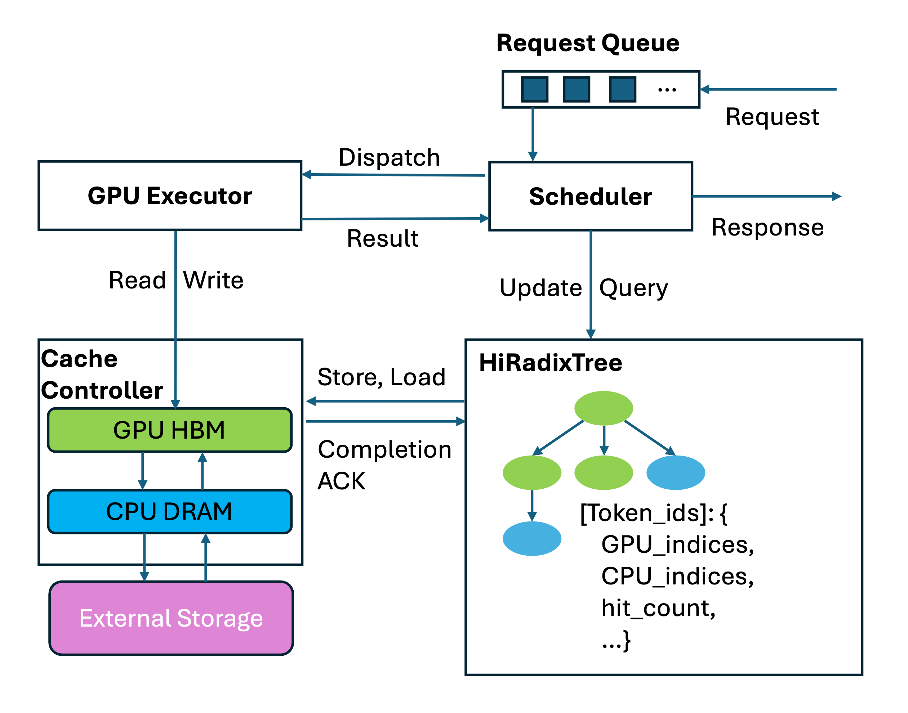
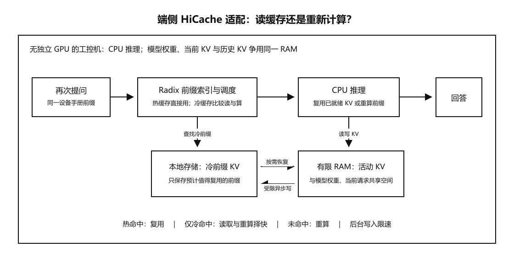
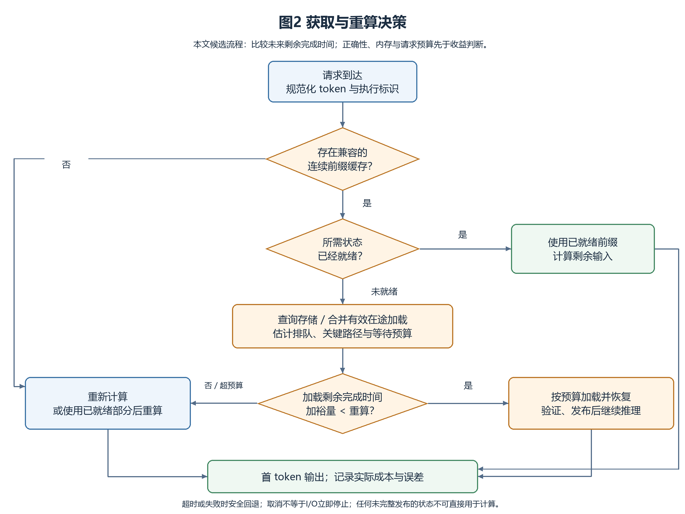
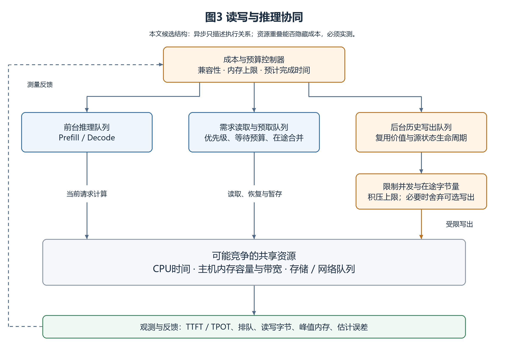

# 面向端侧大模型推理的 HiCache 架构适配与缓存调度研究综述

文献核查日期：2026 年 10 月 3 日。报告性质：专题调研与研究方案。文中不包含作者已完成的移植、算法实现或实验结果；第 5、6 章的分析与设想仍需后续验证。HiCache 指 SGLang 的 Hierarchical KV Caching，不指其他同名缓存工作。

## 摘要

大语言模型逐步进入个人电脑、移动终端和边缘设备，长上下文处理、多轮对话和本地知识问答带来的计算与内存开销，使缓存管理成为端侧推理的重要问题。SGLang HiCache 将可复用的前缀 Key-Value Cache 从设备内存扩展到主机内存及外部存储，为减少重复 Prefill 提供了分层管理机制。然而，端侧的计算能力、可用内存、存储性能、网络条件与云侧服务存在差异，增加缓存容量并不必然降低请求延迟。本文围绕 HiCache 架构在端侧的适配问题，梳理前缀复用、分层 KV 管理、稀疏与量化、端侧异构推理以及跨实例状态传递等研究，区分这些技术的管理对象、优化目标和适用前提。在此基础上，分析无独立 GPU、共享内存带宽和普通本地存储条件下的读写调度挑战，提出以请求剩余完成时间为依据的缓存获取与重新计算决策框架，并讨论预取等待预算、后台写入干扰和跨设备复用的扩展条件。本文形成的是端侧缓存调度的研究问题与验证路径，不将成本模型和候选规则视为已经证实的创新成果。

关键词：端侧大模型推理；KV Cache；HiCache；分层缓存；预取；异步写入；缓存调度

## 1 引言

### 1.1 端侧大模型推理的需求与应用场景

基于 Transformer 的语言模型通过注意力机制组织上下文信息，其基本结构由 Vaswani 等提出[1]。在实际应用中，用户的输入往往包含系统提示、历史对话、工具描述和参考文档。相对于一次性的短文本问答，文档助手、编程助手和持续对话会反复处理相同或部分相同的上下文，从而产生中间状态复用机会。SGLang 将多次模型调用中的共享前缀视为可利用的执行结构[4]。这些机会也可能存在于本地应用，但其收益需要结合具体设备和请求模式判断。

本文以“用户围绕同一份本地文档连续提问”为说明场景：应用构造固定系统提示和文档前缀，并在其后添加不同问题。若相同前缀的 KV 已计算完成，后续请求可能减少重复 Prefill。为使问题具有可检验性，本文第一阶段限定为单设备上的同模型、相同 token 前缀复用，优先考虑 CPU、主机内存与普通本地 SSD 组成的原型。手机、NPU 和跨设备协同属于进一步研究的对象，不直接由个人电脑原型的结果推断。

### 1.2 计算、内存与数据传输的资源约束

端侧资源约束至少包含三个方面：模型执行需要计算和访存，模型权重与运行状态占用有限内存，外部缓存的恢复需要存储或网络传输。三者相互关联。例如，缓存保存在 SSD 上可以减少常驻内存，但加载过程会占用 I/O 带宽、主机内存和恢复缓冲区；如果计算也由 CPU 完成，数据解码、复制和模型算子还可能争用 CPU 时间。这样一来，同一段前缀的 KV 即使已经保存在 SSD 上，读取并恢复它也有代价。对于一次新请求，仍需比较“读取后继续推理”和“重新计算后继续推理”两条路径的完成时间。

FlexGen 探索在有限 GPU 资源下联合使用 GPU、CPU 和磁盘，其目标主要是延迟不敏感的批量高吞吐推理[12]。PowerInfer 和 PowerInfer-2 则分别从个人电脑和手机的计算特点出发设计异构执行机制[19-20]。这些工作表明资源限制会改变系统方案，但不意味着不同硬件可以共享一套未经调整的缓存调度规则。

### 1.3 KV Cache 管理与复用的研究意义

KV Cache 的价值一方面是避免生成过程中反复计算历史 token 的 Key 和 Value，另一方面是在满足条件时复用其他请求已经计算的前缀状态。PagedAttention 改善了动态 KV 内存管理及共享[3]，RadixAttention 在请求之间组织前缀复用[4]，HiCache 进一步引入设备外存储[5-7]。分层缓存的意义在于把“能保留多少历史状态”与“设备内存能容纳多少状态”部分解耦；代价则是新增数据搬运与调度依赖。

本文关注的核心不是最大化存储的 KV 数量，而是判断端侧条件下哪些状态值得保留、何时加载、何时等待，以及何时选择重新计算。跨实例共享可以扩大复用机会，但它也会引入索引、兼容性和传输成本，因此应在单设备成本关系较明确之后逐步扩展。

### 1.4 本文的调研问题、范围与组织结构

本文采用问题导向的文献梳理，检索并核对 arXiv 原始记录、USENIX 会议页面和 SGLang 官方资料。参考文献共 28 项，其中 25 项为研究论文，3 项为官方文档或技术文章。文献选择覆盖前缀缓存、KV 数据搬运、端侧推理和分布式调度；不声称完成了全领域的系统性穷尽检索。采用预印本来源的条目明确标注其载体，不依据未经核实的信息补写会议、卷期或页码。

本文拟回答四个问题：HiCache 的哪些抽象可以保留到端侧；无独立 GPU 时缓存层次如何变化；复用与重算的时间收益如何判断；预取、异步写和跨设备获取怎样影响前台推理。第 2 章界定概念，第 3 章说明 HiCache，第 4 章比较相关研究，第 5 章分析适配条件，第 6 章提出待验证框架，第 7 章总结调研结论与后续研究方向。

## 2 技术背景与问题界定

### 2.1 大模型推理的 Prefill 与 Decode 阶段

对本文讨论的因果自回归模型，Prefill 处理输入序列并建立各层的历史 KV；Decode 在已有状态基础上逐步生成新 token。输入已经计算过并不意味着后续生成无需计算，每个新 token 仍需执行模型，并访问其可见上下文。不同阶段的计算、访存和并行特征取决于模型、输入长度、批量大小与后端，不宜脱离这些条件简单指定其瓶颈。

DistServe 将 Prefill 与 Decode 分配到不同计算资源，以减少两阶段干扰，并围绕首 token 延迟和每输出 token 时间安排资源[23]。Splitwise 也利用阶段差异进行机器配置，并强调分离后必须传输状态[24]。对本研究而言，这些工作提供了阶段区分的方法；端侧是否值得采用 P/D 分离，仍取决于资源收益能否抵消通信和协调开销。

### 2.2 KV Cache 的形成、容量开销与复用条件

标准注意力可以写为 Attention(Q,K,V)=softmax(QKᵀ/√d_k)V，其中 d_k 为 Key 向量的维度[1]。对因果模型，某个历史位置的状态由其可见前缀决定。在模型执行配置兼容时，相同 token 前缀为精确复用提供基础；相同词句出现在不同前文之后，则不保证具有相同 KV。复用的匹配对象应是规范化后的 token 序列及其执行语义，而不能只按文档名称或语义相似度匹配。

对采用标准 MHA 或 GQA、各层维度一致的模型，一个批次的未压缩 KV 数据量可近似写为：

$$
M_{\mathrm{KV}} \approx 2 N_{\mathrm{layer}} N_{\mathrm{seq}} N_{\mathrm{token}} N_{\mathrm{kv}} d_{\mathrm{head}} s
$$

其中，2 对应 K 与 V；$N_{\mathrm{layer}}$ 为层数，$N_{\mathrm{seq}}$ 为序列数量，$N_{\mathrm{token}}$ 为每序列存储的 token 数，$N_{\mathrm{kv}}$ 为 KV 头数，$d_{\mathrm{head}}$ 为头维度，$s$ 为每元素字节数。GQA 的 KV 头数通常少于 Query 头数，因此不能直接以 Query 头数代入[2]。该式不适用于所有特殊注意力结构，也未计入分页空隙、索引、量化参数、对齐与暂存副本。

作为本文的计算示例，取 32 层、8 个 KV 头、头维度 128、每元素 2 字节、单序列，则每 token 的 K/V 数据为 131072 字节，即 128 KiB；4096 token 约为 512 MiB。这是指定参数下的算术示例，不是某个实际模型的测量值。模型选择、KV 精度和层结构变化都会改变规模，后续应以真实张量和进程内存记录校准。

### 2.3 前缀复用、运行时 KV 卸载与模型权重卸载的区别

表 1 列出容易混淆的管理对象。本文主线是为未来请求保留完整前缀状态；对当前请求的稀疏注意力和模型权重流式加载，只讨论它们提供的调度启示，不直接混作同一项贡献。

表 1 推理存储优化的对象与作用（依据相关工作整理）

| 技术类型 | 管理对象 | 直接目的 | 必须区分的条件 | 代表工作 |
|---|---|---|---|---|
| 请求内 KV 缓存 | 当前序列历史 K/V | 减少生成时的重复计算 | 新 token 仍要执行模型 | PagedAttention[3] |
| 请求间前缀复用 | 已计算的共享前缀 KV | 减少后续请求 Prefill | 相同前缀与兼容执行配置 | SGLang[4]、HiCache[5] |
| KV 卸载和预取 | 当前或未来需要的 KV | 扩大状态容量、控制搬运 | 加载时机与目标层就绪性 | InfiniGen[13] |
| 稀疏保留或选择 | KV 的部分 token/页 | 降低注意力访存或状态量 | 是否改变注意力及任务质量 | H₂O[14]、Quest[17] |
| KV 量化 | KV 数值表示 | 降低字节量 | 数值误差与解量化成本 | KIVI[18] |
| 权重流式加载 | 模型参数或神经元相关权重 | 运行超出内存容量的模型 | 权重缓存与前缀 KV 不同 | LLM in a flash[21] |

### 2.4 分层存储中的计算与数据搬运开销

缓存复用可以概念性地分解为查找、排队、读取、复制、格式恢复和等待。数据位于 SSD、远程内存或已加载的主机内存时，路径成本不同。顺序吞吐高不等于小块随机读取快；逻辑上异步发起，也不等于传输能完全隐藏。读入的 KV 必须在被使用前完成必要验证和恢复，并且读写缓冲区自身消耗内存。

本文由此区分“执行了多少工作”和“请求还要等待多久”：如果后台传输与现有计算部分重叠，二者之和是总工作量，关键路径则由依赖和资源竞争决定。后续成本模型将估计剩余关键路径，而不是把所有耗时机械相加，或在共享资源条件下无条件使用 max(计算时间,读取时间)。

### 2.5 端侧设备类型与目标场景

端侧设备包括手机、无独立 GPU 的工控机与嵌入式设备，也包括个人电脑；部分设备虽有集成 GPU 或 NPU，推理后端也未必能够调用。它们的可用内存、存储介质（如手机闪存、工控机本地存储）、持续供电和散热条件差异明显，不能用一台内存充裕的个人电脑代表全部端侧。本文以“可供推理使用的计算单元、活动 KV 所在内存、可选的持久存储”描述通用数据路径，再按 CPU-only、CPU/NPU 和小显存 GPU 等条件分别讨论。若先在个人电脑上建立原型，其结果仅用于验证机制和测量方法；手机、工控机上的可行性与收益仍需在对应设备上检验。

工作负载先采用同一文档或设备说明前缀下的连续提问，以明确可复用的 token 前缀；再加入多轮对话、低重复率请求，以及工控设备可能出现的短时集中请求。低重复率场景用于检验缓存管理开销，集中请求用于观察多个请求争用计算、内存和同一缓存时的等待。手机还应考虑前后台切换与内存紧张造成的缓存失效。不同设备的请求并发度、存储速度和可用内存应分别记录，避免把高配置原型上的结果直接推广到低资源终端。

## 3 HiCache 架构与调度机制分析

### 3.1 SGLang 与 RadixAttention

RadixAttention 是 SGLang 用于自动复用前缀 KV 缓存的机制[4]。它以 token 序列为路径建立基数树（一种压缩前缀树），并将路径上的前缀与对应的 KV 关联起来。当新请求到达时，系统沿树查找与输入相同的最长已缓存前缀：命中部分直接使用已有 KV，只对后续未命中的 token 计算 KV。请求处理后，新产生的 KV 可加入树中，供后续请求复用。

例如，两个请求均以同一段系统提示词和文档开头，末尾分别提出不同问题。第一个请求完成后，第二个请求可以复用共同前缀的 KV；在问题开始不同的位置，两条路径分叉，各自保存后续状态。基数树可将连续且没有分叉的多个 token 合并为一段路径，避免为每个 token 单独建立节点。内存不足时，系统从未被当前请求使用的缓存叶节点中选择淘汰对象，尽量保留仍可供其他分支复用的共同前缀[4]。这里的复用依据是相同的 token 前缀，而不是两个问题的语义相似。

### 3.2 HiCache 的三级缓存与组件分工

HiCache 在 RadixAttention 的 GPU 前缀缓存基础上增加后备层：L1 是供 GPU 执行器直接访问的显存，L2 是当前推理实例使用的主机内存，L3 是可配置的外部存储后端[5]。L1、L2 均为实例私有；L3 只有在不同实例连接同一共享后端及命名空间时，才可能提供跨实例复用。这里的 L1/L2/L3 是 HiCache 对 KV 存放位置的命名，并非 CPU 硬件缓存层级；扩大某个实例的 L2，也不会自动合并其他实例的内存。

系统中有四个主要角色。调度器管理请求队列和执行时机，GPU 执行器负责模型计算；HiRadixTree 按 token 前缀组织索引，记录本地命中段及其 GPU／CPU 内存位置；缓存控制器负责搬运或写出实际的 KV 张量[5,7]。树中的 `GPU_indices`、`CPU_indices` 和访问统计等属于元数据，不能把树节点理解为存放了整段 KV。为控制元数据开销，L3 中的缓存存在性与位置通常在需要时向存储后端查询，而非始终完整地保存在本地树中[5]。

图 1 HiCache 原版系统工作流程（引自[7]）。上方是请求调度与 GPU 执行，右下是 HiRadixTree 的前缀元数据，左下是 GPU 显存、主机内存和外部存储之间的 KV 数据通路。

### 3.3 一次请求的完整工作流程

以“多次询问同一份设备手册”为例，第一次请求计算出的共同前缀 KV 可能仍在 L1，也可能随后转移到 L2 或 L3。第二次请求到来时，处理过程可分为四步[5,7]。

（1）**查找。**请求进入队列后，调度器用 token 序列查询 HiRadixTree，找到从序列开头起连续匹配的最长前缀，并确定其中哪些 KV 已在 L1 或 L2。对本地未命中的后续前缀，再查询 L3 是否存在可复用状态。

（2）**加载。**L1 命中部分可直接使用；L2 命中部分需搬入 GPU 显存；若 L3 命中且达到预取条件，缓存控制器先将其取到主机内存，再送往显存。`Store/Load` 指令负责发起相应操作，完成确认（`Completion ACK`）用于更新状态。此时必须区分“已找到缓存”和“KV 已在计算设备就绪”。

（3）**计算与响应。**调度器按已就绪的连续前缀和当前资源安排 GPU 执行器运行。执行器复用该前缀的 KV，对尚未取得缓存的输入做 Prefill，随后生成输出；结果交回调度器并返回用户。L3 预取等待多久，由 3.4 节的策略决定，不能因为 L3 命中就无限等待。

（4）**保留新状态。**新 token 的 KV 先在计算中产生，之后按写入策略留在 L1，或由缓存控制器向 L2、L3 写出，为未来请求提供复用机会；不要求每次都同步写满三层。查找、搬运、计算和后台写出可以部分重叠，上述顺序表达的是依赖关系，而非所有操作严格串行。为后续端侧分析，本文将缓存状态概括为不存在、可查询、加载中、就绪和失效；这是研究用的状态抽象，不是 SGLang 的源码枚举。

### 3.4 预取机制与等待策略

HiCache 在本地 L1/L2 完成前缀匹配后，可查询 L3 中尚未加载的连续前缀 KV；当 L3 命中长度达到预取阈值时，才发起从 L3 到 L2 的预取。官方文档给出的默认阈值为 256 token，可通过配置调整[5]。`best_effort`、`wait_complete` 和 `timeout` 控制的是**已发起的预取何时停止等待、让请求继续执行**，不是决定哪些 KV 要写入 L3 的写入策略。预取结束后，已成功取得的连续前缀可以复用，其余输入仍需计算[5-6]。

表 2 HiCache 的三种 L3 预取停止策略（依据[5-6]）

| 策略 | 请求何时继续 | 可复用的缓存 | 主要代价与适用情形 |
|---|---|---|---|
| `best_effort` | 当 GPU 已能开始 Prefill 时即停止等待预取，不为剩余读取额外阻塞 | 只使用此前已取到的连续前缀；未取到的部分重新计算 | 等待少，适合强调首 token 响应时间的场景，但可能放弃尚未完成的缓存读取 |
| `wait_complete` | 等本次预取全部完成后再继续 | 尽量复用本次命中的完整前缀 | 重复计算少，但慢存储或 I/O 排队可能使请求长时间等待 |
| `timeout` | 预取完成或达到等待上限时继续，以先发生者为准 | 使用到停止时已取到的连续前缀，剩余部分重新计算 | 在等待与复用之间设上限；上限需要按设备和负载配置 |

例如，请求有 1000 个可复用的前缀 token，调度器准备执行时仅有前 400 个已从 L3 取回：`best_effort` 可先复用这 400 个并计算余下部分；`wait_complete` 则等待后续预取完成；`timeout` 只等到完成或预算用尽，若届时连续取回 700 个，就复用 700 个并计算剩余 300 个。这里的数量仅用于说明策略差异，并非实测结果。按当前官方文档，`timeout` 的默认等待上限为 `min(30 秒, 2 秒 + 0.1 秒 × 待取 token 数 / 1024)`；这是预取等待预算，不代表存储读取本身一定耗时这么久，也不应直接作为端侧设备的推荐值[5]。

三种策略改变的是预取等待的结束条件，而非前缀匹配方式或写入时机。`wait_complete` 通常能取得更多可复用 KV，却可能增加首 token 等待；`best_effort` 减少等待，却可能重新计算更多 token；`timeout` 的表现取决于等待上限。不能只用缓存命中率判断哪种策略更好，还应测量 TTFT、吞吐和 I/O 排队。端侧设备需要重新定义“可以继续执行”的条件及超时参数，具体比较见第 5、7 章。

### 3.5 写入、异步执行与同步约束

HiCache 提供三种决定何时把 KV 保存到下一级缓存的方式：访问时及时写入（`write_through`），只保存访问次数达到门槛的热门前缀（`write_through_selective`），或等上层缓存需要腾出空间时再写入（`write_back`）[5,7]。第一种能让下层较早留有副本，但写入更频繁；后两种可减少写入量，下层也可能暂时没有副本。这里的“写入”可以由后台异步完成，不表示请求必须等数据写完才能继续。三种策略决定**何时保存 KV**，而 3.4 节的预取策略决定**下一次请求等待读取多久**。

写入或加载可以异步发起，但异步不代表没有成本，也不代表数据已立即可用。源缓冲区在传输完成前必须保持有效，缓存元数据不能把未完成的写入标为可读；后台传输还会占用容量、内存带宽和 I/O 队列。缓存控制器返回的完成确认表达了这种生命周期约束。各层的数据布局和层间传输能否与模型计算重叠，也会影响最终收益[5,7]。

### 3.6 容量管理与淘汰

三级缓存均有容量约束。运行中的请求可能正在引用某段 KV，此时不能将该段状态当作普通历史缓存回收；没有活动引用的旧前缀才是候选淘汰对象。RadixAttention 的树形组织允许从可淘汰叶节点开始释放，尽量保留其他分支仍可能复用的共同前缀[4]。HiCache 增加 L2、L3 后，还需区分“本层释放”与“所有层均失效”：前者可能仍可从下层恢复，后者只能重新计算。具体淘汰和写回次序受配置与状态生命周期约束[5]。

### 3.7 跨实例共享与 P/D 分离

跨实例缓存的目的，是让后续请求使用其他实例已经产生的状态；P/D 分离中的交接，则让同一次请求在 Prefill 与 Decode 阶段之间继续执行[22-24]。两者都可能搬运 KV，却具有不同请求生命周期。HiCache 的 L1、L2 为实例私有，跨实例复用要经过共享范围正确配置的 L3；使用相同存储后端名称，并不自动意味着不同实例能够互相发现和正确读取 KV[5]。

### 3.8 适用前提与迁移关注点

本章归纳的可迁移抽象包括前缀索引、状态生命周期、分层存储接口和读写事件管理；需要重新检查的部分包括执行后端、设备内存表示、传输接口和调度参数。本文没有在本阶段验证 SGLang 的具体 CPU/NPU 后端能否直接复用 HiCache，也没有把新增存储后端等同于完成推理后端适配。这是后续实现调研的明确检查项。

## 4 相关研究进展与本课题切入点

### 4.1 与本课题最接近的工作

SGLang 的 RadixAttention 已能复用相同 token 前缀，HiCache 进一步把历史前缀 KV 扩展到主存和存储后端，并提供预取、等待和写入策略[4-7]。因此，本课题无需重新发明前缀索引；真正要回答的是这些策略在端侧的内存与 I/O 条件下是否仍有收益。

表 3 只保留直接影响研究问题的工作。“已有结论”来自对应论文或项目资料；“对本课题的意义”是本文的归纳，不是原作者的结论。

表 3 与端侧历史前缀 KV 复用最相关的研究

| 工作 | 已解决或已指出的问题 | 对本课题的意义 |
|---|---|---|
| HiCache[5-7] | GPU—主存—存储三级前缀缓存；提供预取停止与写入策略 | 直接作为机制和固定策略基线，CPU-only 执行路径仍需适配 |
| Strata[10] | 分层 KV 读取会因零散 I/O、加载停顿和相同上下文请求的重复工作而低效 | 页布局、加载就绪性和并发请求不能只看缓存命中率 |
| IMPRESS[11] | 磁盘上存在前缀 KV 也可能无法缩短首 token 延迟；用重要性筛选减少读取量 | “读还是重算”已有研究基础；本课题先研究完整 KV 的精确复用 |
| PowerInfer-2[20] | 手机 CPU/NPU 推理中协调计算与权重 I/O | 端侧资源竞争需要实测，但其调度对象不是历史前缀 KV |
| HillInfer[28] | 借助 SmartSSD 管理长上下文 KV，并安排自适应预取 | 端侧分层 KV 已有人研究；普通 SSD、请求间完整前缀复用是不同条件 |
| Mooncake、Preble[22,25] | 云侧跨实例 KV 共享，以及复用收益与请求负载的联合调度 | 跨设备获取必须连同网络传输和排队一起计时 |

### 4.2 相邻研究解决的是不同问题

Prompt Cache 与 CacheBlend 扩展了重复内容的组织或片段复用方式[8-9]；H₂O、StreamingLLM、SnapKV、Quest 和 KIVI 则通过选择、丢弃或量化 KV 降低容量或访问量[14-18]。这些方法可能改变结果质量、可复用范围或 KV 字节数。为了先看清调度本身的收益，本报告的第一阶段固定模型与 KV 精度，只复用**相同 token 前缀的完整 KV**。

FlexGen、PowerInfer、LLM in a flash 和 PowerInfer-2 展示了有限内存下的计算与数据搬运协同[12,19-21]，但它们主要处理模型执行或权重读取；InfiniGen 选择当前请求后续计算所需的 KV[13]。本文关注的是**下一次请求开始时**要不要取回已经保存的前缀。跨设备方面，Llumnix 研究请求迁移，EdgeShard 研究模型划分[26-27]；它们与多个完整模型实例之间共享历史前缀 KV 也不是同一个动作。

### 4.3 调研后的研究定位

现有工作已经覆盖前缀复用、分层缓存、加载感知调度和端侧 I/O 协同。本课题先收窄到可检验的问题：在 CPU-only 设备上，普通 SSD 中保存的完整前缀 KV，何时比本地重算更快；预取与后台写入共享资源时，固定策略是否失效。第 5 章给出容量和时间上的可行条件，第 6 章提出待验证的决策方法。若固定策略在目标设备上已足够好，就应报告这一结论，而不是预设需要新算法。

## 5 HiCache 端侧适配的可行性与关键挑战

### 5.1 迁移对象：保留机制，不照搬三级物理结构

HiCache 的三级缓存建立在 GPU 显存、实例主机内存和存储后端之上[5]。端侧设备的差别不只是容量变小：在无独立 GPU 的工控机或手机 CPU 推理中，计算和活动 KV 都可能位于同一主存。此时再造一个“L1 主存—L2 主存”的副本，会消耗内存并增加拷贝，却没有形成新的物理存储层。可保留的是按 token 前缀索引、记录 KV 位置、控制读写生命周期和选择复用或重算的机制；必须重做的是执行后端接口、容量分配和调度参数。

表 4 给出按设备划分的适配结论。所列机制指研究原型可借鉴的部分，不表示现有 SGLang HiCache 已支持相应 CPU/NPU 部署。

表 4 HiCache 机制在不同端侧设备上的适配边界

| 设备条件 | 活动 KV 与历史 KV 的可能位置 | 可保留的 HiCache 机制 | 首要实现障碍 |
|---|---|---|---|
| CPU-only 工控机、小主机 | 活动 KV 在 RAM；历史 KV 在 RAM 或普通 SSD | 前缀索引、RAM 命中、存储查询与写出 | 后端能否导出并恢复可继续推理的 KV；主存中无需重复建层 |
| 小显存 GPU 设备 | 活动 KV 在显存；历史 KV 在主存或 SSD | 原有设备—主机层次较接近 | 显存容量、主机到显存复制及存储读取的叠加成本 |
| 手机 CPU/NPU | 活动 KV 依后端位于共享内存或专用缓冲区；历史 KV 在 RAM/闪存 | 前缀匹配与状态生命周期思想 | NPU 是否开放 KV 导入/导出、布局转换和运行时同步 |

### 5.2 CPU-only 场景的实际数据路径

以一台离线运行语言模型的工控机为例，操作员先后询问同一份设备手册：“故障码 E17 如何处理？”和“处理后应检查哪些传感器？”应用每次都按相同模板拼接“系统提示词＋完整手册＋固定分隔符＋本次问题”。两个请求从开头到固定分隔符具有相同的 token 前缀，只有问题部分不同。图 2 展示的是这一场景中的候选数据路径。

图 2 CPU-only 工控机中历史前缀 KV 的保存与再次使用。RAM 命中直接复用；SSD 命中比较恢复与重算；未命中则重算。图中是研究设计，不是 HiCache 已实现的 CPU-only 后端。

（1）**首次提问与缓存产生。**请求进入后，前缀索引中尚无这份手册的 KV。CPU 对系统提示词、手册和第一个问题执行 Prefill，在 RAM 中生成各层 KV，随后逐 token 生成回答。系统将截至固定分隔符的共同前缀及其 KV 关联起来，留作下一次请求使用；问题特有的后缀不属于两个请求的共同前缀。受 RAM 容量限制，历史前缀可留在 RAM，也可按写入策略保存到本地 SSD。后台写入完成前，索引不能把尚未写完的文件标记为可读取。

（2）**再次提问与前缀查找。**第二个请求采用同一模型、tokenizer 和输入模板。系统对新输入分词后，沿前缀索引寻找从第一个 token 开始连续相同的最长前缀，并检查对应 KV 是否就绪。若共同前缀仍在 RAM，CPU 可直接从该状态继续处理新问题；若只在 SSD，说明“数据存在”，还需决定是否值得加载；若无有效缓存，则重新计算。

（3）**从 SSD 恢复或重新计算。**对 SSD 命中的部分，调度器比较预计的读取、格式恢复与导入时间和重新执行该前缀 Prefill 的时间，同时检查 RAM 是否容纳加载缓冲与当前请求。预计恢复更快且状态兼容时，读取 KV 并放入 CPU 推理后端可直接使用的 RAM；否则从头重算。若只取得一段连续前缀，则复用这段，后续输入仍由 CPU 计算。这里没有“GPU 显存到主存”的额外层间搬运；本地 SSD 保存的是**请求之间**复用的历史前缀，并不在每个 Decode 步骤交换当前请求的全部 KV。

（4）**继续推理与状态更新。**无论选择恢复还是重算，CPU 都从已就绪的前缀后继续计算第二个问题，并逐 token 生成回答。请求结束后，系统更新前缀索引和访问记录，依据容量与写入策略决定保留、写出或丢弃新增历史状态。下一次查询同一手册时，再重复“查找—判断—恢复或重算—继续推理”的过程。

这条路径的工程前提是推理后端能够导出并恢复可继续执行的 KV，且模型权重、token 序列、位置设置、KV 精度与布局一致。若后端只能保存整段会话，原型就以整段为粒度；若无法导入状态，SSD 中有文件也不等于前缀可复用。正确性应先通过同一输入下恢复与重算后的 logits 对照验证，而不能只凭回答文字相似判断。

### 5.3 容量约束：一次长前缀就可能占用数百 MiB

按 2.2 节的公式，假设一个仅用于估算的 GQA 模型有 32 层、8 个 KV 头、头维度 128，KV 采用每元素 2 字节表示，则每个 token 的 KV 为 2 × 32 × 8 × 128 × 2 = 131072 字节，即 128 KiB。一个 2048-token 前缀约需 256 MiB；8 个互不共享的同等前缀约需 2 GiB。这是由假设参数推得的**容量示例**，不是已选模型的实测值，尚未计入页对齐、元数据和临时副本。

因此，主存缓存上限不能只按设备标称 RAM 设置。实际可用于历史 KV 的预算应为：可分配内存减去模型权重、当前请求 KV、计算工作区、读取/写出缓冲和安全余量。尤其在加载时，文件读取缓冲与最终 KV 张量若同时存在，峰值可能高于缓存落地后的大小。容量不足时，首先回收不被活动请求引用的历史状态；若 SSD 中仍有副本，可在下次请求时再判断是否加载。该例说明：即使单个前缀能够放进内存，多个文档交替提问也会很快把问题从“是否命中”变成“保留哪一个前缀”。

### 5.4 读还是算：可计算的收益临界点

对一个长度为 P 的有效连续前缀，先测同一设备上的重算时间 T_prefill(P)，再测完整恢复时间 T_restore(P)。后者至少包含存储查询、读取、格式转换或拷贝、后端导入等环节；只用文件大小除以标称 SSD 带宽会低估实际耗时。在两条路径都从当前时刻启动、没有可重叠工作的简化情形下，恢复要缩短首 token 等待时间，须满足 T_restore(P) < T_prefill(P)；若仅恢复部分前缀，还必须加上剩余输入的 Prefill 时间。第 6 章再把排队、在途读取和等待预算纳入请求级决策。

以上述 256 MiB 前缀为例，假设**测量所得有效读取吞吐**恰为 1 GiB/s，单纯读取至少约 0.25 秒；查询、转换与导入只会增加总时间。若同设备重算该前缀需 0.15 秒，冷读取不可能胜出；若重算需 0.8 秒，只有其余恢复环节合计小于约 0.55 秒时才可能受益。这些时间和吞吐均为说明临界关系而设的条件，不是实验结果。它也解释了为何官方默认的 256-token 预取阈值[5]不能直接移用：在此示例中 256 token 已对应约 32 MiB，换模型、精度或存储设备后，同一 token 阈值代表完全不同的字节量与等待时间。

### 5.5 预取、异步写和跨实例共享的收益条件

读取与计算若共享内存带宽和 CPU 线程，预取可能拖慢当前 Prefill；后台写出若占据同一 SSD 队列，可能拖慢下一次需求读取。因此应比较**前台请求完成时间**，而不以“读写已异步提交”证明有收益。写出还占用源缓冲区直至完成；如果主存预算紧张、前缀未来几乎不再出现，保存它可能比直接丢弃更差。第 6 章提出的在途字节上限与等待决策，正是针对这两类资源竞争。

跨实例共享则有另一道门槛：HiCache 的 L2 是实例私有的，同机两个实例也不能直接共用；只有写入同一可见的 L3 后，另一个实例才有获取机会[5]。端侧若只有一个推理实例，跨实例方案不会带来额外命中来源；若确有两个兼容实例或设备，则远端获取还要计入发现、网络传输、接收端恢复及排队。与 P/D 分离中同一请求的阶段交接不同，这里研究的是**后续请求**能否利用先前请求的前缀。故跨设备作为第二阶段扩展，单设备“算与拿”的临界关系应先测清楚。

### 5.6 可行性结论与研究切口

目前可以给出的结论是：HiCache 的**前缀索引与分层复用机制具有端侧研究价值**，但不能据此断言其现有实现可直接运行在 CPU/NPU 上。优先选择 CPU-only、相同模型、可重复的长文档前缀与普通 SSD，先完成 KV 导出—恢复—继续推理的正确性验证，再测读算临界点。如果恢复接口不可用，研究需要转向具备状态接口的后端；如果冷恢复始终慢于重算，就不应继续优化冷加载调度，而应聚焦 RAM 内复用或写出筛选。这个判据使后续算法建立在可验证的收益空间上，而不是建立在“端侧应当有三级缓存”的类比上。

## 6 初步研究判断与调度方案设想

### 6.1 问题提炼与研究定位

结合上述比较，本文拟将“端侧部署 HiCache”收敛为：在有限主存与普通存储条件下，针对相同模型的完整前缀 KV，如何选择加载、继续等待或重算，并控制后台写入对交互请求的干扰。对无 GPU 的研究，重点是共享 CPU 与主存条件下的决策；跨实例与跨设备则作为获得更多候选缓存来源的扩展。

“读取可能比重算更慢”的认识已由 IMPRESS 等讨论[11]，“缓存加载影响调度”的认识也已有 Strata 等研究[10]。本文尚未建立新的最优性结论。可能的研究空间在于特定端侧条件下成本估计、有限等待与读写预算的组合，以及相对于现有固定策略的可重复证据。

### 6.2 主问题与待验证假设

表 5 明确每项假设的可否定条件。这里的预期关系是实验前的判断，不能当作已有结果填入结论。

表 5 研究假设与验证方式（本文提出）

| 假设 | 拟观察的现象 | 验证方式 | 否定或限制条件 |
|---|---|---|---|
| H1：完整前缀加载收益随场景变化 | 不同长度或设备负载下最优路径变化 | 比较真实加载恢复与完整重算 | 所测范围内始终同一路径更好 |
| H2：在线估计比固定规则更适应变化 | I/O 负载变化时减少错误等待 | 固定阈值、固定策略和在线规则对比 | 改善小于测量波动或估计开销 |
| H3：限制后台写可降低前台干扰 | 受限写出比无界写出延迟更稳定 | 同负载下比较读写调度 | 写出积压与命中损失抵消收益 |
| H4：同前缀加载合并可减少重复 I/O | 突发请求在共享一次加载后受益 | 合并与不合并的受控对比 | 等待合并造成的排队更严重 |
| H5：远端获取有条件优于本地重算 | 存在带宽、RTT 和前缀规模边界 | 受控跨设备传输加恢复 | 兼容、网络或能耗成本抵消收益 |

前三项对应单设备主线；H4 可在相同设备上先验证，H5 在主线成立后扩展。这样，即使跨设备实验暂不具备条件，仍可回答师哥提出的预取、异步写与“算和拿”问题。

### 6.3 面向复用与重算的成本模型

设请求 r 在时刻 t 进入决策，候选动作 a 为继续加载、等待共享加载或重新计算。本文以估计的剩余首 token 完成时间 F_hat(r,a,t) 为比较对象：

F_hat(r,a,t) = Q_hat(r,a,t) + CP_hat(r,a,t) + O_hat(r,a,t)。

Q_hat 是尚未开始阶段的队列等待，CP_hat 是加载、恢复、剩余输入计算和必要依赖构成的剩余关键路径，O_hat 是查找、决策、验证等未被前项涵盖的额外开销。该表达是分析框架，不是已证明的精确解析模型。各项应定义为互不重复的阶段，通过时间戳与依赖记录校准，防止把同一次排队重复计入。

在串行冷加载的简单场景，CP_hat 可以近似拆为读取剩余字节、转换恢复和从已命中长度继续 Prefill 的时间。若传输与计算真正重叠，则使用测得的重叠路径，而不是直接相加。对加载中状态，只比较未来剩余工作；已经花费的时间是沉没成本，不应再次作为继续等待的全部代价。

初步决策规则为：在兼容性和内存约束满足时，若 F_hat(recompute) − F_hat(load) 大于裕量 ε，则选择加载；否则重算或只使用已就绪的连续前缀。ε 对应估计不确定性和切换开销，可由观测误差设定，并在实验中扫描。该规则可能退化为简单阈值，也可能无法优于固定策略，二者都是可接受的检验结果。

若构造 TTFT 预算 D_r，可用等待时间上限还应扣除预计后续恢复、剩余计算和其他必要开销。已有预取量只有构成可用连续前缀并完成一致性发布后，才计入收益。一次选择之后，需避免每次微小估计波动都切换路径，可设置最小再评估间隔和迟滞，但这些参数应单独评估，不能未经验证宣称提高性能。

图 3 面向端侧的缓存获取与重算决策流程。为本文候选方案，包含兼容检查、就绪性和加载中状态；不表示算法已实现。共享加载合并属于已有相关思路的端侧候选应用。

### 6.4 自适应预取与等待预算

候选预取器首先为满足条件的连续缓存页估计剩余读取和恢复成本，再由请求队列和 TTFT 预算决定是否等待。若已经有相同前缀的有效在途加载，新请求可加入等待者列表，避免重复读取；若加载路径预计失去优势，则考虑取消尚未发出的工作、保留可用部分并重算剩余输入。

不能把未完成的 I/O 逻辑取消等同于设备立即释放带宽。取消后的结果可能仍返回，必须有请求世代或任务标识，避免覆盖新状态。若后端不支持按页发布，初期以完整对象为粒度，而不是强行暴露半成品。读取粒度、并发和预计重叠窗口应由微基准确定。

### 6.5 异步写调度设想

候选写出管理器维护状态大小、预计复用机会和源缓冲生命周期。它限制并发写入和总在途字节量，并在需求读取或前台推理压力较高时延迟可选写出。在压力持续过高的情况下，允许舍弃尚未承诺保存的历史状态，而不无限积压。被活动请求引用的状态则必须按正确生命周期处理。

简单的保存价值可表示为“预计未来复用次数 × 每次预计节省时间 − 写出及干扰成本”，再参考状态大小进行容量选择。预计未来次数只能来自最近访问或负载提示，不能当作已知事实。写出收益比当前请求收益更难估计，因此第一阶段不优化复杂预测器，先比较无写出、同步写、无界异步写和受限异步写。

图 4 前台推理、需求读取与后台写出的候选协同结构。为本文设想；图中共享资源代表可能竞争的通路，资源重叠与干扰均待测量。

### 6.6 跨设备获取的扩展

远端动作的 CP_hat 需加入网络发现、连接、传输、校验、必要转换和恢复等剩余依赖。数据规模 S 与有效吞吐 B_eff 的比例 S/B_eff 只能表示稳定传输部分，不能覆盖 RTT、排队和发送方读取。若远端缓存也需先从 SSD 加载，则接收端必须把发送方服务成本包含在估计中。

第一阶段的跨设备原型应使用相同模型、相同状态表示和受控网络，依次改变 RTT、吞吐和丢失条件。先验证共享是否正确及其端到端收益，再考虑不同后端格式。完整云侧 P/D 分离不是本研究的必要先决条件；在端侧仅增加缓存来源，可以作为独立实验。

### 6.7 创新性边界与可能结果

本研究能否形成贡献，取决于最终能否证明以下某一类增量：既有策略在明确端侧条件下存在可重复的缺陷；成本估计或预算控制能以较小开销改善延迟和资源使用；或者建立了对设备与负载有效的收益边界。只做模块接线、替换存储后端或重新命名固定阈值，通常不足以证明算法创新。

同样，如果普通端侧条件下 SSD 复用普遍没有收益，仍可形成有用的可行性结论，并转向内存内复用、共享加载或写出控制。若精确复用性能受限而选择性加载有效，则应另开质量约束问题，与 IMPRESS、InfiniGen、Quest 等进行公平比较，而不在原问题中悄然改变语义。

## 7 总结与后续工作

### 7.1 调研形成的主要认识

HiCache 为请求间前缀 KV 提供分层组织的起点，相关工作已覆盖分层 I/O、加载感知调度、选择性 KV 获取、端侧异构执行和跨实例状态传递。端侧迁移需要同时考虑抽象、策略和工程接口；保留分层思想不等于无需修改地运行完整原实现。CPU-only 条件尤其要求重新判断活动层、后备层和共享主存的关系。

本文最重要的研究判断，是将命中率目标转化为受正确性与资源约束的剩余完成时间判断。这个判断方向建立在已有认识之上，拟通过设备测量驱动的获取决策和后台读写预算探索增量。现阶段无法断言候选规则优于固定策略，也不能把跨设备传输的可能性等同于实际收益。

### 7.2 当前完成范围与局限

本报告完成的是公开来源的机制梳理、对象分类、适配问题分析和待验证方案组织。没有根据已有学习笔记推断作者完成了代码调研、运行环境部署、真实 KV 恢复或性能实验。当前局限包括目标硬件尚需确认、后端导入导出能力尚需核查、文献并非穷尽检索，以及成本估计和质量边界尚无实测支撑。

### 7.3 下一阶段研究重点与资源需求

下一步优先确认设备与可观察后端，实现精确状态保存和恢复，测量普通存储条件下的收益边界。如果路径收益和变化足够明显，再实现轻量成本判断与写入约束；如果结果显示 SSD 路径不适合当前设备，则转向内存复用、在途加载合并或更明确的硬件条件。希望与导师讨论的重点是：CPU-only 是否作为主场景，是否坚持完整 KV 的精确复用，以及跨设备共享应作为主线还是后续扩展。研究方向以验证结果和组内资源共同收敛。

## 参考文献

说明：以下为可追溯的参考条目，正文采用顺序编号。arXiv 条目以公开记录的首次提交年份标记，不冒充正式会议版本；USENIX 条目采用会议官网信息；在线资料访问日期均为 2026-10-03。最终投稿时可据目标期刊要求统一格式并替换为已确认的正式出版版本。

[1] VASWANI A, SHAZEER N, PARMAR N, et al. [Attention Is All You Need](https://arxiv.org/abs/1706.03762)[EB/OL]. arXiv:1706.03762, 2017.

[2] AINSLIE J, LEE-THORP J, DE JONG M, et al. [GQA: Training Generalized Multi-Query Transformer Models from Multi-Head Checkpoints](https://arxiv.org/abs/2305.13245)[EB/OL]. arXiv:2305.13245, 2023.

[3] KWON W, LI Z, ZHUANG S, et al. [Efficient Memory Management for Large Language Model Serving with PagedAttention](https://arxiv.org/abs/2309.06180)[EB/OL]. arXiv:2309.06180, 2023.

[4] ZHENG L, YIN L, XIE Z, et al. [SGLang: Efficient Execution of Structured Language Model Programs](https://arxiv.org/abs/2312.07104)[EB/OL]. arXiv:2312.07104, 2023.

[5] SGLang Team. [HiCache System Design and Optimization](https://docs.sglang.io/docs/advanced_features/hicache_design)[EB/OL]. 官方在线文档[2026-10-03].

[6] SGLang Team. [SGLang HiCache Best Practices](https://docs.sglang.io/docs/advanced_features/hicache_best_practices)[EB/OL]. 官方在线文档[2026-10-03].

[7] XIE Z. [SGLang HiCache: Fast Hierarchical KV Caching with Your Favorite Storage Backends](https://www.lmsys.org/blog/2025-09-10-sglang-hicache/)[EB/OL]. LMSYS Org, 2025-09-10[2026-10-03].

[8] GIM I, CHEN G, LEE S S, et al. [Prompt Cache: Modular Attention Reuse for Low-Latency Inference](https://arxiv.org/abs/2311.04934)[EB/OL]. arXiv:2311.04934, 2023.

[9] YAO J, LI H, LIU Y, et al. [CacheBlend: Fast Large Language Model Serving for RAG with Cached Knowledge Fusion](https://arxiv.org/abs/2405.16444)[EB/OL]. arXiv:2405.16444, 2024.

[10] XIE Z, XU Z, ZHAO M, et al. [Strata: Hierarchical Context Caching for Long Context Language Model Serving](https://www.usenix.org/conference/osdi26/presentation/xie-zhiqiang)[C]//20th USENIX Symposium on Operating Systems Design and Implementation (OSDI 26). USENIX Association, 2026: 1-16.

[11] CHEN W, HE S, QU H, et al. [IMPRESS: An Importance-Informed Multi-Tier Prefix KV Storage System for Large Language Model Inference](https://www.usenix.org/conference/fast25/presentation/chen-weijian-impress)[C]//23rd USENIX Conference on File and Storage Technologies (FAST 25). USENIX Association, 2025: 187-201.

[12] SHENG Y, ZHENG L, YUAN B, et al. [FlexGen: High-Throughput Generative Inference of Large Language Models with a Single GPU](https://arxiv.org/abs/2303.06865)[EB/OL]. arXiv:2303.06865, 2023.

[13] LEE W, LEE J, SEO J, et al. [InfiniGen: Efficient Generative Inference of Large Language Models with Dynamic KV Cache Management](https://www.usenix.org/conference/osdi24/presentation/lee)[C]//18th USENIX Symposium on Operating Systems Design and Implementation (OSDI 24). USENIX Association, 2024: 155-172.

[14] ZHANG Z, SHENG Y, ZHOU T, et al. [H₂O: Heavy-Hitter Oracle for Efficient Generative Inference of Large Language Models](https://arxiv.org/abs/2306.14048)[EB/OL]. arXiv:2306.14048, 2023.

[15] XIAO G, TIAN Y, CHEN B, et al. [Efficient Streaming Language Models with Attention Sinks](https://arxiv.org/abs/2309.17453)[EB/OL]. arXiv:2309.17453, 2023.

[16] LI Y, HUANG Y, YANG B, et al. [SnapKV: LLM Knows What You are Looking for Before Generation](https://arxiv.org/abs/2404.14469)[EB/OL]. arXiv:2404.14469, 2024.

[17] TANG J, ZHAO Y, ZHU K, et al. [Quest: Query-Aware Sparsity for Efficient Long-Context LLM Inference](https://arxiv.org/abs/2406.10774)[EB/OL]. arXiv:2406.10774, 2024.

[18] LIU Z, YUAN J, JIN H, et al. [KIVI: A Tuning-Free Asymmetric 2bit Quantization for KV Cache](https://arxiv.org/abs/2402.02750)[EB/OL]. arXiv:2402.02750, 2024.

[19] SONG Y, MI Z, XIE H, et al. [PowerInfer: Fast Large Language Model Serving with a Consumer-grade GPU](https://arxiv.org/abs/2312.12456)[EB/OL]. arXiv:2312.12456, 2023.

[20] XUE Z, SONG Y, MI Z, et al. [PowerInfer-2: Fast Large Language Model Inference on a Smartphone](https://arxiv.org/abs/2406.06282)[EB/OL]. arXiv:2406.06282, 2024.

[21] ALIZADEH K, MIRZADEH I, BELENKO D, et al. [LLM in a flash: Efficient Large Language Model Inference with Limited Memory](https://arxiv.org/abs/2312.11514)[EB/OL]. arXiv:2312.11514, 2023.

[22] QIN R, LI Z, HE W, et al. [Mooncake: Trading More Storage for Less Computation — A KVCache-centric Architecture for Serving LLM Chatbot](https://www.usenix.org/conference/fast25/presentation/qin)[C]//23rd USENIX Conference on File and Storage Technologies (FAST 25). USENIX Association, 2025: 155-170.

[23] ZHONG Y, LIU S, CHEN J, et al. [DistServe: Disaggregating Prefill and Decoding for Goodput-optimized Large Language Model Serving](https://arxiv.org/abs/2401.09670)[EB/OL]. arXiv:2401.09670, 2024.

[24] PATEL P, CHOUKSE E, ZHANG C, et al. [Splitwise: Efficient generative LLM inference using phase splitting](https://arxiv.org/abs/2311.18677)[EB/OL]. arXiv:2311.18677, 2023.

[25] SRIVATSA V, HE Z, ABHYANKAR R, et al. [Preble: Efficient Distributed Prompt Scheduling for LLM Serving](https://arxiv.org/abs/2407.00023)[EB/OL]. arXiv:2407.00023, 2024.

[26] SUN B, HUANG Z, ZHAO H, et al. [Llumnix: Dynamic Scheduling for Large Language Model Serving](https://arxiv.org/abs/2406.03243)[EB/OL]. arXiv:2406.03243, 2024.

[27] ZHANG M, CAO J, SHEN X, et al. [EdgeShard: Efficient LLM Inference via Collaborative Edge Computing](https://arxiv.org/abs/2405.14371)[EB/OL]. arXiv:2405.14371, 2024.

[28] SUN H, LIU S, LI L, et al. [HillInfer: Efficient Long-Context LLM Inference on the Edge with Hierarchical KV Eviction using SmartSSD](https://arxiv.org/abs/2602.18750)[EB/OL]. arXiv:2602.18750, 2026. 核查的 v2 页面标注 under review。
