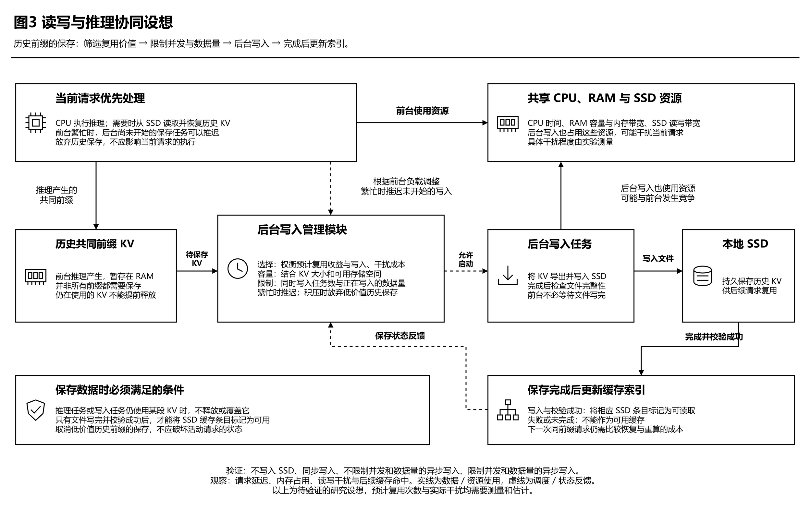

### 6.5 异步写调度设想

本研究拟设计一个后台写入管理模块，负责将有复用价值的历史前缀 KV 从 RAM 保存到 SSD，供后续请求使用。该模块记录 KV 的大小、预计后续复用情况，以及保存过程中所使用的内存缓冲区。为避免后台写入影响当前请求，系统将限制同时执行的写入任务数量和正在写入的数据总量。当当前请求需要读取缓存，或前台推理负载较高时，推迟尚未开始的保存任务。如果待保存的数据持续积压，可放弃部分尚未开始、复用价值较低的历史 KV 保存任务。对于仍被当前请求或写入任务使用的 KV，不能提前释放或覆盖。

在选择保存对象时，可将“预计未来复用次数 × 每次预计节省的时间 − 写入及其对前台请求的干扰成本”作为初步参考，再结合 KV 大小和可用存储容量确定保存优先级。预计复用次数可根据近期访问情况或应用提供的负载信息估计，但不能视为确定会发生的复用次数。写入开销和对前台请求的影响也需要通过测量估计，因此上述表达仅用于说明收益与成本的权衡，不代表已经建立了精确的预测模型。

由于保存任务的收益取决于未来请求，比当前请求是否值得读取缓存更难估计，第一阶段暂不设计复杂的复用预测方法，而是先比较不写入 SSD、同步写入、不限制写入并发和数据量的异步写入，以及限制写入并发和数据量的异步写入四种方式。实验将观察请求延迟、内存占用、读写干扰和后续缓存命中的变化，判断限制后台写入是否有实际收益。

图 3 读写与推理协同设想。后台写入管理模块根据预计复用收益、写入成本及当前负载，筛选和安排历史 KV 的保存任务，并限制写入并发和数据量。前台推理、缓存读取与后台写入可能竞争 CPU、RAM 和 SSD 资源；具体竞争关系、干扰程度及策略收益仍需通过实验验证。
