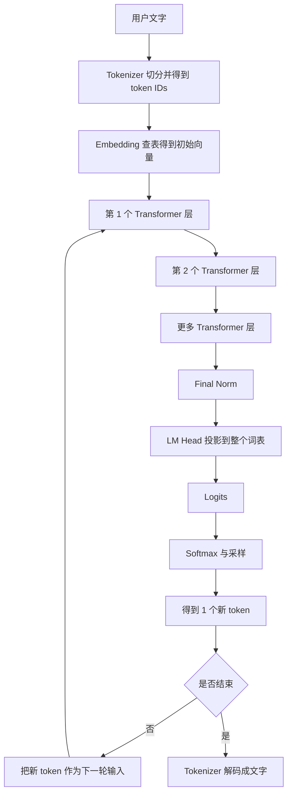
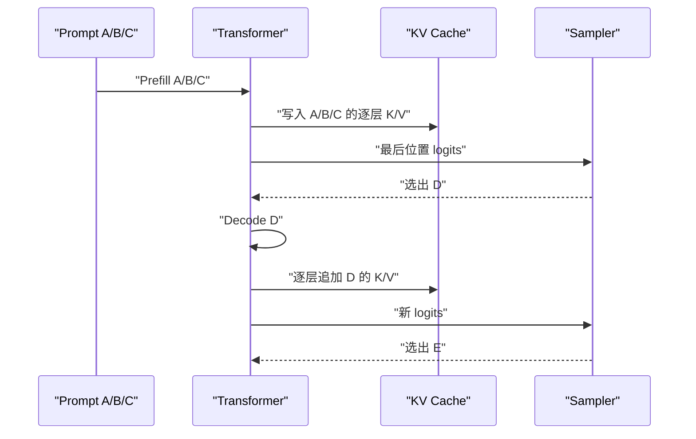
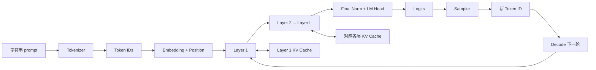

# Transformer 推理零基础教材

> 主题：从 token 到 logits、Prefill / Decode、KV cache 与显存
> 学习量：两个核心学习日 + 一个巩固日；每次“下午到晚上”约 6 小时，共约 18 小时
> 阅读对象：第一次系统学习大模型推理的人
> 本文采用现代 decoder-only 模型（接近 Llama 一类模型）的常见结构。不同模型会在细节上变化，但主流程相同。

---

## 0. 先说清楚：你学完到底要会什么

先不要要求自己会推论文，也不要背所有公式。两个核心学习日结束后，只要你能不用看资料回答下面 5 个问题，就算真正入门；第三日负责把这种理解练成可以稳定复述和计算的能力：

1. 一段文字进入模型以后，怎样一步步变成“下一个 token 的概率”？
2. 为什么模型生成一句话时，通常要一个 token、一个 token 地生成？
3. Prefill 和 Decode 分别在干什么？
4. KV cache 里面到底存了什么？它为什么能省计算？
5. 为什么上下文越长、并发请求越多，KV cache 越容易吃满显存？

整条主线先记成一句话：

```text
文字
  -> tokenizer 切成 token
  -> token ID 查表得到向量
  -> 多层 Transformer 反复处理
  -> 得到词表中每个候选 token 的分数 logits
  -> 按分数选出下一个 token
  -> 把新 token 接到原文后面，再来一轮
```

你现在看不懂其中任何一个词都没关系。下面会从“token 为什么不能直接拿整数计算”开始讲。

## 0.1 这份教材应该怎样读

这不是一本要求你从第一页一口气背到最后一页的词典。每个主题建议读三遍，而且三遍的任务不同：

### 第一遍：只找“它在干什么”

第一遍跳过推导，只看：

- 每章开头的生活化解释；
- 流程图和表格；
- 每章结尾的“一句话版本”；
- 完整故事中的数据流。

第一遍的目标不是会计算，而是脑中出现一条不断线的电影：文字怎样进去，token 怎样移动，cache 在什么时候生成，最后怎样吐出新 token。

### 第二遍：跟着数字手算

第二遍拿纸和笔，跟着例子写下每一步的输入与输出。遇到矩阵时，不问“我能不能推导一般公式”，只问：

```text
这一步原来有几排、每排几个数？
做完以后有几排、每排几个数？
这些新数字接下来拿去做什么？
```

### 第三遍：闭眼复述

合上正文，用自己的话讲。如果某一句只能背英文术语，不能讲出它的输入、动作和输出，就回到对应小节再看一遍。

例如，不要只背：

```text
Attention = softmax(QK^T / sqrt(d))V
```

应该能翻译成：

```text
先让当前 token 的 Q 和所有可见 token 的 K 打分，
把分数变成总和为 1 的权重，
再按照这些权重把各个 V 混合起来。
```

## 0.2 三个阅读标记

正文中可以按下面三个层次处理内容：

| 标记 | 你要怎么处理 |
|---|---|
| 必须理解 | 不一定背原句，但要能自己解释 |
| 建议手算 | 拿纸走一遍，算错也没有关系 |
| 暂时知道 | 第一次读知道它存在即可 |

公式不是门槛。每个公式都只是对一段中文步骤的压缩写法。先懂中文，再看公式。

## 0.3 全流程地图



图中 `D -> E -> F` 不是只处理一次。Prefill 时整段 prompt 通过这些层；Decode 时每个新 token 又逐层通过一遍。KV cache 就挂在每一个 Transformer 层的 Attention 旁边。

## 0.4 学习时允许自己暂时不会什么

前两天不要求：

- 会写 CUDA；
- 会证明 softmax；
- 会从零实现 tokenizer；
- 会背所有模型的具体层数和维度；
- 会解释 MLA、FlashAttention、PagedAttention 的全部工程细节；
- 会精确分析每个 kernel 的时间复杂度。

前两天必须做到：

- 每个名词都知道它是一段文字、一个编号、一组向量，还是模型参数；
- 每一步都知道输入来自哪里，输出去了哪里；
- 能清楚区分“算过了所以缓存”和“模型天生就有的参数”；
- 能亲手算出一个简单配置的 KV cache 大小。

---

# 第一日：从文字走到下一个 token

## 第一日下午到晚上的安排

| 时间 | 内容 | 最低产出 |
|---|---|---|
| 14:00-14:40 | 第 1 章：模型、参数、向量、张量 | 能说清“模型不是数据库” |
| 14:50-15:40 | 第 2-3 章：tokenization 与 embedding | 手算一次 token 查表 |
| 15:50-16:40 | 第 4 章：位置与 RoPE | 说清为什么必须有位置信息 |
| 17:00-18:30 | 第 5-6 章：Transformer 层与 Attention | 跟着例子算一次注意力 |
| 19:30-20:30 | 第 7-8 章：MLP、残差、归一化 | 画出一个 Transformer 层 |
| 20:40-21:30 | 第 9 章：logits 与采样 | 解释温度在改变什么 |
| 21:30-22:00 | 第一日复述与练习 | 不看正文完成 6 道题 |

建议：每学 50 分钟休息 10 分钟。遇到公式时，先读公式下面的中文，不要在一个符号上卡半小时。

---

## 1. 大模型究竟是什么

### 1.1 先把“模型”想成一个巨大函数

在推理阶段，大模型最核心的工作可以写成：

```text
已经出现的 token 序列 -> 下一个 token 的分数
```

例如输入：

```text
今天天气很
```

模型可能给出：

| 候选 token | 原始分数（logit） |
|---|---:|
| 好 | 8.2 |
| 冷 | 7.1 |
| 热 | 6.8 |
| 苹果 | -1.3 |

它不是先在某个句子仓库里搜索完整答案，而是根据当前上下文，计算“下一个位置上每个候选 token 应该得多少分”。

生成“好”以后，输入变成：

```text
今天天气很好
```

模型再计算下一个 token。这个过程不断重复，最后才形成一整段话。

### 1.2 参数是什么

模型内部有大量数字，例如 70 亿参数模型大约有 70 亿个训练得到的数字。参数主要装在许多矩阵里。

你可以暂时把参数理解为模型训练后留下来的“计算规则”。推理时：

- 参数通常固定不变；
- 输入不同，中间计算结果不同；
- 模型用相同参数处理每一次请求。

必须区分两类东西：

| 名称 | 是什么 | 推理时会不会随输入改变 |
|---|---|---|
| 参数 / 权重 | 训练得到的长期数字 | 通常不变 |
| 激活值 | 当前输入经过某一步得到的中间结果 | 会改变 |

KV cache 属于第二类：它是当前请求产生的中间结果，不是模型永久学到的参数。

### 1.3 向量、矩阵和张量是什么

不要被名字吓到：

- 一个数字，例如 `3.2`，叫标量；
- 一排数字，例如 `[0.2, -1.1, 0.7]`，叫向量；
- 很多排整齐放在一起，叫矩阵；
- 更高维的数字盒子，统称张量。

例如一句话有 4 个 token，每个 token 用 8 个数字表示，可以排成：

```text
形状（shape） = [4, 8]
                 |  |
                 |  每个 token 有 8 个数字
                 一共有 4 个 token
```

真实模型里的每个 token 往往不是 8 个数字，而可能是 4096 个、5120 个或更多。这里的 8 只是为了让例子能写出来。

“shape”非常重要。以后看到：

```text
[batch, sequence_length, hidden_size]
```

可以逐项翻译成：

```text
[一次处理几条句子, 每条有几个 token, 每个 token 用几个数字表示]
```

### 1.4 矩阵乘法在做什么

对入门来说，可以把矩阵乘法理解成“把旧的一组数字按权重混合成新的一组数字”。

假设输入向量是：

```text
x = [2, 3]
```

我们想生成两个新数字：

```text
第一个新数字 = 2 × 1 + 3 × 10 = 32
第二个新数字 = 2 × 2 + 3 × 20 = 64
```

对应的权重矩阵可以写成：

```text
W = [[1,  2],
     [10, 20]]
```

于是 `xW = [32, 64]`。

真实模型做的事情规模大得多，但本质仍然是：按训练好的权重，把输入数字重新组合。

### 1.4.1 矩阵乘法为什么能“改变表示方式”

假设一个人的信息原来用两个数字表示：

```text
x = [身高, 体重]
```

我们可以通过不同权重生成新的观察角度，例如：

```text
新特征1 = 0.5 × 身高 + 0.2 × 体重
新特征2 = 1.0 × 身高 - 0.8 × 体重
```

新特征不再单独等于身高或体重，而是旧信息的组合。神经网络中的线性层也做类似事情，只是：

- 输入可能有 4096 个维度；
- 输出也可能有几千或几万个维度；
- 每个组合系数不是人手写，而是训练得到；
- 这些数字不一定能被人类命名成“身高”这样单一的概念。

同一个隐藏向量乘不同矩阵，会得到不同用途的表示。这正是一个 token 能从同一份 `x` 分别产生 Q、K、V 的根本原因：

```text
同一个 x
  × W_Q -> 适合拿去“提问”的 Q
  × W_K -> 适合拿去“被匹配”的 K
  × W_V -> 适合拿去“提供内容”的 V
```

如果三者完全相同，模型就不能分别学习“怎样匹配”和“匹配后交付什么信息”。

### 1.4.2 Shape 是矩阵世界里的尺寸标签

矩阵乘法有一个最基本的尺寸规则：

```text
[A, B] × [B, C] -> [A, C]
```

中间两个 `B` 必须相同，并在乘法中被“消掉”。

例如：

```text
3 个 token，每个 token 4 个数
X shape = [3, 4]

权重把 4 维转换成 6 维
W shape = [4, 6]

XW shape = [3, 6]
```

逐句翻译：每个 token 原来有 4 个特征；同一组权重对 3 个 token 分别工作；每个 token 最后得到 6 个新特征。Token 数没有因为这次线性投影而改变。

建议手算一个极小例子：

```text
X = [[1, 2],
     [3, 4]]

W = [[10, 100, 1000],
     [20, 200, 2000]]
```

第一排 `[1, 2]` 乘 W：

```text
[1×10 + 2×20,
 1×100 + 2×200,
 1×1000 + 2×2000]
= [50, 500, 5000]
```

第二排 `[3, 4]`：

```text
[3×10 + 4×20,
 3×100 + 4×200,
 3×1000 + 4×2000]
= [110, 1100, 11000]
```

结果：

```text
XW = [[ 50,  500,  5000],
      [110, 1100, 11000]]
```

原 shape `[2, 2]`，乘 `[2, 3]` 后得到 `[2, 3]`。两排仍对应两个 token，每排从 2 个数字变成 3 个数字。

### 1.4.3 Batch 又多出哪一维

一次只处理一句话时，可以把输入想成：

```text
[sequence_length, hidden_size]
```

一次并行处理多条序列时，前面加一维 batch：

```text
[batch_size, sequence_length, hidden_size]
```

例如：

```text
[8, 128, 4096]
```

表示一次处理 8 条序列，每条当前按 128 个位置组织，每个位置是 4096 维向量。

Batch 不等于把 8 句话首尾拼成一句。它们在逻辑上仍是 8 条独立序列，通常有各自的 causal mask、位置和 KV cache。

### 1.4.4 参数、激活和缓存可以用“谁活多久”区分

| 数据 | 什么时候产生 | 通常活多久 | 例子 |
|---|---|---|---|
| 参数 | 训练阶段学到 | 模型加载期间一直在 | `W_Q`、`W_K`、embedding 表 |
| 临时激活 | 当前前向计算产生 | 某个操作或某层结束后可释放 | QK 分数、MLP 中间值 |
| KV cache | Prefill / Decode 产生 | 当前请求生成期间持续保留 | 各层历史 K/V |

为什么 QK 注意力分数通常不用像 KV 一样长期保存？因为下一 token 会产生新的 Q，注意力分数也会随之改变；而历史 K/V 会被后续每个新 Q 反复使用。

### 1.4.5 FP32、FP16、BF16 先理解为“每个数装多大”

计算机保存小数需要指定格式。入门阶段先记：

```text
FP32：每个数 4 字节
FP16 / BF16：每个数 2 字节
FP8 / INT8：每个数主体约 1 字节
```

位数越少通常越省存储、搬运更快，但能表示的精细程度或范围会受限制。模型权重、激活、KV cache 可以使用不同格式，因此不能听到“模型是 4-bit”就推断所有中间数据都是 4-bit。

### 1.4.6 本节一句话版本

> 神经网络把每个 token 表示成一排数字，再用许多训练好的矩阵不断重新组合这些数字；shape 只是在记录当前有多少组数据、每组有多少维。

### 1.5 训练和推理不要混在一起

| 阶段 | 主要任务 | 参数是否更新 |
|---|---|---|
| 训练 | 看大量数据，计算错误，调整参数 | 更新 |
| 推理 | 使用已经训练好的参数生成结果 | 不更新 |

本文只讲推理。你会看到很多计算，但不会讲反向传播、梯度和优化器。

---

## 2. Tokenization：文字为什么要先切成 token

### 2.1 计算机不能直接把“猫”送进矩阵

神经网络只会处理数字。因此第一步要把文字变成离散编号。

假设我们有一个极小词表：

| token | token ID |
|---|---:|
| 我 | 0 |
| 爱 | 1 |
| 猫 | 2 |
| 狗 | 3 |
| 。 | 4 |

输入：

```text
我爱猫。
```

经过 tokenizer 后可能得到：

```text
token:    [我, 爱, 猫, 。]
token ID: [0,  1,  2,  4]
```

Tokenizer 是“切分文字并查编号表”的程序；模型主体接收的是 token ID，不是原始字符串。

### 2.2 Token 不一定等于字或单词

真实 tokenizer 可能把内容切成：

- 一个汉字一个 token；
- 常见词组一个 token；
- 生僻词拆成多个 token；
- 英文单词、词根、空格和标点的组合；
- 代码中的缩进、符号或片段。

所以：

```text
token 数量 != 字数 != 单词数
```

同一句话，用不同模型的 tokenizer，token 数可能不同。模型与 tokenizer 必须配套，否则同一个 ID 代表的内容会错位。

### 2.3 特殊 token

词表中还会有一些不直接对应普通文字的 token，例如：

- BOS：序列开始；
- EOS：序列结束；
- PAD：为了批量处理而补齐长度；
- 对话模板中的 system、user、assistant 边界 token。

模型生成 EOS，通常意味着“我认为该结束了”。推理程序会据此停止生成。

### 2.4 第一处常见误解

错误理解：token ID 越大，含义越强。

正确理解：token ID 只是编号。ID `500` 不比 ID `20` 更大、更重要，就像电话号码大不代表人更高。

因此不能把 token ID `500` 当作一个有语义大小的数字直接送入 Transformer。下一步必须做 embedding。

### 2.5 Tokenizer 大致怎样学会切分：一个玩具版 BPE

不同模型会使用不同 tokenizer 算法。这里用极度简化的 BPE 直觉说明“为什么常见片段可能合成一个 token”。

假设训练文本里反复出现：

```text
low
lower
lowest
```

最初可以粗暴地拆成字符：

```text
l o w
l o w e r
l o w e s t
```

统计后发现 `l` 和 `o` 经常相邻，于是合并成 `lo`：

```text
lo w
lo w e r
lo w e s t
```

又发现 `lo` 和 `w` 经常相邻，再合并成 `low`：

```text
low
low e r
low e s t
```

经过许多轮高频合并，常见片段可能成为一个 token，少见词仍会拆成多个片段。真实算法、预分词方式和词表训练更复杂，但这个例子说明了三个事实：

1. Tokenizer 不是简单按空格切词；
2. 高频片段往往能用更少 token 表示；
3. 新词不一定变成“未知词”，可以拆成已有小片段。

### 2.6 为什么空格和标点也会影响 token

Tokenizer 处理的是精确字符串。下面几段在人眼看来接近，但 tokenization 可能不同：

```text
Hello
 Hello
Hello!
hello
```

前导空格、大小写、换行和标点都可能改变切分。这个细节以后会直接影响 prefix caching：只有 token 前缀完全一致，之前算出的 K/V 才能直接复用。

### 2.7 聊天消息会先被套上 Chat Template

用户界面里看到的是：

```text
用户：你好
助手：
```

真正送给 tokenizer 前，推理框架通常会按照模型要求拼成某种模板。概念上可能类似：

```text
<BOS><SYSTEM>你是一个助手</SYSTEM>
<USER>你好</USER>
<ASSISTANT>
```

具体格式因模型而异。模型在训练时见过特定模板，因此推理也要使用匹配模板。模板错误可能导致：

- 模型分不清用户和助手；
- 输出格式异常；
- 提前结束或不停续写；
- 相同可见文字得到不同 token 前缀；
- prefix cache 无法命中。

### 2.8 Tokenizer 在输出端还要做逆过程

模型每一步输出的是 token ID。Tokenizer 还要把这些 IDs 解码回字符串：

```text
[527, 91, 2048] -> 若干 token 片段 -> 最终文字
```

有些 token 只是半个字符或字节片段，因此流式输出系统可能要等几个 token 才能安全显示一个完整字符。用户看到的“一个字一个字出现”不保证底层每次恰好生成一个汉字。

### 2.9 Tokenization 本节一句话版本

> Tokenizer 按模型自己的词表和规则，把精确字符串变成类别编号；空格、模板和标点都可能影响编号序列，而 Transformer 从编号序列开始工作。

---

## 3. Embedding：把编号变成有表达能力的向量

### 3.1 Embedding 本质是一张大表

假设词表有 5 个 token，每个 token 用 4 个数字表示。Embedding 表可能长这样：

| token ID | token | 对应向量 |
|---:|---|---|
| 0 | 我 | `[0.2, 0.8, -0.1, 0.5]` |
| 1 | 爱 | `[0.7, -0.2, 0.9, 0.1]` |
| 2 | 猫 | `[0.6, 0.4, -0.5, 0.8]` |
| 3 | 狗 | `[0.5, 0.3, -0.4, 0.7]` |
| 4 | 。 | `[-0.2, 0.1, 0.2, -0.6]` |

输入 ID `[0, 1, 2]` 时，embedding 层做的是查第 0、1、2 行：

```text
我 -> [0.2,  0.8, -0.1, 0.5]
爱 -> [0.7, -0.2,  0.9, 0.1]
猫 -> [0.6,  0.4, -0.5, 0.8]
```

最终得到形状 `[3, 4]` 的矩阵：3 个 token，每个 token 4 个数字。

### 3.2 为什么一个 token 要用很多数字表示

一个数字只能表达一条轴上的大小，很难同时承载多种关系。向量的许多维度共同工作，可以让模型逐渐表示：

- 词义和语法角色；
- 当前上下文中的指代；
- 句子结构；
- 与前文信息的关系；
- 对下一 token 有用的各种特征。

不能简单地说“第 17 维就是性别，第 203 维就是情感”。真实模型中的意义通常分散在许多维度里，而且经过每一层后都会变化。

### 3.3 Embedding 之后的向量还不是最终语义

Embedding 查到的是 token 的初始表示。同一个“苹果”出现在“吃苹果”和“苹果公司”里，初始向量相同；经过 Transformer 读取周围上下文后，它们的中间向量才会变得不同。

这个会随上下文变化的向量，常叫 hidden state（隐藏状态）。“隐藏”只表示它是模型内部的中间数字，不表示神秘或不可读取。

### 3.4 为什么“查表”也可以看作矩阵乘法

假设词表只有 5 个 token，token ID 2 可以写成 one-hot 向量：

```text
[0, 0, 1, 0, 0]
```

只有第 2 号位置为 1，其余为 0。把它乘 embedding 矩阵：

```text
[0, 0, 1, 0, 0] × EmbeddingMatrix
```

结果恰好就是 embedding 矩阵的第 2 行，因为其他行都乘了 0，第 2 行乘了 1。

真实实现不会真的创建一个巨大 one-hot 向量再乘矩阵，因为直接按 ID 取对应行更快、更省内存。但这个等价关系说明 embedding 不是魔法，它仍然是参数矩阵的一种使用方式。

### 3.5 初始 embedding 和上下文化 hidden state 的区别

用同一个 token“苹果”举例：

```text
句子 A：我吃了一个苹果。
句子 B：苹果发布了新电脑。
```

刚查 embedding 表时，两处“苹果”的初始向量相同。进入层以后：

1. Attention 让“苹果”读取周围 token；
2. 句子 A 中它读取到“吃”“一个”；
3. 句子 B 中它读取到“发布”“电脑”；
4. 两处 hidden state 逐层变得不同；
5. 最终它们对后续 token 的预测也不同。

所以模型并不是在 embedding 表里提前存好每个词的所有含义。Embedding 是起点，上下文理解发生在后续层中。

### 3.6 Embedding 表有多大

假设：

```text
vocab_size = 100,000
hidden_size = 4096
```

Embedding 参数量：

```text
100,000 × 4096 = 409,600,000 个参数
```

如果每个参数用 2 字节保存，单这张表理论上约占：

```text
409,600,000 × 2 = 819,200,000 字节
约 781 MiB
```

有些模型让输入 embedding 和输出 LM Head 共用同一张权重表，可以减少参数；有些模型分别使用两张。这里只是帮助你建立数量级感，不需要记住这个例子的数字。

### 3.7 Embedding 本节一句话版本

> Embedding 用 token ID 从一张训练得到的大表中取出初始向量；相同 token 起点相同，但经过 Attention 读取不同上下文后，会形成不同的 hidden state。

---

## 4. 位置信息与 RoPE：模型怎么知道先后顺序

### 4.1 只有 token 向量还不够

下面两句话 token 相同，但顺序不同：

```text
狗 咬 人
人 咬 狗
```

如果模型只拿到三个 token 向量，却不知道谁在第 1、2、3 个位置，就很难区分两句话。

注意力计算本身只根据向量之间的匹配程度工作，所以必须显式加入位置信息。

### 4.2 两种常见思路

早期 Transformer 常把一个位置向量加到 token embedding 上。现代很多 decoder-only 模型使用 RoPE（Rotary Positional Embedding，旋转位置编码）。

你暂时只需抓住 RoPE 的核心：

```text
根据 token 所在位置，旋转它的 Q 和 K；
不同位置产生不同旋转角度；
两个位置之间的相对距离会影响 Q 与 K 的匹配结果。
```

### 4.3 “旋转”到底是什么意思

先看二维平面中的向量 `[x, y]`。把它旋转角度 `θ` 后：

```text
x' = x cosθ - y sinθ
y' = x sinθ + y cosθ
```

比如 `[1, 0]` 旋转 90 度后变成 `[0, 1]`。向量长度没变，但方向变了。

RoPE 会把 Q、K 的维度两两分组，在多个二维平面上按位置旋转。不同维度组的旋转速度不同，因此既能表示近距离，也能帮助表示更长距离。

### 4.4 为什么通常旋转 Q 和 K，不旋转 V

注意力中：

- Q 和 K 决定“应该关注谁”；
- V 提供“从被关注对象那里取回什么内容”。

位置主要需要影响匹配关系，因此 RoPE 通常施加在 Q、K 上。后面讲 KV cache 时要记住：缓存的 K 通常是已经应用位置变换后的 K。

### 4.5 现在不用深究什么

现在不需要推导复数形式，也不需要研究 RoPE 外推、NTK scaling 或 YaRN。此时只要会说：

> RoPE 通过按位置旋转 Q 和 K，让注意力分数包含位置信息，尤其体现 token 之间的相对位置关系。

### 4.6 为什么旋转后能体现“相隔多远”

假设相同基础向量在位置 1 旋转 10 度，在位置 3 旋转 30 度。比较两个旋转后向量时，它们之间的角度差是 20 度。位置整体往后平移：位置 11 旋转 110 度，位置 13 旋转 130 度，角度差仍是 20 度。

这就是相对位置直觉：匹配结果不仅知道“你在第 3 个位置”，还自然包含“你和我相隔 2 个位置”。

更压缩的数学说法是：

```text
位置 m 的 Q：R(mθ)q
位置 n 的 K：R(nθ)k

两者点积会与角度差 (n-m)θ 有关
```

你不需要推导旋转矩阵，只要理解位置差进入了 Q/K 的匹配关系。

### 4.7 Decode 时位置编号不能从零重新开始

Prompt 有 5 个 token，位置可以编号为：

```text
0, 1, 2, 3, 4
```

第一个生成 token 的位置必须接着是 5，下一 token 是 6。虽然 Decode 每次物理上只输入一个新 token，但它在逻辑序列中的 position ID 不能每次都写 0。

否则新 token 的 Q/K 会应用错误旋转，模型会误解它与历史 token 的相对位置。

### 4.8 为什么 cache 里的 K 通常已经带位置

历史 token 的 K 在首次计算时已经根据它的位置应用了 RoPE。以后新 Q 查询历史 K 时，直接读取这个“带位置的 K”即可。

如果缓存未旋转 K，那么每次 Decode 读取历史 K 后都要重新做相同的位置变换，失去一部分复用意义。具体框架可能有实现差异，但现代 RoPE 模型的常见逻辑是缓存已经应用 RoPE 的 K 和原本的 V。

### 4.9 RoPE 本节一句话版本

> 每个位置让 Q/K 按不同角度旋转，Q 和 K 的角度差使注意力感知相对距离；Decode 时新 token 必须使用接续历史的正确位置编号。

---

## 5. 一个 Transformer 层长什么样

现代 decoder-only 模型会把相似的层重复很多次，例如 32 层、40 层或 80 层。以常见的 Pre-Norm 结构为例，一个层大致做：

```text
输入 x
  -> 归一化
  -> Self-Attention
  -> 与原输入相加（残差连接）
  -> 再归一化
  -> MLP
  -> 再与原输入相加（残差连接）
  -> 本层输出
```

公式可以压缩成：

```text
h = x + Attention(Norm(x))
y = h + MLP(Norm(h))
```

这里的 `y` 会成为下一层的 `x`。

每层分工可以先这样理解：

| 部件 | 最核心的作用 |
|---|---|
| Self-Attention | 让当前 token 从其他可见 token 中读取信息 |
| MLP | 对每个 token 自己的特征做更复杂的变换 |
| Norm | 控制数值尺度，让计算更稳定 |
| Residual | 保留原信息，同时叠加新变化 |

Attention 负责 token 之间交流；MLP 不让不同位置直接交流，它只处理每个位置自身的向量。

---

## 6. Self-Attention：整条流程里最关键的一步

### 6.1 为什么需要 Attention

输入：

```text
小明把书放在桌上，因为它很重。
```

模型处理“它”时，需要从前文寻找与当前任务有关的信息。Self-Attention 就是让每个 token 根据当前需要，计算自己应该从哪些历史 token 获取多少信息。

“关注”不是一个开关，而是一组权重。例如：

```text
书：0.55
桌：0.25
小明：0.10
其他：0.10
```

### 6.2 Q、K、V 分别是什么

每个 token 的隐藏向量会经过三组不同的权重矩阵，生成：

```text
Q = x W_Q
K = x W_K
V = x W_V
```

Q、K、V 都是向量。名称来自 Query、Key、Value。

一个不完全准确但很好用的入门比喻：

- Q（查询）：我现在想找什么信息？
- K（键）：我这里有什么类型的信息，可以怎样被匹配？
- V（值）：如果你关注我，我实际贡献什么内容？

必须注意：Q、K、V 不是人写的文本标签，也不是数据库里的字符串键值对。它们都是模型用矩阵乘法算出来的一排浮点数。

同一个 token 会同时产生 Q、K、V，但三者用途不同。

### 6.3 第一步：用 Q 和 K 算匹配分数

当前 token 的 Q 与每个可见 token 的 K 做点积。

点积就是对应位置相乘再相加：

```text
[a, b] · [c, d] = ac + bd
```

例如：

```text
Q = [1, 2]
K = [3, 4]
点积 = 1×3 + 2×4 = 11
```

点积通常越大，表示这个 Q 与这个 K 在当前模型空间中越匹配。

实际公式会除以 `sqrt(d_head)`：

```text
score = (Q · K) / sqrt(d_head)
```

原因是维度越多，点积数值通常越容易变大。缩放可以避免后面的 softmax 过早变得极端。

再往底层走一步：如果 Q/K 每个维度都是均值接近 0、波动大小相近的数，点积是 `d_head` 项乘积的累加。累加项越多，结果的波动范围通常越大，其标准差大约按 `sqrt(d_head)` 增长。

例如维度从 4 增到 64，点积波动不会只保持原样。大正数和大负数更常出现，softmax 容易变成：

```text
[0.9999, 0.0001, 接近 0, ...]
```

这会让概率过于饱和，较小分数几乎没有影响，训练中的梯度也可能不理想。除以 `sqrt(d_head)` 是把不同 head 维度下的分数拉回较稳定的尺度。

为什么不是除以 `d_head`？因为点积随机波动的标准差通常按平方根增长，而不是按维度本身增长。这是缩放点积注意力中 `sqrt(d_head)` 的来源直觉。

### 6.4 第二步：加上因果遮罩 Causal Mask

模型生成第 3 个 token 时，不能偷看第 4 个 token。训练时虽然整句话已知，也必须遮住未来位置，保持和生成阶段相同的因果规则。

4 个 token 的可见关系可以写成：

```text
            被关注的位置
          1    2    3    4
当前位置1  可   禁   禁   禁
当前位置2  可   可   禁   禁
当前位置3  可   可   可   禁
当前位置4  可   可   可   可
```

实现时，禁止关注的位置会加上一个非常大的负数，可近似理解为负无穷。经过 softmax 后，其权重接近 0。

这就是 decoder-only 模型中的“causal”：每个位置只能根据自己和过去预测未来。

### 6.5 第三步：Softmax 把分数变成权重

假设某个 token 对三个位置的分数是：

```text
[2, 1, 0]
```

Softmax 会把它们变成：

```text
[0.665, 0.245, 0.090]
```

它有两个重要性质：

- 所有权重都大于 0；
- 所有权重相加等于 1。

Softmax 的公式是：

```text
softmax(s_i) = exp(s_i) / sum(exp(s_j))
```

现在不必手算指数函数。你只需知道：原始分数相差一点，softmax 后会形成“更关注谁、少关注谁”的比例。

### 6.6 第四步：用权重混合 V

假设三个 token 的 V 是：

```text
V1 = [1, 0]
V2 = [0, 2]
V3 = [3, 1]
```

注意力权重是：

```text
[0.665, 0.245, 0.090]
```

那么输出为：

```text
0.665 × V1 + 0.245 × V2 + 0.090 × V3

= 0.665 × [1,0] + 0.245 × [0,2] + 0.090 × [3,1]
= [0.935, 0.580]（近似值）
```

这一步的意义是：当前 token 按相关程度，从多个 token 的 V 中取回并混合信息。

### 6.7 把四步合成一个公式

```text
Attention(Q, K, V)
  = softmax(QK^T / sqrt(d_head) + causal_mask) V
```

逐字翻译：

1. `QK^T`：每个 Q 与每个 K 算匹配分数；
2. `/ sqrt(d_head)`：把分数缩放到合适范围；
3. `+ causal_mask`：把未来位置封死；
4. `softmax`：变成总和为 1 的注意力权重；
5. 最后乘 `V`：按权重取回内容。

这条公式不是新的五件事，只是把刚才四小节压缩写在一行。

### 6.8 什么叫 Self-Attention

“Self”表示 Q、K、V 都来自同一个序列自己的隐藏状态。

在 decoder-only LLM 中，模型主要使用带因果遮罩的 self-attention。其他模型还可能有 cross-attention，即 Q 来自一个序列，K/V 来自另一个序列，但这不是本文主线。

### 6.9 为什么要多头 Multi-Head

一个注意力头只有一种 Q/K/V 投影空间。多个头允许模型并行学习不同的匹配方式，例如某些头更关注近邻语法，某些头更容易追踪长距离实体。不要把这些例子当作固定分工；真实头的作用通常更混合。

假设：

```text
hidden_size = 4096
query heads = 32
每个 head 的维度 d_head = 128
```

因为：

```text
32 × 128 = 4096
```

每个头分别完成注意力，结果拼接，再经过输出投影 `W_O`，回到模型的 hidden size。

### 6.10 Attention 为什么在长文本上贵

Prefill 一次处理 T 个 token 时，每个 token 都要与它之前的许多 token 比较。匹配分数矩阵大致是 `T × T`。

如果 T 从 1000 增加到 2000：

```text
1000² = 1,000,000
2000² = 4,000,000
```

长度只翻倍，注意力配对数约变为 4 倍。这就是标准 attention 常被说成对序列长度具有平方复杂度的原因。

但不要误解为整个模型所有计算都只由 `T²` 决定。线性投影和 MLP 也很贵，具体瓶颈取决于模型大小、序列长度、硬件和实现。

### 6.11 完整手算：三个 token 怎样做一次 Attention

这一节建议拿纸跟着抄。为了数字简单，我们只看：

```text
3 个 token：A、B、C
1 个 attention head
每个 Q/K/V 只有 2 维
暂时把缩放因子当作 1
```

假设某层已经算出了：

```text
Q_A = [1, 0]    K_A = [1, 0]    V_A = [1, 0]
Q_B = [0, 1]    K_B = [0, 1]    V_B = [0, 2]
Q_C = [1, 1]    K_C = [1, 1]    V_C = [3, 1]
```

把三排放成矩阵：

```text
Q = [[1, 0],
     [0, 1],
     [1, 1]]

K = [[1, 0],
     [0, 1],
     [1, 1]]

V = [[1, 0],
     [0, 2],
     [3, 1]]
```

三者 shape 都是：

```text
[token 数, head_dim] = [3, 2]
```

#### 第一步：为什么是 `QK^T`

Q 是 `[3, 2]`，我们希望每一个 Q 都与三个 K 比较，得到 `3 × 3` 张分数表。

原 K 是 `[3, 2]`，转置后 `K^T` 是 `[2, 3]`：

```text
[3, 2] × [2, 3] -> [3, 3]
   Q        K^T      分数表
```

计算结果：

```text
QK^T =

[[Q_A·K_A, Q_A·K_B, Q_A·K_C],
 [Q_B·K_A, Q_B·K_B, Q_B·K_C],
 [Q_C·K_A, Q_C·K_B, Q_C·K_C]]

= [[1, 0, 1],
   [0, 1, 1],
   [1, 1, 2]]
```

每一排都代表“当前位置的 Q 对所有 K 的分数”：

| 当前 Query | 看 A 的 K | 看 B 的 K | 看 C 的 K |
|---|---:|---:|---:|
| A | 1 | 0 | 1 |
| B | 0 | 1 | 1 |
| C | 1 | 1 | 2 |

#### 第二步：应用 causal mask

A 不能看未来的 B、C；B 不能看未来的 C；C 可以看全部：

```text
mask 后分数 =

[[1,  -∞, -∞],
 [0,   1, -∞],
 [1,   1,  2]]
```

注意 A 对 C 原始分数虽然是 1，但 C 是未来位置，必须强制封死。Causal mask 的优先级高于“它们看起来很匹配”。

#### 第三步：每一排分别做 softmax

第一排：

```text
softmax([1, -∞, -∞]) = [1, 0, 0]
```

A 只能读取自己。

第二排：

```text
softmax([0, 1, -∞]) ≈ [0.269, 0.731, 0]
```

B 约用 26.9% 权重读 A，73.1% 权重读自己。

第三排：

```text
softmax([1, 1, 2]) ≈ [0.212, 0.212, 0.576]
```

C 对 A、B 各约 21.2%，对自己约 57.6%。

得到完整权重矩阵：

```text
P = [[1.000, 0.000, 0.000],
     [0.269, 0.731, 0.000],
     [0.212, 0.212, 0.576]]
```

每一排之和都是 1。Softmax 是按 Query 的每一排分别做，不是把整张 3×3 表一起变成总和 1。

#### 第四步：权重矩阵乘 V

```text
输出 O = PV

[3, 3] × [3, 2] -> [3, 2]
```

A 的输出：

```text
O_A = 1.000V_A
    = [1, 0]
```

B 的输出：

```text
O_B = 0.269V_A + 0.731V_B
    = 0.269[1,0] + 0.731[0,2]
    = [0.269, 1.462]
```

C 的输出：

```text
O_C = 0.212V_A + 0.212V_B + 0.576V_C
    = 0.212[1,0] + 0.212[0,2] + 0.576[3,1]
    = [1.940, 1.000]
```

最终：

```text
O = [[1.000, 0.000],
     [0.269, 1.462],
     [1.940, 1.000]]
```

这三排分别是 A、B、C 从可见 V 中读取信息后的新表示。

真实计算还会把分数除以 `sqrt(d_head)`。这里为了让 softmax 数字容易看，临时把缩放看作 1；加上缩放不会改变步骤和 shape，只会改变权重的具体数值。

### 6.12 这次手算中，信息到底发生了什么变化

最开始 B 自己的 V 是：

```text
V_B = [0, 2]
```

Attention 后 B 得到：

```text
O_B = [0.269, 1.462]
```

它不再只含自己的 V，而是混入了 A 的一部分信息。C 的输出则混入 A、B、C 三个位置的信息。

因此 Attention 不是简单找出“最相关的一个词”，而是可以按连续权重混合多个来源。不同 head、不同层还会使用不同投影和权重，形成更丰富的信息流。

### 6.13 从 hidden state 拆成多个 head

假设：

```text
batch = 2
sequence_length = 5
hidden_size = 8
num_heads = 2
head_dim = 4
```

开始的 hidden states：

```text
X shape = [2, 5, 8]
```

乘 `W_Q` 后仍可先看成：

```text
Q shape = [2, 5, 8]
```

因为 `8 = 2 heads × 4 dims`，把最后一维拆开：

```text
Q shape = [2, 5, 2, 4]
          [B, T, H, D]
```

为了让每个 head 独立做矩阵乘法，常交换维度：

```text
Q shape = [2, 2, 5, 4]
          [B, H, T, D]
```

K、V 做类似变化。每个 head 内：

```text
Q [T, D] × K^T [D, T] -> scores [T, T]
scores [T, T] × V [T, D] -> output [T, D]
```

所有 head 完成后，再把 `[H, D]` 合回 `H×D`：

```text
[B, H, T, D]
  -> 调整回 [B, T, H, D]
  -> 拼接为 [B, T, H×D]
  -> [B, T, hidden_size]
```

最后乘 `W_O`，让不同 heads 的信息重新混合，并回到残差连接要求的 hidden size。

### 6.14 Attention 全程 shape 账本

MHA 情况下，可以记这张表：

| 数据 | 逻辑 shape | 它表示什么 |
|---|---|---|
| X | `[B, T, d_model]` | 每个 token 当前的隐藏向量 |
| Q/K/V | `[B, H, T, d_head]` | 分头后的查询、键、值 |
| `QK^T` | `[B, H, T, T]` | 每个 head 中每个位置对每个位置的分数 |
| Softmax 权重 | `[B, H, T, T]` | 每排总和为 1 的读取比例 |
| 加权 V | `[B, H, T, d_head]` | 每个 head 的读取结果 |
| 拼接 heads | `[B, T, H×d_head]` | 把各头结果放回一起 |
| `W_O` 后 | `[B, T, d_model]` | 可与残差中的 X 相加 |

这里也解释了为什么残差两边必须 shape 相同：不能直接把 `[B,T,4096]` 和 `[B,T,128]` 相加。

### 6.15 为什么 Q/K 负责“地址”，V 负责“内容”只是比喻

数据库里一个 key 通常精确对应一个 value；Attention 不一样：

- 一个 Q 同时与许多 K 算连续分数；
- Softmax 后可以读取许多 V 的混合；
- K/V 都是根据当前层 hidden state 动态计算的；
- 下一层还会重新生成全新的 Q/K/V。

所以比喻只帮助记忆角色，不要进一步推导成“模型在数据库里查关键词”。

### 6.16 Attention 本节一句话版本

> 每层把 token 的 hidden state 投影成 Q/K/V；每个 Q 对可见 K 打分，mask 掉未来，softmax 得到读取比例，再混合 V。多头只是让这套匹配在多个子空间并行发生。

---

## 7. Norm、Residual 和 MLP 在做什么

### 7.1 RMSNorm：控制数值尺度

很多现代模型使用 RMSNorm。它大致会根据向量各维度的均方根调整整体尺度：

```text
RMS(x) = sqrt(mean(x_i²) + epsilon)
输出 = x / RMS(x) × 可学习缩放参数
```

直觉上：如果某层输入整体数值突然特别大，后续点积和激活函数容易不稳定。Norm 把数值拉回更可控的范围。

Norm 不是把每个 token 变成同一个向量，也不会删除全部大小信息，因为还有可学习缩放参数和方向信息。

### 7.2 Residual：给信息留一条直路

残差连接是：

```text
输出 = 原输入 + 某个模块算出的变化
```

例如：

```text
h = x + Attention(Norm(x))
```

可以把它理解成：不要让 Attention 从零重写全部内容，只让它在原表示上添加修正。这样信息更容易跨越很多层流动，深层网络也更容易训练。

### 7.3 MLP：每个 token 自己进行深加工

Attention 让不同 token 交流，MLP 对每个位置独立做非线性变换。

常见 Llama 类模型使用类似 SwiGLU 的结构：

```text
MLP(x) = Down( SiLU(Gate(x)) × Up(x) )
```

不用背公式。它的动作可以拆成：

1. 把 hidden vector 投影到更宽的中间维度；
2. 用非线性函数和门控选择、组合特征；
3. 再投影回 hidden size。

为什么要非线性？如果所有层都只是纯矩阵乘法，那么很多层线性变换最终仍可合并成一次线性变换，表达能力会受到严重限制。激活函数让网络能表示复杂关系。

### 7.4 一个层的完整数据流

对于每个 Transformer 层：

```text
x
│
├───────────────┐
│               │
└-> RMSNorm -> Q/K/V -> RoPE -> Causal Attention -> W_O
                                                │
原 x + Attention 输出 <─────────────────────────┘
│
├───────────────┐
│               │
└-> RMSNorm -> Gate/Up -> SiLU 与门控 -> Down
                                         │
中间结果 + MLP 输出 <────────────────────┘
│
└-> 送入下一层
```

模型有 32 层，就大体重复 32 次。每一层都有自己的权重，也会产生自己那一层的 K 和 V。

### 7.5 用数字看一次残差

假设原 hidden state 是：

```text
x = [1.0, 2.0, -1.0]
```

Attention 模块算出的“修正量”是：

```text
delta = [0.2, -0.5, 0.1]
```

残差相加：

```text
h = x + delta
  = [1.2, 1.5, -0.9]
```

原信息没有被整体丢掉，而是在原向量上添加了一次变化。下一模块继续在 `h` 上添加新变化。

“残差”不是指错误，也不是训练 loss；它是 residual connection 的名字，指原输入绕过模块直接加到输出。

### 7.6 MLP 为什么先变宽再变窄

假设 hidden size 是 4，中间维度是 12：

```text
[token 数, 4]
  -> Up / Gate 投影
[token 数, 12]
  -> 非线性与门控
[token 数, 12]
  -> Down 投影
[token 数, 4]
```

变宽给模型更多中间“工作空间”组合特征；再变窄是为了回到统一 hidden size，接上残差并送往下一层。

以更接近真实模型的数量级举例，若 hidden size 为 4096，中间维度约 11008，仅一张 `4096 × 11008` 矩阵就有约 4500 万参数。SwiGLU 常涉及 Gate、Up、Down 三张大矩阵，所以 MLP 往往占一层中很大一部分参数和计算。

### 7.7 为什么 MLP 不需要 KV cache

MLP 对每个位置独立工作：某 token 的 MLP 输出只依赖这个 token 当前的 hidden state。下一轮生成新 token 时，历史 token 不需要重新过 MLP，因为它们的作用已经通过各层 K/V 被保存用于后续 attention。

我们不需要保存历史 MLP 中间值，原因是：

- 后续新 token 不会直接查询历史 token 的 MLP 中间激活；
- 它只会通过 Q/K/V attention 接口读取历史信息；
- MLP 临时的宽向量用完即可释放，可以节约显存。

### 7.8 为什么“层数多”不等于每层做同一件事

结构模板相同，但每层参数不同，输入也不同：

```text
第 1 层输入：embedding 附近的初始表示
第 2 层输入：第 1 层已经混合、加工后的表示
...
第 32 层输入：前 31 层多次加工后的表示
```

同一个 token 在每层都会产生不同 Q/K/V。层的重复像是反复阅读和改写同一份草稿，每一轮都基于上一轮结果继续处理。

### 7.9 Transformer 层本节一句话版本

> Attention 负责跨 token 读取信息，MLP 负责每个 token 内部的非线性加工，Norm 稳定数值，Residual 保留原表示并叠加变化；这套结构用不同参数重复很多层。

---

## 8. 从多层隐藏状态到 logits

### 8.1 最后一层之后还差一步

经过所有 Transformer 层后，模型得到每个位置的最终隐藏向量。通常还会经过一次 final norm，然后乘输出矩阵：

```text
logits = hidden_state × W_vocab
```

如果词表有 100,000 个 token，最后一个位置就会得到 100,000 个 logit：每个候选 token 一个分数。

输出矩阵有时会和输入 embedding 表共享权重，称为 weight tying；也有模型不共享。这个实现细节不改变主流程。

### 8.2 Logit 不是概率

Logit 可以是任意实数，不要求大于 0，也不要求总和为 1。

例如：

```text
[8.2, 7.1, 6.8, -1.3]
```

经过 softmax 后才变成概率分布。

### 8.3 为什么 Prefill 通常只用最后一个位置的 logits

输入 prompt 有 T 个 token 时，模型在并行计算中会得到每个位置的输出。但要续写 prompt，我们只需要问：“完整 prompt 后面的下一个 token 是什么？”因此通常只取第 T 个位置的 logits 进行采样。

训练时不一样：为了让每个位置都学习预测下一个 token，通常会使用多个位置的 logits 计算损失。

### 8.4 从 logits 选 token

常见方法包括：

| 方法 | 做什么 |
|---|---|
| Greedy / argmax | 永远选 logit 最大的 token |
| Temperature | 调整分布尖锐或平坦程度 |
| Top-k | 只在分数最高的 k 个 token 中采样 |
| Top-p | 只在累计概率达到 p 的最小候选集合中采样 |

温度的基本形式：

```text
概率 = softmax(logits / temperature)
```

- 温度小于 1：差距被放大，结果更确定；
- 温度大于 1：分布更平，结果更多样；
- 温度趋近 0：效果接近永远选最大值。

温度不会重新训练模型，也不会改变 KV cache；它只改变当前 logits 如何变成采样概率。

### 8.5 为什么不能普通地一次生成后面 20 个 token

因为第 2 个新 token 依赖第 1 个新 token，第 3 个又依赖前两个：

```text
P(y1, y2, y3 | prompt)
= P(y1 | prompt)
× P(y2 | prompt, y1)
× P(y3 | prompt, y1, y2)
```

在还没决定 `y1` 之前，就不知道 `y2` 的完整条件是什么。因此标准自回归生成必须一步接一步。

投机推理会尝试先“猜”多个 token，再由大模型并行验证，但那属于后续主题，并没有消除 token 之间的因果依赖。

### 8.6 完整手算：logits 怎样变成概率

假设玩具词表只有 4 个候选：

```text
[好, 坏, 的, 猫]
```

最后 hidden state 经过 LM Head 后得到 logits：

```text
[2.0, 1.0, 0.0, -1.0]
```

Softmax 先对每个分数取指数：

```text
exp(2)  ≈ 7.389
exp(1)  ≈ 2.718
exp(0)  = 1.000
exp(-1) ≈ 0.368
总和     ≈ 11.475
```

再除以总和：

```text
P(好) ≈ 7.389 / 11.475 = 0.644
P(坏) ≈ 2.718 / 11.475 = 0.237
P(的) ≈ 1.000 / 11.475 = 0.087
P(猫) ≈ 0.368 / 11.475 = 0.032
```

概率约为：

```text
[64.4%, 23.7%, 8.7%, 3.2%]
```

Logit 最大的“好”不一定百分之百被选中。如果使用随机采样，它只是概率最高。

### 8.7 温度到底怎样改变分布

仍使用 logits：

```text
[2, 1, 0, -1]
```

温度 `T=0.5` 时，先除以 0.5：

```text
[4, 2, 0, -2]
```

分数差距扩大，softmax 后最高项更占优势，输出更稳定。

温度 `T=2` 时：

```text
[1, 0.5, 0, -0.5]
```

差距缩小，低分候选获得更多概率，输出更多样。

注意：温度是“除数”。所以小温度反而让数值差变大，大温度让差距缩小。

### 8.8 Top-k 的具体动作

若 `top_k = 2`，只保留概率最高的两个候选：

```text
保留：[好, 坏]
删除：[的, 猫]
```

然后把保留项重新归一化成总和 1，再采样。被删除候选本轮概率视为 0。

### 8.9 Top-p 的具体动作

若概率排序为：

```text
好 0.50
坏 0.25
的 0.15
猫 0.06
。 0.04
```

设置 `top_p = 0.80`：

```text
好：累计 0.50
坏：累计 0.75
的：累计 0.90，首次达到 0.80
```

于是保留 `[好, 坏, 的]`，其余删除，再重新归一化。Top-p 的候选数量不是固定的：模型很确定时可能只留少量 token，分布很平时可能留下更多。

### 8.10 Repetition penalty 在哪一层起作用

一些推理程序会根据已经生成的 token 修改当前 logits，降低重复候选的分数。这属于采样策略，不是 Transformer 层本身，也不是修改模型权重。

完整顺序通常近似：

```text
Transformer 得到原始 logits
  -> 应用重复惩罚、禁用词等规则
  -> temperature
  -> top-k / top-p 等过滤
  -> 采样 token ID
```

具体框架顺序可能不同，但这些动作都发生在 logits 之后。

### 8.11 模型什么时候停止

常见停止条件：

- 采样出 EOS token；
- 达到最大生成 token 数；
- 命中用户指定的 stop string / stop token；
- 用户主动取消；
- 服务端超时或资源限制。

停止字符串可能跨多个 token，因此推理程序需要在解码后的文本流中检测；EOS 则是词表中的特殊 token ID。

### 8.12 Logits 本节一句话版本

> 最终 hidden state 经 LM Head 变成全词表 logits；采样器再用温度和候选过滤把它们变成选择规则，选出一个 token ID，模型主体本身并不直接输出完整句子。

---

## 9. 第一日总复述：从 token 到 logits

现在把整条链重新走一遍。

假设输入是：

```text
我爱猫
```

### 第 1 步：Tokenizer

```text
文字 -> token -> token ID
我爱猫 -> [我, 爱, 猫] -> [0, 1, 2]
```

### 第 2 步：Embedding

根据每个 ID 从 embedding 表取一行，得到每个 token 的初始向量。

### 第 3 步：进入第 1 个 Transformer 层

1. 对输入做 RMSNorm；
2. 每个 token 分别计算 Q、K、V；
3. 对 Q、K 应用 RoPE，加入位置信息；
4. Q 与允许看到的 K 匹配，经过 mask 和 softmax 得到权重；
5. 按权重混合 V；
6. 多头结果拼接并做输出投影；
7. 加残差；
8. 再做 Norm、MLP、残差。

### 第 4 步：重复所有层

第 1 层输出送到第 2 层，直到最后一层。越往后，隐藏向量通常包含越经过加工的上下文信息。

### 第 5 步：Final Norm 与 LM Head

取最后位置“猫”的最终隐藏向量，投影到整个词表，得到每个候选 token 的 logits。

### 第 6 步：采样

把 logits 变成概率，选择下一个 token，例如“。”。

### 第 7 步：追加

序列变成：

```text
我 爱 猫 。
```

如果还没结束，就需要继续预测下一个 token。第二日要解决的问题是：继续预测时，难道要把“我爱猫。”从头到尾全部重算吗？

---

## 10. 第一日练习

先遮住答案，口头回答。说不完整时再回正文找，不要只在脑中说“我好像懂了”。

### 练习 1

为什么 token ID 不能直接当作有语义的连续数值使用？

### 练习 2

输入有 12 个 token，hidden size 是 4096，不考虑 batch 时，embedding 输出形状是什么？

### 练习 3

Q、K、V 各自负责什么？它们是文字还是数字？

### 练习 4

因果遮罩为什么必要？第 5 个位置可以看见哪些位置？

### 练习 5

Attention 和 MLP 在 token 交流方面有什么区别？

### 练习 6

Logit 和概率有什么区别？温度改变的是模型参数吗？

### 第一日答案

1. Token ID 只是类别编号，编号大小没有连续语义；embedding 会把它查表转换成可计算的语义向量。
2. `[12, 4096]`；如果加 batch，则常写成 `[batch_size, 12, 4096]`。
3. Q 表示当前查询需求，K 用于被匹配，V 提供被取回的内容；三者都是浮点向量。
4. 防止当前位置偷看未来，保持自回归因果关系。第 5 个位置能看第 1 到第 5 个位置。
5. Attention 让不同位置根据权重交换信息；MLP 对每个位置的向量独立做非线性加工。
6. Logit 是任意实数分数，softmax 后才成为概率。温度只改变采样分布，不改变模型参数。

---

# 第二日：Prefill、Decode 与 KV Cache

## 第二日下午到晚上的安排

| 时间 | 内容 | 最低产出 |
|---|---|---|
| 14:00-15:00 | 第 11 章：Prefill | 画出 prompt 一次过层的过程 |
| 15:10-16:10 | 第 12 章：Decode | 手推两个生成步骤 |
| 16:20-17:50 | 第 13-14 章：KV cache 存什么、为何省计算 | 能准确说出 cache 的 shape |
| 18:00-18:40 | 第 15 章：显存公式 | 手算两个配置的 cache 大小 |
| 19:40-20:40 | 第 16 章：为何 Decode 常受带宽限制 | 解释“搬数据”和“做计算” |
| 20:50-21:30 | 第 17-18 章：伪代码与完整例子 | 从 prompt 走到第 2 个新 token |
| 21:30-22:00 | 易错题与最终验收 | 完成 10 道口头题 |

---

## 11. Prefill：先把整段 prompt 消化一遍

### 11.1 什么是 Prefill

用户给模型的已有输入叫 prompt。模型第一次处理整段 prompt 的阶段，通常叫 Prefill。

例如 prompt 有 5 个 token：

```text
[A, B, C, D, E]
```

Prefill 会让这 5 个 token 一起经过所有 Transformer 层。在每一层中：

- 为 5 个位置计算 Q、K、V；
- 使用因果遮罩做 attention；
- 经过 MLP 等模块；
- 保存每个位置的 K 和 V，形成该层的 KV cache。

最后，通常取位置 E 的最终 logits，选出第一个新 token F。

### 11.2 “一起处理”不等于互相看见未来

GPU 可以把 5 个位置组织成大的矩阵并行计算，但 causal mask 仍保证：

```text
A 只能看 A
B 能看 A、B
C 能看 A、B、C
D 能看 A、B、C、D
E 能看 A、B、C、D、E
```

“并行计算”说的是硬件可以同时做许多数值运算；“因果依赖”说的是信息允许从哪里流向哪里。两者不矛盾。

### 11.3 Prefill 的输入输出

```text
输入：整段 prompt 的 token IDs
主要输出：
  1. 最后位置的 logits，用于选择第一个新 token
  2. 每一层、每个历史位置的 K 和 V，写入 KV cache
```

### 11.4 TTFT 是什么

TTFT（Time To First Token）是从请求到达，到用户看到第一个输出 token 的时间。

长 prompt 需要较长的 prefill，所以通常会拉高 TTFT。首 token 出来后，后续 token 的速度更多由 decode 阶段决定。

### 11.5 Prefill 为什么适合并行矩阵计算

Prefill 已经知道整个 prompt 的所有 token。虽然 attention 有因果遮罩，但各位置的 Q/K/V 投影、MLP 等大量运算可以放进大矩阵中并行完成。

大矩阵乘法能让 GPU 的大量计算单元同时工作，并让权重被多个 token 重复利用。因此 Prefill 常被概括为更偏“计算密集”。这是总体直觉，不是所有长度和硬件上的绝对定律。

### 11.6 用 shape 跟踪一层 Prefill

假设：

```text
batch = 1
prompt 长度 T = 4
hidden_size = 8
heads = 2
head_dim = 4
```

进入一层前：

```text
X: [1, 4, 8]
```

投影并拆 head：

```text
Q: [1, 2, 4, 4]
K: [1, 2, 4, 4]
V: [1, 2, 4, 4]
```

每个 head 的 Q 与 K 相乘：

```text
scores: [1, 2, 4, 4]
```

这里最后两个 `4,4` 是“4 个 Query 位置 × 4 个 Key 位置”。Mask 后，每个 head 的分数表呈下三角可见：

```text
[[可, 禁, 禁, 禁],
 [可, 可, 禁, 禁],
 [可, 可, 可, 禁],
 [可, 可, 可, 可]]
```

Softmax 和加权 V 后：

```text
head outputs: [1, 2, 4, 4]
```

拼接 heads：

```text
[1, 4, 8]
```

经过 `W_O`、残差和 MLP，仍为：

```text
[1, 4, 8]
```

这一层还会把 K/V 中的 4 个位置写入本层 cache。然后整份 `[1,4,8]` hidden states 进入下一层。

### 11.7 Prefill 完成后 cache 像什么

假设模型只有 3 层，prompt 是 `[A,B,C,D]`。Prefill 完成后逻辑上有：

```text
第 1 层 cache:
  K: [K1_A, K1_B, K1_C, K1_D]
  V: [V1_A, V1_B, V1_C, V1_D]

第 2 层 cache:
  K: [K2_A, K2_B, K2_C, K2_D]
  V: [V2_A, V2_B, V2_C, V2_D]

第 3 层 cache:
  K: [K3_A, K3_B, K3_C, K3_D]
  V: [V3_A, V3_B, V3_C, V3_D]
```

下标 `1_A` 表示“A 在第 1 层的 K”，不是 token A 的第 1 个维度。

### 11.8 为什么 prompt 中每个 token 都要存 K/V

最后位置 D 在 Prefill 时已经读取过 A/B/C，但未来生成的 E 可能以不同方式重新读取 A/B/C/D。

Attention 权重由“新 Q 与各历史 K”决定。新 Q_E 还没有出现，所以不能在 Prefill 时提前算好 E 应该从历史取多少信息。必须保留每个历史 K/V，让未来不同的新 Q 自己决定读取比例。

### 11.9 Prefill 为什么会产生所有位置的 logits，却只常用最后一个

因果模型对 prompt 每个位置都能给出“它后面应该是什么”的 logits：

```text
位置 A 的 logits：预测 B
位置 B 的 logits：预测 C
位置 C 的 logits：预测 D
位置 D 的 logits：预测第一个新 token E
```

推理续写只关心 D 后面，所以只采样最后位置。但中间位置的 hidden states 和 K/V 仍然重要，因为未来 token 要通过 cache 读取它们。

### 11.10 Prefill 时间为什么随 prompt 变长

Prompt 更长会同时增加：

- Q/K/V 投影要处理的 token 数；
- MLP 要处理的 token 数；
- attention 的 Q-K 配对数量；
- 要写入 KV cache 的数据量。

因此长 prompt 会提高首 token 延迟。标准 attention 的配对数量近似平方增长，但端到端耗时还混合了线性层、MLP、内存写入和 kernel 效率，不能仅拿 `T²` 精确预测秒数。

### 11.11 Prefill 本节一句话版本

> Prefill 把所有已知 prompt token 以带 causal mask 的大矩阵方式通过每一层，给每层批量建立历史 K/V，并用最后位置 logits 选出第一个新 token。

---

## 12. Decode：一次生成一个新 token

### 12.1 什么是 Decode

Prefill 选出第一个新 token F 后，模型还要继续生成 G。这个逐 token 生成阶段叫 Decode。

逻辑上的完整上下文是：

```text
[A, B, C, D, E, F]
```

但是有 KV cache 时，计算引擎不用把 A 到 E 的所有层重新计算一遍。它只把新 token F 送进模型，为 F 计算新的隐藏状态、Q、K、V。

### 12.2 F 怎样读取过去的信息

在某一层中：

1. cache 已有 A 到 E 在本层的 K、V；
2. 模型为新 token F 计算本层的 Q_F、K_F、V_F；
3. Q_F 与 `[K_A, K_B, K_C, K_D, K_E, K_F]` 匹配；
4. 得到权重后，混合 `[V_A, V_B, V_C, V_D, V_E, V_F]`；
5. 把 K_F、V_F 追加到本层 cache；
6. 本层结果送入下一层，下一层重复相同逻辑。

经过所有层后，模型得到下一个 token G 的 logits。

### 12.3 第二个 Decode 步骤

选出 G 后，下一步为 G 计算：

```text
Q_G 与 [K_A ... K_F, K_G] 匹配
再从 [V_A ... V_F, V_G] 取回信息
```

并把 K_G、V_G 追加到 cache。KV cache 会随着每个新 token 线性增长。

### 12.4 Prefill 与 Decode 对比

| 对比项 | Prefill | Decode |
|---|---|---|
| 输入 | 整段 prompt | 每步通常 1 个新 token |
| 是否容易形成大矩阵 | 是 | 单请求下较难 |
| 每次输出 | 第一个新 token 的 logits | 下一个新 token 的 logits |
| KV cache | 批量创建 prompt 的 K/V | 每步追加一个位置的 K/V |
| 常见关注指标 | TTFT | 每 token 延迟、tokens/s |
| 常见资源特征 | 更偏计算密集 | 常更受内存带宽影响 |

### 12.5 一个容易混淆的语言问题

聊天接口每轮看起来会把“完整对话”发给服务端。这是接口层的逻辑输入。底层推理引擎是否能复用之前的 KV cache，取决于会话管理、缓存是否保留、前缀是否完全一致、调度策略等。

因此：

```text
API 里出现完整文本
不等于
GPU 底层一定把所有历史 token 从零重算
```

### 12.6 用 shape 跟踪一层 Decode

继续使用：

```text
batch = 1
heads = 2
head_dim = 4
历史长度 = 4
```

新 token E 进入某层，只产生一个位置：

```text
Q_new: [1, 2, 1, 4]
K_new: [1, 2, 1, 4]
V_new: [1, 2, 1, 4]
```

本层旧 cache：

```text
K_old: [1, 2, 4, 4]
V_old: [1, 2, 4, 4]
```

追加新 K/V 后：

```text
K_all: [1, 2, 5, 4]
V_all: [1, 2, 5, 4]
```

打分：

```text
Q_new [1,2,1,4]
× K_all^T [1,2,4,5]
-> scores [1,2,1,5]
```

解释最后两维：只有 1 个新 Query，它要查看 5 个 Key。

加权 V 后：

```text
[1,2,1,5] × [1,2,5,4]
-> [1,2,1,4]
```

拼接两个 head 后回到：

```text
[1,1,8]
```

这与 Prefill 的关键差别非常直观：

```text
Prefill scores: [B, H, T, T]
Decode scores:  [B, H, 1, 当前总长度]
```

### 12.7 “采样”和“写 cache”之间差一拍

这一点特别容易讲错。假设 prompt 是 `[A,B,C]`：

```text
Prefill(A,B,C)
  -> cache 里有 A,B,C
  -> logits 采样出 D

Decode(D)
  -> D 通过所有层
  -> cache 里追加 D
  -> logits 采样出 E

Decode(E)
  -> E 通过所有层
  -> cache 里追加 E
  -> logits 采样出 F
```

所以“刚采样出 D”时，只知道 D 的 token ID；D 的各层 K/V 要等 D 作为下一轮输入经过模型时才产生。



### 12.8 Decode 时还需要 causal mask 吗

单 token Decode 构造的 K/V 只包含历史位置和当前新位置，本来就没有未来 token，因此常不需要像 Prefill 那样建立完整三角 mask。

但实际框架仍可能使用 mask、长度信息或边界检查，尤其在 batch 内序列长度不同、使用 padding、滑动窗口或特殊 attention 模式时。逻辑原则仍是：新 token 能看过去和自己，不能看尚未生成的未来。

### 12.9 多请求 Decode 为什么能组成 batch

单请求每轮只有一个 token，矩阵太小。服务端可以把多个正在生成的请求各取一个新 token，拼成 decode batch：

```text
请求 1 的新 token
请求 2 的新 token
请求 3 的新 token
...
```

这样权重一次加载后可服务多个 token，提高 GPU 利用率。但每个请求历史长度可能不同、cache 地址不同，还可能随时结束或有新请求加入，所以推理框架需要复杂调度。

这就是 continuous batching 的直觉入口：batch 不是固定等所有请求一起结束，而是每轮动态加入或移除序列。

### 12.10 Decode 输出速度为何可能忽快忽慢

除模型本身外，还可能受到：

- 当前 batch 中同时生成的请求数；
- 每条请求的上下文长度；
- cache 是否需要分配新 block；
- GPU 上是否还有其他任务；
- 采样、网络传输和文本解码；
- 服务端调度和排队。

因此用户看到的流式速度不仅由模型参数量决定。

### 12.11 Decode 本节一句话版本

> Decode 每轮把上一步选出的一个 token 逐层处理；每层用它的新 Q 查询该层全部历史 K/V，追加自己的 K/V，最终产生下一 token 的 logits。

---

## 13. KV Cache 到底存了什么

### 13.1 最准确的一句话

> KV cache 保存当前请求中，每个已处理 token 在每个 Transformer 注意力层产生的 Key 向量和 Value 向量。

这句话中的每个限定词都重要：

- “当前请求”：不同请求通常有各自的 cache；
- “每个已处理 token”：prompt token 和已生成 token 都包含；
- “每个 Transformer 层”：第 3 层 K/V 不能代替第 20 层 K/V；
- “Key 和 Value”：通常不缓存历史 Query。

### 13.2 它不是什么

KV cache 通常不是：

- 原始文字；
- token ID 列表；
- 某种字典数据库；
- 模型参数；
- 最终 logits；
- attention 权重矩阵；
- 模型永久记忆；
- 所有层完整 hidden states。

推理程序当然还会保存 token IDs、采样状态等其他数据，但严格说它们不是 KV cache 本体。

### 13.3 为什么每层都要有自己的 K/V

第 1 层根据 embedding 附近的表示算 K/V；第 2 层根据第 1 层加工后的表示算 K/V；越往后输入表示越不同，而且每层的 `W_K`、`W_V` 权重也不同。

因此：

```text
K^(第1层) != K^(第2层)
V^(第1层) != V^(第2层)
```

不能只缓存一份给所有层共用。

### 13.4 为什么不缓存历史 Q

在新 token F 到来时，需要的是新 Q_F 去查询所有历史 K。历史 Q_A 到 Q_E 已经完成了它们当时的查询任务，生成 F 时不再需要。

而历史 K/V 仍然要：

- K 用来和新 Q_F 计算匹配分数；
- V 用来按新权重取回历史内容。

所以缓存 K、V，不缓存历史 Q。

### 13.5 为什么不能只保存 token ID，需要时再算 K/V

当然可以重新根据 token ID 从头计算，但这正是 KV cache 要避免的工作。某个历史 token 在高层的 K/V 不只取决于它自己的 ID，还取决于它经过前面各层、读取整个可见前文后得到的 hidden state。

重新得到第 25 层的 K/V，就需要把前面的许多层重新跑一遍。直接保存结果，后续就能复用。

### 13.6 KV cache 的常见形状

一种常见的逻辑形状是：

```text
K cache: [batch, num_kv_heads, sequence_length, head_dim]
V cache: [batch, num_kv_heads, sequence_length, head_dim]
```

再加上“每一层都有一份”，整体可理解为：

```text
[num_layers, 2, batch, num_kv_heads, sequence_length, head_dim]
             |
             2 表示 K 和 V 两份
```

真实框架可能为了内存布局、分块管理和 kernel 效率交换维度顺序，甚至按 block/page 存放。但逻辑内容不变。

### 13.7 MHA、GQA、MQA 与 KV head

为了算 cache 大小，必须先理解最小版本的注意力头差异：

| 类型 | Query head | KV head | 直觉 |
|---|---:|---:|---|
| MHA | 多个 | 通常和 Query 一样多 | 每个 Query head 有自己的 K/V |
| GQA | 多个 | 比 Query 少 | 一组 Query heads 共享一组 K/V |
| MQA | 多个 | 通常只有 1 组 | 所有 Query heads 共享 K/V |

例如 32 个 Query heads：

```text
MHA: 32 个 KV heads
GQA: 8 个 KV heads，每 4 个 Query heads 共享 1 个 KV head
MQA: 1 个 KV head，32 个 Query heads 共享
```

Query heads 仍然可以很多，但 cache 大小主要跟 `num_kv_heads` 有关。KV heads 越少，cache 越小，读取量也越低。共享太强可能影响模型表达质量，因此这是质量、速度和显存之间的设计取舍。

MLA、DSA 属于下一阶段，本教材不展开；当前只需知道它们也在试图降低长上下文注意力和缓存的成本。

### 13.8 KV cache 的生命周期

一次普通请求中：

```text
请求到达
  -> Prefill 创建并填充 prompt 的 K/V
  -> Decode 每步追加新 token 的 K/V
  -> 达到 EOS、长度上限或被用户停止
  -> cache 被释放，或由系统保留用于前缀复用
```

多个并发请求同时生成时，每个请求都可能持有一块不断增长的 KV cache，这就是服务端显存管理困难的重要原因。

### 13.9 最底层的问题：未来 token 加入后，历史 K/V 为什么不用更新

答案来自 causal mask。

历史 token A 在最初计算时只能看 A；B 只能看 A/B；C 只能看 A/B/C。后来新 token D 出现，因果规则不允许 A/B/C 回头看 D。因此 A/B/C 的 hidden states 不会因为未来增加 D 而改变。

既然历史 hidden states 不变，由它们投影得到的历史 K/V 也不变：

```text
加入 D 之前：K_A, K_B, K_C
加入 D 之后：K_A, K_B, K_C 仍然相同，只追加 K_D
```

这正是自回归模型能够安全缓存历史 K/V 的数学基础。

如果使用双向 attention，让历史位置也能读取后来位置，那么新增 token 可能改变所有历史位置的表示，简单的追加式 KV cache 就不再成立。

### 13.10 一个 token 到底给 cache 增加多少数据

先只看一层、一个请求。

如果：

```text
num_kv_heads = 8
head_dim = 128
dtype = FP16 = 2 字节
```

一个 token 的 K：

```text
8 × 128 × 2 = 2048 字节
```

一个 token 的 V 也是 2048 字节，所以一层共：

```text
2048 + 2048 = 4096 字节 = 4 KiB
```

若模型有 32 层，一个 token 跨全部层增加：

```text
4 KiB × 32 = 128 KiB
```

也就是说，在这个配置中，每多生成一个 token，单请求核心 KV 数据约增加 128 KiB。生成 1000 个 token，理论上约增加 125 MiB。

这种“先算一个 token 每层多少，再乘层数和 token 数”的方式，比直接背一长串公式更不容易算错。

### 13.11 Cache 中 token 方向为什么只追加不覆盖

每个新 token 的位置不同，K 又带有位置信息，并且其 hidden state 也不同。因此不能只保留“最新一份 K/V”覆盖旧数据。

新 Q 可能需要关注很久以前的 token。例如代码补全中的变量定义、长文中的人物名字，都可能来自数千 token 之前。标准全注意力需要让这些历史 K/V 保持可访问。

某些模型使用滑动窗口，只保留最近一段 token 的局部 cache；这会限制单层能直接查看的历史范围，是另一种结构设计，不等于普通全量 KV cache 自动覆盖旧 token。

### 13.12 Cache 在内存里不一定是一整条连续数组

逻辑上我们画成：

```text
[A, B, C, D, E, ...]
```

实际服务框架可能把它切成固定大小的 blocks/pages：

```text
Block 1: [A, B, C, D]
Block 2: [E, F, G, H]
Block 3: [I, ... 空位]
```

这样做便于：

- 请求增长时按块追加；
- 请求结束后回收块；
- 避免每次增长都搬动整条 cache；
- 让不同请求使用不连续但可索引的物理内存；
- 为共享前缀复用相同 block。

PagedAttention 主要围绕这种分块管理和访问 KV cache 的工程问题展开。它没有改变 Q/K/V 的数学定义。

### 13.13 为什么会有内存碎片和预留浪费

假设一个 block 能放 16 个 token，请求最后一个 block 只用了 3 个位置，剩下 13 个暂时空着。这是 block 内部浪费。

如果为每个请求一开始就按最大上下文预留连续空间，一个只生成 100 token 的请求也可能占住可容纳 8192 token 的区域，浪费会更大。分块管理正是为了按需要逐渐分配。

但 block 太小会增加管理和索引开销，太大又增加尾部浪费，所以 block 大小也是工程取舍。

### 13.14 KV cache 与 Prefix Cache 的关系

普通生成内复用：

```text
同一个请求中，下一 token 复用之前 token 的 K/V
```

Prefix caching：

```text
另一个请求若有完全相同的 token 前缀，
尝试复用这段前缀已经计算好的 K/V，跳过对应 Prefill
```

例如所有请求都以同一段 2000-token system prompt 开头，前缀缓存命中后，不必为每个请求重复 Prefill 这 2000 token。

但“文字看起来一样”不一定够，通常要求：

- token IDs 完全相同；
- 模型版本和权重相同；
- 位置处理相容；
- 相关推理配置相容；
- cache 尚未被驱逐。

### 13.15 KV cache 能不能量化

可以。一些系统把 K/V 从 FP16/BF16 压到 FP8 或更低精度，从而：

- 减少 cache 显存；
- 降低读取 K/V 的带宽；
- 可能支持更长上下文或更高并发。

代价包括：

- 量化、反量化计算；
- 额外 scale 元数据；
- 数值误差可能影响输出质量；
- 硬件与 kernel 必须有效支持，才一定能获得速度收益。

模型权重量化和 KV cache 量化是两个独立开关，不能混为一谈。

### 13.16 Beam Search 为什么会让 cache 管理更复杂

普通采样每一步只保留一条生成路径。Beam search 会同时保留多条候选路径，例如：

```text
Prompt -> 候选 A -> A1 / A2
       -> 候选 B -> B1 / B2
```

这些路径共享 prompt 和早期生成前缀，但后来分叉。理想实现会共享共同前缀的 cache，只为不同后缀保存新增部分；粗暴复制则会迅速增加显存。

现在只需知道：cache 大小不仅受 batch 和上下文影响，也受“一条请求同时保留多少生成分支”影响。

### 13.17 KV cache 本节一句话版本

> 因果遮罩保证新增未来 token 不会改变历史表示，所以历史 K/V 可以按层、按 token 永久追加复用；工程框架再用分块、共享或量化控制这些数据的显存与访问成本。

---

## 14. KV Cache 为什么能省计算

### 14.1 没有 cache 时会发生什么

Prompt 是 `[A, B, C]`，先生成 D。为了再生成 E，如果完全没有 cache，模型要重新处理：

```text
[A, B, C, D]
```

生成 E 后，为了生成 F，又要重新处理：

```text
[A, B, C, D, E]
```

A、B、C 的各层 K/V 被重复算了一遍又一遍。生成越长，重复越严重。

### 14.2 有 cache 时会发生什么

Prefill 已保存 A、B、C 的每层 K/V。生成 D 后，只需：

- 为 D 算本轮所需的 Q/K/V 和其他层计算；
- 用 Q_D 读取缓存的 K/V；
- 追加 K_D、V_D。

下一轮只为 E 计算新内容，再读取 A 到 D 的缓存。

### 14.3 对比表

| 动作 | 无 KV cache | 有 KV cache |
|---|---|---|
| 历史 token 的 K/V 投影 | 每轮重算 | 直接读取 |
| 历史 token 的 MLP 和前层表示 | 每轮重算 | 不重算 |
| 新 token 的 Q/K/V | 要算 | 也要算 |
| 新 Q 与历史 K 的匹配 | 要算 | 也要算 |
| 显存占用 | cache 少 | cache 随上下文增长 |

KV cache 的本质取舍是：

```text
用更多显存保存中间结果
换取少做大量重复计算
```

### 14.4 Cache 并没有让每一步变成固定成本

这是非常重要的细节。

生成第 10 个 token 时，新 Q 大约要读取并比较前 10 个位置的 K；生成第 10,000 个 token 时，新 Q 要读取并比较更长的 K 序列。

所以 cache 避免了“把所有历史 token 重新过完整模型”，但新 token 的 attention 仍需扫描历史 K/V。上下文越长，每步 decode 的 attention 成本和 cache 读取量仍会增加。

### 14.5 精确 cache 是否改变模型输出

如果保存和重算使用完全相同的数值精度、运算顺序和实现，复用 K/V 在数学上应与重算等价。实际硬件中可能因为浮点运算顺序、低精度或 KV cache 量化产生极小差异。

KV cache 不是一种“近似算法”本身，它首先是一种避免重复计算的复用机制。

### 14.6 用 1000-token prompt 算“重复了多少次”

假设 prompt 长 1000，准备生成 4 个新 token。

#### 没有 cache

为了依次得到 4 个 token，可能需要处理：

```text
第 1 次：1000 个已知 token -> 选新 token 1
第 2 次：1001 个已知 token -> 选新 token 2
第 3 次：1002 个已知 token -> 选新 token 3
第 4 次：1003 个已知 token -> 选新 token 4
```

仅按“有多少 token 再次经过完整层”粗略数：

```text
1000 + 1001 + 1002 + 1003 = 4006 token-次
```

最早的 prompt token 被完整计算了 4 次。

#### 有 cache

```text
Prefill：1000 个 token 一次
后续 Decode：每步只让 1 个新 token 过完整层
```

若把选第一个 token 归入 Prefill，之后为了继续得到另外 3 个 token，只需让前面选出的新 token 各进入一次。完整层前向的 token 数约为：

```text
1000 + 1 + 1 + 1
```

当然每个 `1` 的 attention 仍要读取整个历史 cache，但历史 1000 个 token 不再重复做所有层的 Q/K/V 投影和 MLP。

### 14.7 分模块看 cache 省了什么

对历史 token 来说：

| 模块 | 有 cache 后是否重算历史位置 |
|---|---|
| Embedding | 不重查并重新走完整路径 |
| 历史 Q 投影 | 不重算，也不需要保存 |
| 历史 K/V 投影 | 不重算，直接读 cache |
| 历史 attention 输出 | 不重算 |
| 历史 MLP | 不重算 |
| 新 Q 对历史 K 打分 | 仍然要做 |
| 按新权重读取历史 V | 仍然要做 |

因此 cache 不是“跳过 Transformer”，而是把 Transformer 从“重跑整段序列”缩成“只让新 token 逐层前进，并在每层读取历史”。

### 14.8 用复杂度符号建立方向感

只看单层 attention，设当前历史长度为 T，head 维度为 D：

```text
Prefill 的 QK 配对：大约 T × T × D
单步 Decode 的 QK 配对：大约 1 × T × D
```

但一个完整层还包含大规模权重投影和 MLP，它们更多与 `d_model²` 或中间维度有关。因此：

- 标准 Prefill attention 随 T 增长很快；
- Decode 每步 attention 对 T 近似线性增长；
- Decode 还必须为每个新 token 读取模型权重；
- 生成 G 个 token 要做 G 次顺序 Decode。

### 14.9 为什么生成总时间大致是每步延迟的累加

标准自回归中：

```text
总生成时间
≈ Prefill 时间
+ Decode token 1 的时间
+ Decode token 2 的时间
+ ...
```

后一步必须等待前一步采样完成，所以单请求很难把所有 Decode 步骤普通地并行起来。这就是减少单 token 延迟、提高带宽利用率和投机推理都很重要的原因。

### 14.10 Cache 加速本节一句话版本

> Cache 保存历史 token 的逐层 K/V，使历史 token 不再重复做完整 Transformer 前向；新 token 仍要过所有层，并在每层对越来越长的历史 K/V 做一次读取和匹配。

---

## 15. KV Cache 为什么吃显存

### 15.1 最重要的估算公式

单个请求的 KV cache 大小可粗略估算为：

```text
字节数
= 层数
× token 数
× 2（K 和 V）
× KV head 数
× 每个 head 的维度
× 每个数占用的字节数
```

加上 batch 或并发槽位后：

```text
总字节数
= batch_size
× num_layers
× sequence_length
× 2
× num_kv_heads
× head_dim
× bytes_per_element
```

常见精度占用：

| 数据类型 | 每个数大约占用 |
|---|---:|
| FP32 | 4 字节 |
| FP16 / BF16 | 2 字节 |
| FP8 / INT8 cache | 1 字节左右，另有缩放等开销 |

### 15.2 手算例子：MHA 模型

假设：

```text
层数 = 32
上下文 = 4096 token
KV heads = 32
head_dim = 128
数据类型 = FP16，即 2 字节
batch = 1
```

代入：

```text
32 × 4096 × 2 × 32 × 128 × 2
= 2,147,483,648 字节
= 2 GiB
```

也就是说，仅一个 4096-token 请求的 KV cache 就约 2 GiB。这里还没有计算模型权重、临时激活、CUDA 工作区和框架管理开销。

### 15.3 换成 GQA 会怎样

如果 Query heads 仍是 32，但 KV heads 减为 8：

```text
32 × 4096 × 2 × 8 × 128 × 2
= 536,870,912 字节
= 0.5 GiB
```

KV heads 从 32 变 8，cache 理论大小约变为四分之一。

### 15.4 上下文与并发怎样放大显存

仍以 MHA 例子为基准：

| 上下文长度 | batch / 同类并发槽位 | 粗略 KV cache |
|---:|---:|---:|
| 4096 | 1 | 2 GiB |
| 8192 | 1 | 4 GiB |
| 4096 | 4 | 8 GiB |
| 8192 | 4 | 16 GiB |

因为公式对 `sequence_length` 和 `batch_size` 都是线性的：上下文翻倍，cache 约翻倍；并发翻倍，总 cache 也约翻倍。

### 15.5 为什么估算值和监控值可能不同

公式算的是核心 K/V 数据的理论量。实际占用还受这些因素影响：

- 框架是否预分配一大片 cache 池；
- 分页或 block 大小造成的尾部浪费；
- 内存对齐；
- 不同层是否有不同 head 配置；
- 滑动窗口 attention；
- cache 数据类型和量化 scale；
- beam search 是否共享或复制 cache；
- 显存碎片与其他临时张量。

所以公式用于快速判断数量级，不保证和工具显示值逐字节相等。

### 15.6 模型权重和 KV cache 是两笔账

假设一个模型的量化权重占 5 GB，不代表 8 GB 显卡还一定能放下 3 GB 的上下文 cache。运行还需要：

```text
模型权重
+ KV cache
+ 当前计算的临时激活
+ kernel 工作空间
+ 框架和驱动开销
```

因此“模型文件能塞进显存”不等于“模型能以目标上下文和并发稳定运行”。

### 15.7 最不容易算错的三步法

不要一上来把所有数塞进长公式。分三步：

#### 第一步：一个 token 在一层占多少

```text
一层每 token
= 2 × num_kv_heads × head_dim × bytes
```

#### 第二步：一个 token 跨所有层占多少

```text
全模型每 token
= 一层每 token × num_layers
```

#### 第三步：所有 token 占多少

```text
完整 cache
= 全模型每 token × token 总数
```

如果有多个请求，更准确的“token 总数”是所有活跃请求已缓存长度之和：

```text
T_total = T_1 + T_2 + ... + T_n

总 cache
= 2 × layers × kv_heads × head_dim × bytes × T_total
```

只有每条请求长度都相同，才可简单写成 `batch × sequence_length`。

### 15.8 再手算一个 GQA 例子

配置：

```text
layers = 32
kv_heads = 8
head_dim = 128
FP16 = 2 字节
context = 4096
```

第一步，一层每 token：

```text
2 × 8 × 128 × 2
= 4096 字节
= 4 KiB
```

第二步，全模型每 token：

```text
4 KiB × 32 = 128 KiB
```

第三步，4096 token：

```text
128 KiB × 4096
= 524,288 KiB
= 512 MiB
= 0.5 GiB
```

如果同类请求有 10 条、每条都接近 4096 token，核心 KV 数据就约 5 GiB。

### 15.9 长上下文大模型的例子

假设：

```text
layers = 80
kv_heads = 8
head_dim = 128
BF16 = 2 字节
context = 32768
batch = 1
```

一层每 token 仍是：

```text
2 × 8 × 128 × 2 = 4096 字节 = 4 KiB
```

全模型每 token：

```text
4 KiB × 80 = 320 KiB
```

32768 token：

```text
320 KiB × 32768
= 10,485,760 KiB
= 10,240 MiB
= 10 GiB
```

即使只有 8 个 KV heads，层数多、上下文长时，单请求 cache 仍可能达到 10 GiB。长上下文不只是 attention 计算问题，也是显存容量和带宽问题。

### 15.10 GB 和 GiB 为什么看起来差一点

硬件和软件可能使用不同单位：

```text
1 GB  = 1,000,000,000 字节
1 GiB = 1,073,741,824 字节

1 MB  = 1,000,000 字节
1 MiB = 1,048,576 字节
```

所以同一字节数换算成 GB 与 GiB 会不同。本文按二进制换算时使用 KiB/MiB/GiB。

### 15.11 从显存预算反推能放多少请求

假设 GPU 可用显存 24 GiB：

```text
模型权重和常驻数据：14 GiB
临时工作区与安全余量：2 GiB
留给 KV cache：约 8 GiB
```

若每个满长请求核心 cache 约 0.5 GiB，最粗糙上限：

```text
8 / 0.5 = 16 条
```

这不是承诺能稳定跑 16 条，因为还要考虑：

- block 尾部浪费；
- 请求长度不一致；
- 框架元数据；
- Prefill 临时激活峰值；
- 预留策略；
- 实际吞吐和延迟要求。

但这个估算能帮助你快速判断“理论上是个位数、十几条，还是上百条”。

### 15.12 为什么框架启动时可能一下占满很多显存

一些服务框架会根据设定的 GPU memory utilization，启动时预分配大量空间作为 KV block 池。监控工具会显示显存已占用很多，但其中一部分可能是“预留给未来请求的空闲 cache 块”，并不表示已经有那么多有效 token。

因此要区分：

```text
进程已保留显存
实际写入有效 K/V 的显存
当前活跃请求能继续增长的剩余块
```

### 15.13 显存公式本节一句话版本

> 先算 `K+V` 在一层中为一个 token 占多少，再乘层数和所有活跃 token 数；长上下文与高并发最终都等价为“同时留在 cache 里的 token 总量变多”。

---

## 16. 为什么 Decode 常常受显存带宽影响

### 16.1 计算能力和带宽是两种不同资源

把 GPU 想成一个工厂：

- 计算单元：工人每秒能做多少乘加；
- 显存容量：仓库能装多少数据；
- 显存带宽：传送带每秒能把多少数据送到工人手里。

仓库很大，不代表传送带很快；工人很多，如果等不到原料，也会闲着。

### 16.2 Prefill 为什么更容易喂饱计算单元

Prefill 同时处理很多 token。加载一份权重后，可以拿它与许多 token 的向量做矩阵乘法，权重利用率高，计算可以组成较大的矩阵。

简化理解：

```text
搬来一大块权重 -> 连续为很多 token 做计算
```

### 16.3 Decode 为什么容易“搬得多、算得不够多”

单请求 Decode 每步通常只有一个 token。模型仍要读取大量层权重，同时 attention 还要读取越来越长的 K/V cache，但只产出一个新 token。

简化理解：

```text
搬来大量权重和历史 K/V -> 只为一个新 token 做这一轮计算
```

这时计算单元可能没有完全忙起来，速度受限于数据从显存搬过来的速度，因此称为 memory-bandwidth-bound（受显存带宽限制）。

### 16.4 “Decode 受带宽限制”不是永远绝对

下列因素会改变瓶颈：

- batch 变大后，一份权重可以服务多个请求，计算利用率提高；
- 上下文很长时，读取 KV cache 的成本更明显；
- 模型大小、量化方式、GPU 型号不同；
- kernel 优化和 cache 布局不同；
- speculative decoding 等技术会改变一次验证的 token 数。

所以这是一条非常有用的工程直觉，不是一条无条件定理。

### 16.5 两个延迟指标不要混淆

| 指标 | 主要受什么影响 | 用户感受 |
|---|---|---|
| TTFT | prompt prefill、排队、调度 | 等多久看到第一个字 |
| TPOT / ITL | 每次 decode 的耗时 | 后面的字流得顺不顺 |

TPOT 是 Time Per Output Token；ITL 是 Inter-Token Latency。不同系统定义细节可能略有区别，但都在描述首 token 之后的生成节奏。

### 16.6 什么叫“算术强度”

算术强度（arithmetic intensity）可以粗略理解成：

```text
每搬运 1 字节数据，能做多少次有用计算
```

若搬一大块权重只用于一个新 token，算术强度较低；若同一块权重同时用于几百个 prompt token，算术强度更高。

硬件最终速度通常受两个上限中更紧的那个限制：

- 计算单元每秒最多做多少运算；
- 内存系统每秒最多搬多少字节。

这就是 roofline 模型的基本直觉。现在不需要画性能屋顶，只需会判断“工人在算不过来”还是“工人在等数据”。

### 16.7 一个极粗略的权重读取数量级

假设某量化模型权重约 14 GB。单 batch Decode 每生成一个 token，许多权重至少需要被读取或经过缓存层级供应一次。若完全粗略地按每 token 搬 14 GB 看：

```text
50 token/s × 14 GB/token = 700 GB/s
```

这个算式不能直接预测真实性能，因为硬件缓存、权重布局、融合 kernel、并行设备和量化解码都会影响实际流量。但它能解释：为什么单 token 生成速度与显存带宽关系很大，为什么把权重从 16-bit 压到 4-bit 可能减少搬运。

### 16.8 Batch 为什么能摊薄权重读取

假设同一轮有 8 条请求，每条各算 1 个新 token。理想情况下，同一份权重块加载后可以服务 8 个 token：

```text
batch 1：搬权重 -> 算 1 个 token
batch 8：搬权重 -> 算 8 个 token
```

总吞吐可能大幅提高，但每条请求未必更快，因为：

- 一轮工作总量变大；
- 请求可能排队等批次；
- 长短序列混在一起，cache 读取不同；
- GPU 计算逐渐成为新瓶颈。

所以服务端常在两个目标间取舍：

```text
单请求尽快返回（低延迟）
单位时间服务更多 token（高吞吐）
```

### 16.9 长上下文还会增加多少 cache 读取

仍用 GQA 例子：一层每 token K+V 是 4 KiB，32 层。历史长度 4096 时，单个新 Query 在完整 attention 中要访问大量历史 K/V，核心 cache 数据数量级约：

```text
4 KiB × 32 层 × 4096 历史 token
= 512 MiB
```

这不是说每个 decode 步骤一定原封不动从最慢显存读取完整 512 MiB，也不是精确的总线流量；kernel、缓存层级和分块会改变实际访问。但它说明上下文很长时，历史 K/V 本身就是巨大的数据源。

上下文从 4096 增加到 32768，理论 K/V 数据量变 8 倍，新 token 扫描历史的带宽压力也显著增加。

### 16.10 为什么量化既可能省容量，也可能加速

以权重为例，从 FP16 的 2 字节压到 4-bit 的约 0.5 字节，理论存储约变为四分之一。若 Decode 主要等权重搬运，少搬数据可能提高速度。

但量化并非免费：

- 计算前可能要解码或反量化；
- 特殊分组 scale 会增加元数据；
- 某硬件对某格式的 kernel 可能不成熟；
- batch 大时瓶颈可能转向计算；
- 极低比特可能损害质量。

因此“更小”通常成立，“一定按比例更快”不成立。

### 16.11 Prefill 与 Decode 的优化方向为何不同

| 阶段 | 更常见的问题 | 常见优化方向的直觉 |
|---|---|---|
| Prefill | 大矩阵计算、长序列 attention、TTFT | 高效矩阵 kernel、FlashAttention、chunked prefill |
| Decode | 权重与 KV 读取、顺序依赖、每步延迟 | 量化、GQA/MLA、continuous batching、投机推理 |

一种技术可能同时影响两个阶段，但收益大小通常不同。以后看推理优化论文时，第一件事就是问：它主要优化 Prefill、Decode，还是调度与并发？

### 16.12 带宽本节一句话版本

> Prefill 能让同一份权重服务许多已知 token，容易形成高利用率大矩阵；单请求 Decode 每轮只产出一个 token，却要逐层读取大量权重和历史 K/V，因此经常更受数据搬运速度限制。

---

## 17. 用伪代码看完整推理循环

以下不是某个框架可直接运行的代码，而是帮你把逻辑钉牢。

### 17.1 Prefill

```python
token_ids = tokenizer(prompt)
x = embedding(token_ids)

kv_cache = empty_cache()

for layer in model.layers:
    h = norm(x)
    q = h @ layer.Wq
    k = h @ layer.Wk
    v = h @ layer.Wv

    q, k = apply_rope(q, k, positions=all_prompt_positions)
    kv_cache[layer].append(k, v)

    attention_output = causal_attention(q, k, v)
    x = x + layer.output_projection(attention_output)
    x = x + layer.mlp(norm(x))

last_hidden = final_norm(x[-1])
logits = last_hidden @ vocabulary_output_matrix
next_token = sample(logits)
```

### 17.2 Decode 一步

```python
x = embedding(next_token)

for layer in model.layers:
    h = norm(x)
    q_new = h @ layer.Wq
    k_new = h @ layer.Wk
    v_new = h @ layer.Wv

    q_new, k_new = apply_rope(q_new, k_new, position=current_position)

    old_k, old_v = kv_cache[layer]
    all_k = concatenate(old_k, k_new)
    all_v = concatenate(old_v, v_new)

    attention_output = attention(q_new, all_k, all_v)
    kv_cache[layer].append(k_new, v_new)

    x = x + layer.output_projection(attention_output)
    x = x + layer.mlp(norm(x))

hidden = final_norm(x)
logits = hidden @ vocabulary_output_matrix
next_token = sample(logits)
```

注意 Decode 中最关键的差异：

```text
q_new 只有新位置
all_k / all_v 包含所有历史位置
cache 只追加 k_new / v_new
```

### 17.3 为什么新 token 在每层都能使用正确的历史信息

在第 1 层，新 token 用第 1 层历史 cache；第 1 层算完的新 hidden state 进入第 2 层，再用第 2 层历史 cache。如此逐层向上。

它不是一次用完所有层 cache，而是在经过每一层时使用对应层的 K/V。

---

## 18. 用一个完整故事走两遍

Prompt：

```text
天空是
```

为了简化，假设 tokenizer 得到：

```text
[天空, 是] -> [41, 9]
```

### 18.1 Prefill 阶段

1. 查 embedding，得到“天空”和“是”的初始向量；
2. 在第 1 层为两个位置计算 Q/K/V，加 RoPE；
3. “天空”只能看自己，“是”可以看“天空”和自己；
4. 保存第 1 层两个位置的 K/V；
5. 经过第 1 层 MLP 后进入第 2 层；
6. 第 2 层重新计算属于第 2 层的 Q/K/V，再保存；
7. 重复直到最后一层；
8. 取最后位置“是”的 hidden state，映射成全词表 logits；
9. 采样得到“蓝色”。

此刻逻辑文本为：

```text
天空是蓝色
```

Cache 中已经有“天空”和“是”的每层 K/V。注意：刚采样出来的“蓝色”还没有经过完整模型，因此它的 K/V 要在下一个 decode 步骤中计算。

### 18.2 第一个 Decode 步骤

为了预测“蓝色”后面的 token：

1. 只输入新 token“蓝色”；
2. 第 1 层计算它的 Q/K/V，并用 Q 查询第 1 层历史 K；
3. 它从“天空”“是”和自身的 V 中取回信息；
4. 把“蓝色”的第 1 层 K/V 追加到第 1 层 cache；
5. 进入第 2 层并使用第 2 层历史 cache；
6. 逐层完成后得到 logits；
7. 采样出“的”。

### 18.3 第二个 Decode 步骤

为了预测“的”后面的 token：

1. 只输入“的”；
2. 它在每一层查询 `[天空, 是, 蓝色, 的]` 对应的本层 K/V；
3. 每层 cache 追加“的”的 K/V；
4. 最后得到下一个 token，例如“。”。

真正应记住的不是例句结果，而是每轮的节奏：

```text
上轮选出的 token
  -> 本轮过所有层
  -> 每层读旧 K/V、追加新 K/V
  -> 得到下一 token 的 logits
```

---

## 19. 20 个最容易混淆的问题

### 1. KV cache 是不是键值数据库？

不是。名字中的 Key/Value 来自 attention 的 K/V 向量，内容是数值张量。

### 2. Cache 里保存聊天文字吗？

KV cache 本体不保存原始文字，而保存文字经过模型各层计算后的 K/V。系统通常会在别处保留 token IDs 或消息文本。

### 3. Cache 是模型的长期记忆吗？

不是。普通 KV cache 通常与当前请求或会话相关，请求结束后可释放。模型参数才是训练得到的长期内容载体。

### 4. 为什么只缓存 K/V，不缓存 Q？

新一步需要新 Q 去查询历史 K/V；历史 Q 的查询已经完成，不会被新 token 再使用。

### 5. 为什么每层都要缓存？

每层的输入表示和 K/V 投影权重都不同，因此每层 K/V 不同。

### 6. Cache 能不能省掉全部 attention？

不能。它省掉历史 token 的重复投影和整层重算；新 Q 仍需与历史 K 匹配并读取历史 V。

### 7. 上下文越长，单步 Decode 为什么还会变慢？

因为每个新 Q 要读取和比较更多历史 K/V，数据搬运和 attention 工作量增加。

### 8. Prefill 是不是一次直接生成很多 token？

不是。它一次处理很多已知 prompt token，但通常只据最后位置 logits 选出第一个新 token。

### 9. Prefill 并行会不会偷看未来？

不会。矩阵运算并行，但 causal mask 禁止信息从未来位置流入过去位置。

### 10. Decode 时模型逻辑上看得到完整上下文吗？

看得到。历史上下文的信息通过每层 cache 中的 K/V 提供，不需要把历史 token 全部重算。

### 11. 第一个输出 token 的 K/V 何时进入 cache？

Prefill 只根据 prompt 选出它。下一次 decode 把这个 token 作为输入走过各层时，才产生并追加它的 K/V。

### 12. 为什么输出必须一个 token 一个 token 来？

因为后一个 token 的概率以之前已经选出的 token 为条件。标准自回归过程存在顺序依赖。

### 13. Logits 是不是 attention 权重？

不是。Attention 权重决定某层某位置从哪些 V 读取信息；logits 是模型最后对整个词表候选的分数。

### 14. Tokenizer 是模型中的 Transformer 层吗？

不是。Tokenizer 通常是模型前后的离散文本处理组件：输入时文字转 IDs，输出时 IDs 转文字。

### 15. Embedding 是不是把 token 变成一个固定“词义坐标”？

它提供初始向量。真正与上下文相关的表示会在多层 Transformer 中不断变化。

### 16. 模型权重量化会自动让 KV cache 也变小吗？

不一定。权重和 KV cache 是不同数据。模型可以使用 4-bit 权重，但 KV cache 仍用 FP16；要缩小 cache，需要单独支持 KV cache 量化或更少 KV heads 等方案。

### 17. GQA 为什么能减小 cache？

多个 Query heads 共享更少的 KV heads，公式中的 `num_kv_heads` 变小。

### 18. Prefix cache 和普通 KV cache 是一回事吗？

普通 KV cache 主要复用同一生成过程内的历史 K/V；prefix caching 进一步尝试让相同前缀在不同请求或后续轮次之间复用。两者都复用 K/V，但管理范围不同。

### 19. 显存够放模型就一定能推理吗？

不一定。还必须给 KV cache、临时激活、工作区和框架开销留空间。

### 20. 删除 KV cache 会不会删除模型能力？

不会删除参数中的能力，但当前请求若要继续生成，就必须根据历史上下文重建 cache 或从头计算。

---

## 20. 第二日计算练习

### 练习 1：判断阶段

模型收到 3000-token 的 prompt，第一次把它送过 32 层。这是什么阶段？主要形成什么缓存？

### 练习 2：判断本轮输入

Prompt 有 3000 token，已经生成 20 token。在标准有 cache 的单请求 decode 下一步，通常有多少个新 token 进入各层计算？逻辑上下文多长？

### 练习 3：说出形状

某层 cache 的逻辑形状是：

```text
[batch, num_kv_heads, sequence_length, head_dim]
```

请用中文解释每个维度。

### 练习 4：手算 cache

假设：

```text
batch = 1
layers = 24
tokens = 2048
KV heads = 8
head_dim = 128
dtype = FP16（2 字节）
```

计算 K 和 V 总共约占多少字节、多少 MiB。

### 练习 5：翻倍问题

其他参数不变：

- 上下文从 2048 变 4096，cache 如何变化？
- batch 从 1 变 8，cache 如何变化？
- KV heads 从 8 变 2，cache 如何变化？

### 练习 6：解释省计算

用不超过 100 字解释：为什么 KV cache 既加速推理，又增加显存占用？

### 练习 7：解释瓶颈

为什么 Prefill 容易形成大矩阵，而单请求 Decode 容易受内存带宽限制？

### 练习 8：找错误

判断这句话错在哪里：

> 有了 KV cache 后，每次生成新 token 都是 O(1)，与上下文长度无关。

### 练习 9：找错误

判断这句话错在哪里：

> 模型采样出 token F 的瞬间，F 在所有层的 KV cache 都已经存在。

### 练习 10：完整复述

从用户输入“你好”开始，讲到模型生成第 2 个新 token 为止。必须使用这些词：

```text
token ID、embedding、Q/K/V、RoPE、causal mask、logits、
prefill、decode、KV cache、追加
```

### 第二日答案

1. Prefill。形成每个 Transformer attention 层中，3000 个 prompt token 的 K/V cache。
2. 通常只把上一步选出的 1 个新 token 送入各层；逻辑上下文长度是 `3000 + 20 = 3020` token。
3. batch 是并行序列数；num_kv_heads 是 K/V 头数；sequence_length 是已缓存 token 数；head_dim 是每个 K/V 头向量的维度。
4. `1 × 24 × 2048 × 2 × 8 × 128 × 2 = 201,326,592` 字节，约 `192 MiB`。
5. 上下文翻倍则约翻倍；batch 变 8 则约变 8 倍；KV heads 从 8 变 2 则约变为四分之一。
6. 参考：它保存历史 token 在每层算好的 K/V，让后续只计算新 token，避免整段历史反复过模型；代价是每层、每个 token 都要保存两组向量，所以显存随上下文和并发增长。
7. Prefill 已知多个 prompt token，权重可被许多 token 复用并组织成大矩阵；单请求 Decode 每轮只有一个新 token，却要读取大量权重和历史 K/V，数据搬运占比更高。
8. Cache 只避免历史 token 过完整模型，新 Q 仍要读取并匹配随上下文增长的历史 K/V，因此每步成本并非与长度无关。
9. 采样 F 时只得到它的 ID；下一 decode 步骤让 F 通过各层后，才逐层生成并追加它的 K/V。
10. 没有唯一措辞。对照第 18 章检查是否把 Prefill 和两次 token 选择、一次 Decode 的先后顺序讲对。

---

# 第三日：把“看懂”变成“真的会”

前两日负责输入知识，第三日不继续堆新论文名词，只做四件事：

```text
重新画 -> 亲手算 -> 找错误 -> 讲给别人听
```

如果只阅读不提取，文字会产生“我都认识”的熟悉感，但一合上文档就说不出完整流程。第三日就是专门解决这个问题。

## 第三日下午到晚上的安排

| 时间 | 内容 | 必须留下的结果 |
|---|---|---|
| 14:00-14:50 | 第 21 章：从空白纸重画总流程 | 一张完整流程图 |
| 15:00-16:20 | 第 22 章：Shape 训练 | 完成 12 道 shape 题 |
| 16:30-17:40 | 第 23 章：Cache 时间线实验 | 正确填写逐步 cache 表 |
| 18:40-19:50 | 第 24 章：显存预算工作坊 | 算完 4 个配置 |
| 20:00-20:50 | 第 25 章：术语词典与辨错 | 把相近词成对区分 |
| 21:00-22:00 | 最终口试 | 连续讲 10 分钟不中断 |

---

## 21. 空白纸重建总流程

### 21.1 第一轮：只画 8 个方框

不要看正文，在纸上画：

```text
文字
-> token IDs
-> embedding
-> Transformer layers
-> final hidden state
-> logits
-> sampling
-> 新 token
```

画不出时才看答案。第一轮不画 Q/K/V。

### 21.2 第二轮：展开一个 Transformer 层

在 `Transformer layers` 下面展开：

```text
x
-> Norm
-> Q/K/V 投影
-> Q/K 加 RoPE
-> QK^T 打分
-> causal mask
-> softmax
-> 加权 V
-> 多头拼接与 W_O
-> residual
-> Norm
-> MLP
-> residual
```

然后圈出会跨 token 交流的部分。答案：Attention 会，MLP 不会直接跨位置交流。

### 21.3 第三轮：把 Prefill 和 Decode 分叉

在进入 Transformer 前画一个分叉：

```text
Prefill：输入 T 个 prompt token
Decode：输入 1 个刚选出的新 token
```

在每层 Attention 旁画一个 cache 盒子：

```text
Prefill：批量写入 T 组 K/V
Decode：读取历史 K/V，追加 1 组新 K/V
```

### 21.4 第四轮：标出每种数据的类型

给流程中的对象加标签：

| 对象 | 类型 |
|---|---|
| 原始 prompt | 字符串 |
| token ID | 整数类别编号 |
| embedding / hidden state | 浮点向量 |
| W_Q / W_K / W_V | 模型参数矩阵 |
| Q/K/V | 当前输入产生的浮点张量 |
| KV cache | 跨 Decode 步骤保留的中间张量 |
| logits | 对词表中每个 token 的原始分数 |
| 采样结果 | 一个 token ID |

如果你能准确标出这些类型，很多“模型到底存文字还是数字”的混乱会自然消失。

### 21.5 最终参考图



---

## 22. Shape 强化训练

Shape 题不要靠感觉。每次写出矩阵规则：

```text
[A,B] × [B,C] -> [A,C]
```

### 题 1：Embedding 输出

Batch 为 4，每条序列 128 token，hidden size 4096。Embedding 输出 shape 是什么？

### 题 2：Q 投影

`X=[4,128,4096]`，`W_Q=[4096,4096]`。相乘后 Q 的未拆头 shape 是什么？

### 题 3：拆 heads

Q 是 `[4,128,4096]`，有 32 个 Query heads，每头 128 维。拆头并把 head 放到第二维后是什么 shape？

### 题 4：Prefill 分数表

Q/K 都是 `[4,32,128,128]`。`QK^T` 后是什么 shape？

### 题 5：加权 V

Attention 权重 `[4,32,128,128]`，V 为 `[4,32,128,128]`。加权后是什么 shape？

### 题 6：拼 heads

输出 `[4,32,128,128]`，交换并拼接 head 后是什么 shape？

### 题 7：GQA 的 K/V

Batch 4，序列长 128，8 个 KV heads，每头 128 维。K cache 的逻辑 shape 是什么？

### 题 8：单步 Decode 的 Q

Batch 4、32 Query heads、每头 128 维，每个请求本轮 1 个 token。Q_new shape 是什么？

### 题 9：单步 Decode 分数

Q_new 为 `[4,32,1,128]`，通过 GQA 与长度 500 的历史 K 计算后，按 Query heads 展开的 scores shape 是什么？

### 题 10：LM Head

最后一个位置 hidden state 为 `[4,4096]`，输出矩阵为 `[4096,100000]`。Logits shape 是什么？

### 题 11：为什么能做残差

X 是 `[4,128,4096]`，Attention 经 `W_O` 后也是 `[4,128,4096]`。为什么两者能相加？相加后 shape 是什么？

### 题 12：找出错误

有人写：

```text
Q [B,H,T,D] × K [B,H,T,D] -> scores [B,H,T,T]
```

这句话省略了哪个关键操作？

### Shape 题答案

1. `[4,128,4096]`。
2. `[4,128,4096]`，线性层改变/保持最后一维，不改变 batch 和 token 数。
3. `[4,32,128,128]`，顺序是 `[B,H,T,D]`。
4. `[4,32,128,128]`。前一个 128 是 Query 位置，后一个是 Key 位置；这个例子二者碰巧与 head_dim 都是 128，实际含义不同。
5. `[4,32,128,128]`。前面的 token 维保留，最后回到 V 的 head_dim。
6. `[4,128,4096]`，因为 `32×128=4096`。
7. `[4,8,128,128]`，即 `[B,H_kv,T,D]`。
8. `[4,32,1,128]`。
9. `[4,32,1,500]`。GQA 中 KV heads 会按组供 Query heads 使用，逻辑输出仍按 32 个 Query heads 组织。
10. `[4,100000]`，每条序列得到整个词表的分数。
11. 对应维度完全相同，可以逐元素相加；结果仍为 `[4,128,4096]`。
12. K 必须在最后两个维度转置，写成 `K^T [B,H,D,T]`。

### 一个危险的巧合

真实配置中 `sequence_length` 和 `head_dim` 有时都可能是 128，所以 shape `[B,H,128,128]` 看不出哪个 128 是 token、哪个是特征。学习时最好写语义名：

```text
[B, H, T_query, T_key]
[B, H, T, D]
```

不要只看数字。

---

## 23. KV Cache 时间线实验

### 23.1 实验设置

假设模型只有 2 层，prompt token 是：

```text
[A, B, C]
```

Prefill 采样出 D；Decode D 后采样出 E；Decode E 后采样出 EOS。

### 23.2 先自己填写

| 时刻 | 本轮进入模型的 token | 第 1 层 cache | 第 2 层 cache | 本轮结束采样出 |
|---|---|---|---|---|
| Prefill 前 | ? | ? | ? | ? |
| Prefill 后 | ? | ? | ? | ? |
| Decode D 后 | ? | ? | ? | ? |
| Decode E 后 | ? | ? | ? | ? |

### 23.3 正确答案

| 时刻 | 本轮进入模型的 token | 第 1 层 cache | 第 2 层 cache | 本轮结束采样出 |
|---|---|---|---|---|
| Prefill 前 | 尚未处理 | 空 | 空 | 无 |
| Prefill 后 | A/B/C | A/B/C 的 K1/V1 | A/B/C 的 K2/V2 | D |
| Decode D 后 | D | 追加 D 的 K1/V1 | 追加 D 的 K2/V2 | E |
| Decode E 后 | E | 追加 E 的 K1/V1 | 追加 E 的 K2/V2 | EOS |

EOS 被采样出以后，通常直接停止，不一定还需要让 EOS 再进入一次模型。因为我们已经知道序列结束，不需要预测 EOS 后面的 token。

### 23.4 为什么每层是逐层追加

Decode D 不是先一次性生成 D 在所有层的 K/V，再执行模型。真实逻辑是：

```text
D 进入第 1 层
  -> 使用第 1 层历史 cache
  -> 产生并追加第 1 层 K_D/V_D
  -> 得到第 1 层输出

第 1 层输出进入第 2 层
  -> 使用第 2 层历史 cache
  -> 产生并追加第 2 层 K_D/V_D
  -> 得到第 2 层输出
```

第 2 层 K_D/V_D 依赖 D 经过第 1 层后的 hidden state，所以不可能在第 1 层之前就凭 token ID 一次性全部算好。

### 23.5 Cache 正确性检查清单

看到一段推理流程时，逐项问：

- [ ] 每层是否使用自己的 cache？
- [ ] 新 token 是否使用正确 position ID？
- [ ] Cache 是否只追加新 token，而不重写历史 token？
- [ ] 新 Q 是否能访问全部允许的历史 K/V？
- [ ] 请求结束后 cache 是否被释放或进入可控复用？
- [ ] 不同请求的 cache 是否被正确隔离？

---

## 24. 显存预算工作坊

统一使用：

```text
每 token 全模型 KV 字节数
= layers × 2 × kv_heads × head_dim × bytes
```

### 配置 A：小型 GQA

```text
layers = 24
kv_heads = 4
head_dim = 128
FP16 = 2 bytes
context = 8192
```

自己计算：一层每 token、全层每 token、单请求完整 cache。

答案：

```text
一层每 token = 2×4×128×2 = 2048 B = 2 KiB
全层每 token = 2 KiB×24 = 48 KiB
8192 token = 48 KiB×8192 = 384 MiB
```

### 配置 B：同模型 12 条不同长度请求

假设配置 A 同时有：

```text
4 条请求各 8192 token
4 条请求各 4096 token
4 条请求各 2048 token
```

总缓存 token 数：

```text
4×8192 + 4×4096 + 4×2048
= 32768 + 16384 + 8192
= 57344 token
```

总核心 cache：

```text
48 KiB × 57344
= 2,752,512 KiB
= 2688 MiB
= 2.625 GiB
```

不能粗暴用最大长度 `12×8192` 当成有效数据量，除非框架确实按最大长度固定预分配给每条请求。有效 K/V 量与已缓存 token 总数相关，保留显存量则还取决于分配策略。

### 配置 C：MHA 改 GQA

```text
layers = 32
query_heads = 32
head_dim = 128
context = 4096
FP16
```

比较：

```text
MHA: kv_heads = 32
GQA: kv_heads = 8
MQA: kv_heads = 1
```

答案：

```text
MHA = 2 GiB
GQA = 0.5 GiB
MQA = 0.0625 GiB = 64 MiB
```

这里只比较理论 cache 大小，不代表三种结构能在不重新训练模型的情况下随意切换，也不代表质量完全相同。

### 配置 D：把 cache 从 FP16 改成 8-bit

若核心 K/V 从每元素 2 字节改成约 1 字节，主体数据理论上约减半。配置 C 的 GQA 从约 0.5 GiB 变约 0.25 GiB。

实际还会有 scale、对齐和 block 元数据，因此监控值未必精确减半。

### 24.1 看到模型配置时应摘哪些数字

以后阅读 `config.json` 或模型说明时，为 cache 估算找：

```text
num_hidden_layers
num_attention_heads
num_key_value_heads
hidden_size 或 head_dim
KV cache dtype
目标 context length
目标并发和每条实际长度
```

如果没有直接给 `head_dim`，许多普通结构中可用：

```text
head_dim = hidden_size / num_attention_heads
```

但有些模型会显式使用不同 head_dim，最终以模型配置为准。

---

## 25. 术语词典：把相近词彻底分开

### 文本与表示

| 术语 | 最短解释 | 不要误认为 |
|---|---|---|
| Text / String | 人能读的原始字符序列 | 模型直接计算的浮点向量 |
| Token | Tokenizer 定义的离散片段 | 必然等于一个字或一个词 |
| Token ID | Token 在词表中的整数编号 | 有连续大小意义的特征 |
| Vocabulary | Token 与 ID 的全集 | 模型所有知识的文字仓库 |
| Embedding | ID 查表得到的初始向量 | 最终上下文理解 |
| Hidden state | 某位置在某层的当前向量 | 必须是不可观测的秘密状态 |
| Position ID | Token 在逻辑序列中的位置编号 | 每次 Decode 都从 0 开始 |

### 模型结构

| 术语 | 最短解释 | 不要误认为 |
|---|---|---|
| Parameter / Weight | 训练学到并在推理中固定使用的数字 | 当前请求的 cache |
| Linear projection | 用矩阵重新组合特征 | 只能放大或缩小一个数 |
| Norm | 调整向量数值尺度 | 把所有 token 变成相同向量 |
| Residual | 原输入加模块输出 | 模型预测误差 |
| MLP | 对每个 token 独立做非线性加工 | 跨 token 搜索 |
| Layer | Attention、MLP 等组成的一轮处理 | 所有层共享完全相同权重 |
| Decoder-only | 用因果规则逐 token 建模的结构 | 只能做文本解码、不能理解输入 |

### Attention

| 术语 | 最短解释 | 不要误认为 |
|---|---|---|
| Q / Query | 当前位置用于提出匹配需求的向量 | 用户写的自然语言问题 |
| K / Key | 每个位置用于被 Q 匹配的向量 | 数据库字符串键 |
| V / Value | 被关注位置实际贡献内容的向量 | 原始 token 文本 |
| Dot product | 对应维相乘再求和的匹配分数 | 最终概率 |
| Attention score | Q/K 缩放点积加 mask 后的分数 | 词表 logits |
| Attention weight | Score 经 softmax 后的读取比例 | 模型参数 |
| Causal mask | 禁止位置读取未来 token 的规则 | 随机丢弃 token |
| RoPE | 按位置旋转 Q/K 的位置编码 | 给 token ID 加一个整数 |
| Head | 一套独立的注意力投影子空间 | 一个固定语法功能模块 |
| MHA | 多 Query heads 各有对应 KV heads | 多个完整模型 |
| GQA | 多个 Query heads 分组共享较少 KV heads | 推理时随意合并 heads |
| MQA | 多个 Query heads 共享一组 KV | 没有 Query heads |

### 输出与采样

| 术语 | 最短解释 | 不要误认为 |
|---|---|---|
| LM Head | Hidden state 到词表分数的输出投影 | Attention head |
| Logit | 每个候选 token 的原始分数 | 已归一化概率 |
| Softmax | 把一组分数变成和为 1 的分布 | 训练模型的过程 |
| Temperature | 缩放 logits 差距的采样参数 | 改写模型权重 |
| Top-k | 只留最高的固定 k 个候选 | 每次必选第 k 个 |
| Top-p | 保留累计概率达到 p 的候选集合 | 固定保留 p 个 token |
| EOS | 模型词表中的结束 token | 字符串一定显示为 EOS |

### 推理与缓存

| 术语 | 最短解释 | 不要误认为 |
|---|---|---|
| Inference | 使用固定参数得到输出 | 更新参数的训练过程 |
| Prefill | 一次处理已知 prompt 并建立 K/V | 一次生成整段答案 |
| Decode | 每轮处理一个新 token 并继续采样 | Tokenizer 把 ID 转文字 |
| KV cache | 每层历史 token 的 K/V 张量 | 键值数据库或永久记忆 |
| Prefix cache | 跨请求或轮次复用相同前缀 K/V | 任意相似文本都能命中 |
| Context length | 当前可见 token 序列长度 | 只等于用户输入字数 |
| TTFT | 请求到首 token 的时间 | 整段生成总时间 |
| TPOT / ITL | 首 token 后每个 token 的节奏 | Prompt 处理速度 |
| Throughput | 系统单位时间处理的总 token 数 | 单请求一定很快 |
| Latency | 某请求等待或处理所需时间 | 整个服务器总产能 |
| Memory capacity | 能装多少数据 | 每秒能搬多少数据 |
| Memory bandwidth | 每秒能搬多少数据 | 显存总容量 |

### 25.1 最容易混淆的五组词

```text
Token ID vs Embedding：编号 vs 向量
Attention score vs Logit：层内位置匹配分数 vs 最终词表候选分数
Parameter vs KV cache：训练后固定数据 vs 当前请求中间结果
Prefill vs Decode：整段已知 prompt vs 单个新 token 循环
Capacity vs Bandwidth：仓库大小 vs 传送速度
```

---

## 26. 最终口试：能答到这个程度就过关

### 问题 1：从 token 到 logits 的流程是什么？

合格回答：

> Tokenizer 把文字切成 token ID；embedding 把 ID 查表变成向量。向量经过多层 Transformer，每层先归一化，再计算 Q/K/V，对 Q/K 加 RoPE，用 causal self-attention 从可见位置的 V 中取信息，再经过残差、MLP 和残差。最后隐藏状态经过 final norm 和词表输出矩阵，得到每个候选 token 的 logits。

### 问题 2：Prefill 和 Decode 有什么区别？

合格回答：

> Prefill 一次处理整段 prompt，批量建立各层历史 token 的 KV cache，并用最后位置 logits 选第一个新 token。Decode 之后每步通常只处理上一步选出的一个新 token，读取历史 cache，逐层追加新 K/V，再得到下一个 token。

### 问题 3：KV cache 存什么？

合格回答：

> 它存当前请求中每个已处理 token 在每个注意力层产生的 K 和 V 数值向量。它通常不存历史 Q，也不是原始文字、logits、模型权重或永久记忆。

### 问题 4：为什么 KV cache 能加速？

合格回答：

> 因为历史 token 的各层 K/V 和前序计算已经做过。保存后，下一步只需为新 token 计算，并让新 Q 查询历史 K/V，不用把整段历史重新经过所有 Transformer 层。

### 问题 5：为什么 KV cache 影响显存？

合格回答：

> 每层都要为每个 token 保存 K 和 V，大小近似为 `batch × 层数 × token 数 × 2 × KV heads × head_dim × 每元素字节数`。因此上下文、并发、层数或 KV heads 增加都会让显存占用增加。

---

## 27. 三天结束后的“一页纸”记忆版

```text
1. 文本先被 tokenizer 变成 token IDs。
2. ID 只是编号，要用 embedding 查表变成向量。
3. 每个 Transformer 层主要包含：Norm -> Attention -> 残差 -> Norm -> MLP -> 残差。
4. Attention 中，Q 与 K 算相关性，softmax 得到权重，再按权重混合 V。
5. RoPE 给 Q/K 加位置信息；causal mask 禁止偷看未来。
6. 所有层结束后，hidden state 投影到词表，得到 logits。
7. 从 logits 采样一个 token，把它追加到上下文，再预测下一个。
8. Prefill 并行处理整段 prompt，并为每层建立 K/V。
9. Decode 每步处理一个新 token，读取旧 K/V，追加新 K/V。
10. KV cache 用显存换计算，但新 token 仍需扫描历史 K/V。
11. Cache 大小随层数、上下文、并发、KV heads、head_dim 和精度线性增长。
12. Prefill 常更偏计算密集；单请求 Decode 常更受内存带宽限制。
```

---

## 28. 我现在还没完全理解的问题

学习时把真正卡住你的问题写在下面。不要写“我什么都不懂”，要尽量定位到具体一步。

- [ ] 我能否解释 token ID 为什么必须先变成 embedding？
- [ ] 我能否跟着数字算一次 `Q·K -> softmax -> 加权 V`？
- [ ] 我是否理解并行 Prefill 与 causal mask 不矛盾？
- [ ] 我是否理解采样出一个 token 和它的 K/V 进入 cache 不是同一时刻？
- [ ] 我能否不看资料写出 KV cache 显存公式？
- [ ] 我能否解释 cache 为什么没有让 decode 成为固定成本？
- [ ] 我能否说清模型权重显存和 KV cache 显存是两笔账？

把问题改写得越具体，下一轮学习越容易。例如：

```text
模糊问题：我不懂 Attention。

更好的问题：
我知道 Q 和 K 点积会得到分数，但不懂为什么还要除以 sqrt(d_head)。
```

这三个学习日完成后，再进入 MHA / MQA / GQA 的正式对比，以及 MLA 如何进一步压缩 KV cache。此时后面的框架、量化和缓存优化才会真正有落脚点。
