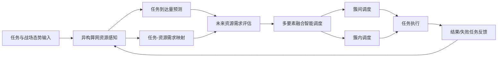

# 算网一体化资源管控调度技术项目学习文件

> 适用目的：帮助快速理解 `YY报告集合` 中的项目材料，尤其是老师重点提到的两份开题材料：
> 1. `开题-面向异构算网资源的智能感知与预测算法(1).docm`
> 2. `开题-基于多要素融合的算网资源智能调度算法(2).docm`

本文是内部学习笔记，内容来自项目资料整理，不建议单独对外传播。

## 1. 先用一句话理解整个项目

这个项目要解决的是：在复杂、动态、资源受限的作战算网环境中，先感知和预测未来任务会需要多少算力/网络资源，再自动决定这些任务应该调度到哪些节点或节点簇上执行，从而提高任务完成率、降低时延、保障高优先级任务。

可以把项目理解成一个闭环：



项目里真正核心的两个成果是：

- **面向异构算网资源的智能感知与预测算法**：回答“未来会来什么任务、这些任务需要多少资源”。
- **基于多要素融合的算网资源智能调度算法**：回答“知道资源需求后，任务应该调到哪里执行”。

## 2. 为什么需要这个项目

材料里的背景可以拆成三类矛盾：

1. **资源异构**
   作战节点可能有 CPU、GPU、NPU、内存、磁盘、网络带宽等不同资源，而且每个节点能力差异很大。某个任务适合 NPU 节点，另一个任务可能更依赖 CPU 或存储。

2. **任务动态**
   任务不是稳定均匀到达的。作战阶段变化、前置任务触发、突发任务、任务优先级变化都会导致某些节点突然拥塞。

3. **单节点受限**
   单个节点的算力、存储、能耗、链路能力有限。如果只靠固定节点执行任务，会出现队列堆积、任务丢弃、时延变大。

所以项目不是单纯“训练一个模型”，而是要做一个面向动态算网的 **感知-预测-调度-反馈** 体系。

## 3. 两份开题材料之间的关系

建议先不要把两份开题看成两个孤立项目，而要看成上下游关系。

### 3.1 智能感知与预测算法是上游

它负责把原始任务、节点状态、作战阶段等信息变成可供调度算法使用的预测结果。

输入大致包括：

- 历史任务到达量
- 任务类型特征
- 作战阶段
- 节点运行状态
- 任务数据量、计算量、最大容忍时延
- 任务依赖关系

输出大致包括：

- 下一时隙任务综合负载量
- 下一时隙任务综合类型特征向量
- 任务需要的 CPU/NPU/内存/磁盘/网络等资源需求

### 3.2 多要素融合智能调度算法是下游

它拿到预测和映射结果后，结合系统状态检测中心提供的节点资源、链路状态、任务队列等信息，决定任务调度策略。

输入大致包括：

- 任务 CPU/NPU/内存/磁盘需求
- 任务计算量、紧急程度、容忍时延
- 节点剩余资源
- 节点簇资源利用率
- 链路容量、实时链路速率、链路发射功率
- 任务队列状态

输出大致包括：

- 任务来源节点
- 任务编号
- 任务执行节点

一句话总结：**预测算法让系统“提前知道会发生什么”，调度算法让系统“决定现在该怎么做”。**

## 4. 第一份开题：面向异构算网资源的智能感知与预测算法

### 4.1 研究目标

这部分算法的目标是构建统一的算网资源感知与预测体系，解决三个问题：

- 不同任务到底需要多少算力和网络资源？
- 节点未来会不会突然负载升高？
- 如何把未来任务需求提前提供给调度算法？

材料中写到，该算法通过提取节点历史运行信息，预测未来任务到达情况，同时构建“任务-算力资源”映射模型，从而感知未来节点总体算网资源需求量。

### 4.2 技术指标

核心指标可以记成三句话：

- 具备对节点未来各项算网资源需求量进行预测的能力。
- 算力网络资源负载预测准确率不低于 80%。
- 支持不少于 3 种算力网络资源表征，并支撑后续不低于 1000 个调度管理节点的资源调度。

测试总结中给出的预测侧结果是：

- 单次批量推理总耗时：4.2 秒。
- 综合预测准确率：82.4%。
- MAE：2.1。
- MSE：0.8。
- 支持 5 类任务并发资源需求感知。

### 4.3 模块组成

开题中把算法拆成三个主要子模块。

#### 4.3.1 算网资源感知子模块

这个模块做“数据准备”和“任务特征建模”。

它要感知两类内容：

- **战场作战阶段**：不同阶段会导致任务请求密度、任务类型发生变化。
- **任务执行需求**：包括传输数据量 `dsize`、处理数据量 `csize`、最大时延容忍值 `tdelay`、任务依赖关系。

为了让模型不只是用简单的任务编号，材料将任务类型表示成一个四维特征向量：

```text
Q = (T, D, C, R)
```

含义如下：

- `T`：时间敏感性。任务越急，T 越高。
- `D`：数据需求强度。任务需要传输的数据越多，D 越高。
- `C`：计算复杂度。任务需要处理的数据越多，C 越高。
- `R`：任务引流关联性。当前任务越容易触发后续任务，R 越高。

这里的 `R` 很重要，因为作战任务往往存在链式触发关系。例如任务 A 完成后，有一定概率触发任务 B，再触发任务 D/E。材料使用有向无环图和触发概率计算直接、间接引流影响。

#### 4.3.2 节点任务请求预测子模块

这个模块的核心是 **Informer 时序预测模型**。

它要预测的是下一时隙节点上的任务负载情况。输入不是单一变量，而是多维时间序列，包括：

- 历史任务负载到达量
- 任务类型综合特征
- 作战阶段

Informer 适合这里的原因：

- 适合长序列时间预测。
- 支持多变量输入和多任务输出。
- 通过稀疏注意力机制降低计算复杂度。
- 通过生成式解码器一次性输出未来序列，避免逐步预测造成误差累积。

学习时可以这样理解：Transformer 是“全量关注历史”，Informer 是“只重点关注最关键的历史片段”，所以更适合长时间序列和实时推理。

#### 4.3.3 任务需求映射子模块

预测模块告诉我们“会来多少任务、是什么类型的任务”，但调度算法还需要更具体的问题：这些任务需要多少 CPU、NPU、内存、磁盘、网络资源？

任务需求映射子模块就是做这个转换。材料采用 **深度神经网络 + LightGBM** 的方式：

- LightGBM 擅长处理结构化特征，训练快，可解释性相对较好。
- 神经网络擅长拟合复杂非线性关系。
- 两者结合，用于将任务类型、数据量、计算量、时延要求等映射为资源需求。

### 4.4 两种触发模式

材料中多次提到两种触发模式：

- **时间驱动**：按照固定时隙周期预测节点未来资源需求，适合周期性调度。
- **事件驱动**：当新任务到达时立即计算该任务资源需求，适合实时请求。

可以理解为：时间驱动偏“提前规划”，事件驱动偏“即时响应”。

## 5. 第二份开题：基于多要素融合的算网资源智能调度算法

### 5.1 研究目标

这部分算法的目标是设计高效、智能、动态的作战任务调度方案。

它要解决的问题是：当系统知道任务需求和节点状态后，如何把任务分配给最合适的节点或节点簇，尽量降低时延、提高完成率、保证高优先级任务。

材料强调两个调度层级：

- **簇间调度**：在多个节点簇之间做负载均衡。
- **簇内调度**：在某个节点簇内部，把任务分配到具体节点。

### 5.2 技术指标

调度侧的核心指标可以记成：

- 能够通过监控感知网络中分布式算力资源，自动编排资源规划策略。
- 支持 5 种场景驱动下的网络资源调配能力。
- 算网资源一体化调度策略生成时间不大于 5 秒。
- 支撑的算网资源调度管理节点数量不低于 1000 个。
- 在不少于 30% 节点异常退网情况下仍能稳定调度。

测试总结中给出的调度侧结果：

- 覆盖单编组、多编组、动态任务、千节点规模、节点异常退网 5 类场景。
- 约 1000 节点规模下平均调度用时满足实时性要求。
- 跨编组场景下，超额任务可分流至其他编组兼容节点。
- 动态任务场景下，任务完成率和高优先级保障率高于基准策略。
- 约 30% 节点异常退网时，可规避不可用节点并降级调度。

### 5.3 调度算法整体流程

材料中的流程可以按 6 步理解：

1. **初始化**
   给节点和节点簇编号，从智能感知与预测算法、系统状态检测中心获取输入。

2. **判断是否需要调度**
   检查节点簇资源利用率、节点剩余资源、任务资源需求。如果资源利用率过高或节点不能按时完成任务，就触发调度。

3. **需要簇间调度时**
   指挥节点读取各节点簇资源、任务队列、网络链路情况，决定是否把任务从一个节点簇分流到其他节点簇。

4. **需要簇内调度时**
   根据任务优先级、容忍时延、节点状态预测、链路状态和节点资源，在当前簇内选择具体执行节点。

5. **执行调度策略**
   把任务分配到目标节点执行。

6. **反馈与重调度**
   当前时隙结束后检查任务完成情况，未完成任务退回队列，后续重新调度。

### 5.4 簇间调度

簇间调度解决的是“当前节点簇忙不过来，是否把任务转给别的节点簇”。

它关注：

- 各节点簇资源利用率
- 各节点簇任务队列
- 节点簇之间链路状态
- 当前节点簇任务资源需求

材料中提到簇间调度采用多节点联合决策，在指挥节点之间共享参数以实现联合更新。学习时可以先把它理解成一种跨集群负载均衡：不要让某个簇一直排队，尽量把超额任务分给更空闲、更兼容的簇。

### 5.5 簇内调度

簇内调度解决的是“任务已经属于某个节点簇，应该交给簇里的哪个具体节点执行”。

它关注：

- 任务资源需求
- 任务紧急程度
- 任务容忍时延
- 节点剩余 CPU/NPU/内存/磁盘资源
- 节点-任务亲和性
- 链路状态
- 队列长度

开题中将长期调度过程建模为 **马尔可夫决策过程 MDP**，并使用 **TD3** 这类深度强化学习方法优化策略。TD3 的作用可以简化理解为：在连续动态环境里学习“当前状态下把任务放到哪个节点，长期收益最好”。

注意：部分算法选型材料还讨论了图神经网络强化学习方向。学习时先以开题和使用说明中的 TD3/深度强化学习主线为准，再把图神经网络强化学习理解为更复杂拓扑建模下的扩展思路。

### 5.6 任务优先级

调度算法不是单纯看哪个节点空，而是要考虑任务优先级。材料里优先级相关因素包括：

- 任务重要程度
- 任务紧急程度
- 任务容忍时延
- 任务资源需求
- 是否为高优先级或时敏任务

直观理解：越重要、越紧急、越不能等的任务，越应该优先调度到预计完成时间更短、资源更匹配的节点。

### 5.7 节点-任务亲和性

亲和性是一个很实用的概念。

如果任务主要需要 NPU，就尽量放到 NPU 资源充足的节点；如果任务主要依赖存储，就尽量放到存储资源充足的节点；如果任务通信频繁，就关注带宽和链路状态。

这能减少“节点虽然有空余资源，但不是任务真正需要的资源”这种浪费。

## 6. 测试材料怎么看

项目测试材料主要是在证明：两类算法是否真的满足指标。

### 6.1 调度算法测试

调度算法主要测试 5 类场景：

| 场景 | 测什么 | 结论重点 |
| --- | --- | --- |
| 单编组任务调度 | 一个编组内，任务能否分配到最优节点 | 算法任务完成率高于固定节点基准 |
| 多编组任务调度 | 一个编组拥塞时，能否跨编组分流 | 超额任务可分流到其他兼容节点 |
| 动态任务与优先级 | 随机动态任务、高优先级任务能否被保障 | 完成率和高优先级保障率高于基准 |
| 千节点规模 | 约 1000 节点下调度是否仍然及时 | 平均调度用时满足 5 秒要求 |
| 节点异常退网 | 约 30% 节点不可用时能否降级调度 | 可规避不可用节点并继续运行 |

### 6.2 预测算法测试

预测算法主要测试：

- 训练流程是否能正常完成。
- 推理时能否生成 `prediction_results.csv`。
- 综合预测准确率是否不低于 80%。
- 单次批量推理总耗时是否不大于 5 秒。
- 是否支持 5 类任务并发资源需求感知。

测试总结中的关键结果：

| 指标 | 目标 | 实测 |
| --- | --- | --- |
| 推理总耗时 | 不大于 5 秒 | 4.2 秒 |
| 综合预测准确率 | 不低于 80% | 82.4% |
| MAE | 满足精度需求 | 2.1 |
| MSE | 满足精度需求 | 0.8 |
| 并发任务类型 | 不少于 5 类 | 5 类任务正常预测 |

## 7. 你读两份开题时的抓重点顺序

### 第一步：先看总目标

重点看每份开题的“概述”“研究目标”“技术指标”。你要先知道它想解决什么问题，而不是一上来陷进公式。

### 第二步：看模块图和流程

预测算法重点看：

- 算网资源感知子模块
- 节点任务请求预测子模块
- 任务需求映射子模块
- 时间驱动和事件驱动

调度算法重点看：

- 簇间调度
- 簇内调度
- 输入输出表
- 整体流程 6 步

### 第三步：看算法选择

预测侧：

- Informer 为什么比 LSTM/Prophet/TCN 更适合长序列、多变量预测。
- LightGBM + 神经网络为什么适合任务-资源映射。

调度侧：

- 为什么要用强化学习/TD3。
- MDP 的状态、动作、奖励分别是什么。
- 为什么要考虑任务优先级和节点-任务亲和性。

### 第四步：看测试材料

测试材料不是单独的文档，它是在验证开题里的承诺。看测试时要对应回技术指标：

- 5 秒有没有满足？
- 80% 准确率有没有满足？
- 1000 节点有没有覆盖？
- 5 类场景有没有覆盖？
- 30% 节点异常退网有没有说明？

## 8. 项目里的常见术语

| 术语 | 简单解释 |
| --- | --- |
| 算网资源 | 算力资源和网络资源的统称，包括 CPU/GPU/NPU、内存、存储、带宽、链路状态等 |
| 异构算网 | 节点能力不同、资源类型不同、链路状态不同的算网环境 |
| 节点簇 | 一组节点组成的调度单元，通常有一个指挥节点/簇首 |
| 簇间调度 | 在不同节点簇之间转移任务，解决跨簇负载不均 |
| 簇内调度 | 在一个节点簇内部选择具体执行节点 |
| 任务-资源映射 | 将任务特征转换成 CPU/NPU/内存/网络等资源需求 |
| Informer | 面向长序列预测的 Transformer 改进模型 |
| LightGBM | 梯度提升决策树模型，适合结构化数据建模 |
| MDP | 马尔可夫决策过程，用来描述长期序列决策问题 |
| TD3 | 深度强化学习算法，用于学习连续动作或复杂调度策略 |
| 高优先级保障率 | 高优先级任务被及时、合理调度的比例 |

## 9. 可以向师姐或老师确认的问题

后续如果要继续参与项目，建议优先确认这些问题：

1. 当前最终交付版本到底以哪套算法实现为准：开题中的 TD3 主线，还是选型材料中的图神经网络强化学习扩展？
2. 千节点测试场景以哪种拓扑口径为准：`143 编组 x 7 节点约 1001 节点`，还是测试总结中的 `50 编组 x 20 节点约 1000 节点`？
3. CloudSimPlus 生成的数据集是否已经固定，还是后续还要补充真实/半真实数据？
4. 预测算法输出给调度算法的接口字段是否已经冻结？
5. 调度算法里的优先级公式、奖励函数和节点亲和性权重是否已经定稿？
6. 30% 节点异常退网是否已经有独立测试用例，还是目前归在鲁棒性扩展测试中？
7. 结题前最需要补的材料是代码、测试日志、报告表格，还是答辩讲解材料？

## 10. 两周快速学习路线

### 第 1-2 天：建立全局认识

读本文，再快速翻两份开题的目录、概述、研究目标、技术指标。目标是能讲清楚“预测算法”和“调度算法”的上下游关系。

### 第 3-5 天：吃透预测算法

重点看智能感知与预测开题：

- 任务特征向量 `Q=(T,D,C,R)`
- Informer 输入输出
- 任务需求映射
- 时间驱动/事件驱动
- 82.4% 准确率的测试依据

### 第 6-8 天：吃透调度算法

重点看调度开题：

- 簇间调度和簇内调度
- 输入输出字段
- MDP 和 TD3
- 任务优先级、任务亲和性
- 调度流程 6 步

### 第 9-11 天：对照测试材料

把每个技术指标和测试结论对应起来：

- 5 秒实时性
- 1000 节点
- 5 类场景
- 30% 节点异常退网
- 80% 预测准确率

### 第 12-14 天：准备讲解稿

尝试用 5 分钟讲清楚：

1. 项目背景是什么。
2. 两个算法分别解决什么问题。
3. 预测算法怎么预测。
4. 调度算法怎么调度。
5. 测试结果说明了什么。
6. 目前还有哪些需要确认或补充的点。

## 11. 5 分钟口头讲解模板

如果师姐或老师问“你了解这个项目了吗”，可以按下面这个逻辑讲：

> 这个项目面向动态作战算网环境，核心目标是实现资源感知、负载预测和智能调度。项目包含两个主要算法成果：第一个是面向异构算网资源的智能感知与预测算法，它通过任务特征建模、Informer 时序预测和任务-资源映射，预测未来节点的任务到达和资源需求；第二个是基于多要素融合的算网资源智能调度算法，它利用预测结果和系统状态检测信息，在簇间和簇内两个层级生成调度策略。簇间调度主要解决跨编组负载均衡，簇内调度主要解决具体节点选择，并考虑任务优先级、容忍时延、节点资源和链路状态。测试材料显示，预测侧综合准确率达到 82.4%，推理总耗时 4.2 秒；调度侧覆盖单编组、多编组、动态任务、千节点规模和节点异常退网场景，约 1000 节点下调度时间满足不大于 5 秒要求。因此这个项目的主线可以概括为：先预测任务和资源需求，再通过智能调度提升任务完成率、实时性和鲁棒性。

## 12. 最后抓一句主线

不要被文档里的公式和算法名吓住。这个项目的主线很清楚：

**感知预测算法负责把未来资源需求看清楚，智能调度算法负责把任务放到最合适的位置执行，测试材料负责证明这套机制在准确率、时延、规模和鲁棒性上达标。**
